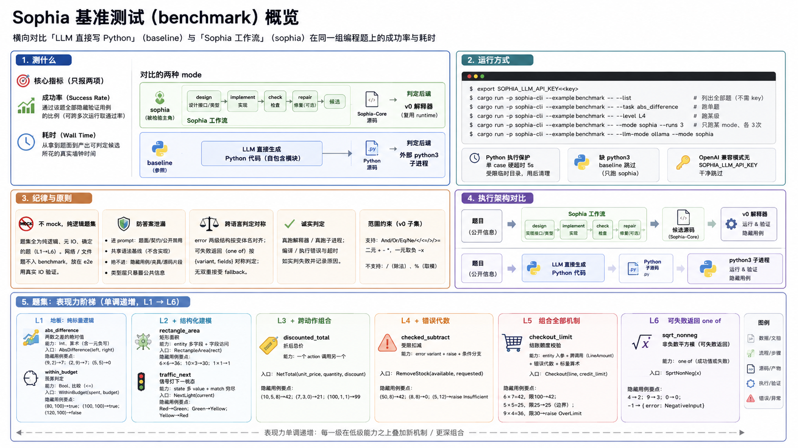

# Sophia 基准测试指南（benchmark test）



> Sophia 三类测试的第三类。benchmark 在多组小规模编程题上横向对比「LLM 直接写 Python」
> （`baseline` mode）与「Sophia 工作流」（`sophia` mode）的两个**核心指标——成功率（success
> rate）与耗时（wall time）**。它是 `example`（**不进** `cargo test` 门禁，无 LLM key / 无
> `python3` 时干净跳过）。这是一份 test guide：讲清楚 benchmark **测什么、怎么跑、按什么纪律
> 组织、有哪些题**。

---

## 一、定位

### 1.1 要回答的问题

同一组编程题、同一个 LLM、同一套隐藏验证用例下，对比两个核心指标：

- **成功率**：某 mode 产出的代码能否通过该题的**全部隐藏验证用例**（pass/fail，可跨多次运行取
  通过比例）；
- **耗时**：从拿到题面到产出可判定候选所花的真实墙钟时间。

不引入第三类综合指标（不发明「智力分」），只报这两项并按题 / 按 mode 聚合。

### 1.2 被对比的 mode

| mode | 解法路径 | 产出 | 判定执行后端 |
| --- | --- | --- | --- |
| `sophia` | Sophia 工作流（design → implement → check →[repair]→ 候选） | Sophia-Core 源码 | **v0 解释器**（复用 `runtime::run_action` / `runtime::verify`） |
| `baseline` | LLM 直接写一个自包含 Python 模块 | Python 源码 | **外部 `python3` 子进程** |

`sophia` 是被检验的主角；`baseline` 提供「让同一模型直接写主流语言」的参照。语言是 `baseline` 的
一个参数（当前**只做 Python**，见 §三.1），不是独立 mode。

### 1.3 不测什么

- 不验证语言构件的正确性——那是单元测试（见 `docs/unit_test.md`）。
- 不验证真实 LLM 闭环能否跑通——那是 e2e（见 `docs/e2e_test.md`）。
- 不发明对比指标，只报成功率 + 耗时。

### 1.4 mock 政策：禁 mock，纯逻辑题集

**benchmark 原则上不 mock。** 它要对比两条路径的真实能力，mock 会**掩盖错误**、且让对比失真
（真实 IO 在两 mode 间不确定、不公平）。因此：

- benchmark 题集**全为纯逻辑、无 IO、确定**的题（L1→L6），两 mode 在确定输入→输出语义下可比。
- **网络 / 文件题不入 benchmark**——它们的端到端验收在 e2e 用**真实 IO** 做（见
  `e2e_test.md` G2-03 网络 / G5-01 文件）。这避免了「为了让题确定而用 mock」的捷径。

### 1.5 选题哲学：表现力阶梯（与 e2e 的覆盖面不同）

benchmark 选题重**表现力**（expressiveness）——题目按**单调递增的难度阶梯**（L1→L6）组织，每级
在低级能力之上**叠加**新机制 / 更深组合，目的是让 Sophia 工作流与直接写 Python 的**能力分叉点**
随难度上升显现。这与 e2e 的**覆盖面**选题（按正交能力维度铺开作回归 gate，见 `e2e_test.md`）不同。

两者唯一共享的是底座：同一份可泛化、防作弊的提示词 + 脚手架（`sophia_syntax_baseline` + 同一套
防答案泄漏纪律）。改进底座对两者同时生效；但**题目刻意不重叠**，避免互相污染结论。

### 1.6 题目规模约束

题目严格限制在 **v0 起步子集**能表达、能解释执行的范围内：解释器支持 `And/Or/Eq/Ne/<,<=,>,>=`、
二元 `+ - *`、一元取负 `-x`（**无除法 / 取模**）。超出范围会让 `sophia` mode 因语言尚未支持而失败，
那是**语言能力**问题、不是**工作流**问题，会污染对比。

---

## 二、运行

```bash
export SOPHIA_LLM_API_KEY=<key>          # OpenAI 兼容模式需要；不落盘 / 不进图 / 不打印
cargo run -p sophia-cli --example benchmark -- --list                    # 列出全部题（不需 key）
cargo run -p sophia-cli --example benchmark -- --task abs_difference      # 跑单题
cargo run -p sophia-cli --example benchmark -- --level L4                 # 跑某级
cargo run -p sophia-cli --example benchmark -- --mode sophia --runs 3     # 只跑某 mode、各 3 次
cargo run -p sophia-cli --example benchmark -- --llm-mode ollama --mode sophia
```

批量执行器 `scripts/run_benchmark.sh` 逐题各起一进程、日志落盘（与 `run_e2e.sh` 同构）。

参数：`--task`（按 id）/ `--level`（L1–L6）/ `--mode`（sophia | baseline）/ `--runs`（每题次数）/
`--label`（产物子目录，默认 `default`）/ `--list`，以及 LLM 后端参数 `--llm-mode`
（openai | ollama）/ `--llm-model` / `--llm-base-url` / `--llm-api-key`。环境变量同 e2e：
`SOPHIA_LLM_MODE`、`SOPHIA_LLM_MODEL`、`SOPHIA_LLM_BASE_URL`、`SOPHIA_LLM_TIMEOUT_SECS`、
`SOPHIA_LLM_API_KEY`。OpenAI
兼容模式无 `SOPHIA_LLM_API_KEY` 干净跳过；Ollama 模式默认本地 `http://localhost:11434`、
默认模型 `qwen3.6:latest`，无需 API key。`--llm-timeout-secs` / `SOPHIA_LLM_TIMEOUT_SECS`
表示连接 / 响应读取空闲超时；OpenAI 兼容与 Ollama 都使用 streaming，不限制整段生成总耗时。
Ollama 默认不重试，避免本地生成被重复触发。缺 `python3` 时 baseline mode 跳过（只跑 sophia，
`python3` 仅运行期外部工具、不进 Cargo 依赖树）。

执行 LLM 生成的任意 Python 受**硬超时**（单 case 5s）+ **受限临时工作目录** + **用后清理** 保护。

---

## 三、纪律

### 3.1 baseline 只做 Python（项目固有的执行不对称）

`baseline` 必须真正执行 LLM 生成的代码，而当前工作区**纯 Rust、不依赖 python**。这是
`sophia`（判定复用 `runtime::verify`，零新增执行能力）与 `baseline`（从零搭子进程执行 + 跨语言
比对）之间**真实的、项目固有的工程不对称**，必须正视——故 baseline 只做 Python（`python3` 依赖
最轻、几乎人人有）。

### 3.2 防答案泄漏（与 e2e 同源）

- **进 prompt**（题目）：`prompt_goal` / 入口契约（`entry`）/ `public_forbidden`；`sophia` mode
  额外注入共享语法基线（仅 implement / repair，design 不注入）+ 按需标准库资产（当前题集全为纯
  逻辑题，design 不会选库，零注入）。implement 阶段也注入当前根目标作为语义上下文，保证实现
  对题面命名与意图保持锚定。
- **绝不进 prompt**（答案）：`hidden_cases` 整体、baseline runner 夹具、源码片段 / 实现提示。
- **结构化防线**：`Problem::public_brief()` 在**类型层**只暴露公开字段，prompt 组装函数收不到
  `hidden_cases`（靠函数签名而非自律隔离）；防泄漏断言守护共享资产不含题目领域 token。

### 3.3 跨语言判定的对称性（错误身份）

Sophia 的错误是**两级**结构（`error <类型> { variant <变体> }`），hidden case 按**变体名**判定
（`raise OverLimit` 对照 `Raises("OverLimit")`）；Python 异常是**单级**的。对齐规则（防作弊安全、
可泛化）：baseline 契约明确——题面把错误描述为「error 含 variant」两级结构时，Python 异常类名取
**最具体的一级即 variant 名**（variant 名本就在公开题面里，不泄漏 hidden case）。可失败返回
（`one of`）的失败成员两 mode 按 `{variant, fields}` 对象对称判定（baseline 契约：失败 return 该
dict 而非 raise）。无双重接受 fallback（符合单一路线）。

### 3.4 诚实判定

判定**绝不伪造**：`sophia` 复用 `runtime::run_hidden_cases`（真跑解释器、真比对）；`baseline`
子进程编译 / 执行硬错误 → 该题判失败并如实记原因；超时 → 判失败。

---

## 四、题集清单

题集是**单调递增难度阶梯**（每级累积叠加机制）。每题给出：场景、叠加的能力、入口、隐藏用例要点。
**只描述题目，不含答案；隐藏用例是答案，绝不进 prompt。**

### L1 地板：纯标量逻辑

| 题 id | 场景 | 叠加能力 | 入口 | 隐藏用例要点 |
| --- | --- | --- | --- | --- |
| `abs_difference` | 两数之差的绝对值 | Int、算术（含一元取负）、纯函数 | `AbsDifference(left, right)` | `(9,2)→7`；`(2,9)→7`；`(5,5)→0` |
| `within_budget` | 预算判定 | Bool、比较（`<=`） | `WithinBudget(spent, budget)` | `(80,100)→true`；`(100,100)→true`；`(120,100)→false` |

### L2 + 结构化建模

| 题 id | 场景 | 叠加能力 | 入口 | 隐藏用例要点 |
| --- | --- | --- | --- | --- |
| `rectangle_area` | 矩形面积 | entity 多字段 + 字段访问 | `RectangleArea(rect)` | `6×6→36`；`10×3→30`；`1×1→1` |
| `traffic_next` | 信号灯下一状态 | state 多 value + `match` 穷尽 | `NextLight(current)` | `Red→Green`；`Green→Yellow`；`Yellow→Red` |

### L3 + 跨动作组合

| 题 id | 场景 | 叠加能力 | 入口 | 隐藏用例要点 |
| --- | --- | --- | --- | --- |
| `discounted_total` | 折后总价 | 一个 action 调用另一个 | `NetTotal(unit_price, quantity, discount)` | `(10,5,8)→42`；`(7,3,0)→21`；`(100,1,1)→99` |

### L4 + 错误代数

| 题 id | 场景 | 叠加能力 | 入口 | 隐藏用例要点 |
| --- | --- | --- | --- | --- |
| `checked_subtract` | 受限扣减 | error variant + `raise` + 条件分支 | `RemoveStock(available, requested)` | `(50,8)→42`；`(8,8)→0`；`(5,12)→raise Insufficient` |

### L5 组合全部机制

| 题 id | 场景 | 叠加能力 | 入口 | 隐藏用例要点 |
| --- | --- | --- | --- | --- |
| `checkout_limit` | 结账额度校验 | entity 入参 + 跨调用（`LineAmount`）+ 错误代数 + 标量算术压进一题 | `Checkout(line, credit_limit)` | `6×7=42, 限100→42`；`5×5=25, 限25→25`（边界）；`9×4=36, 限30→raise OverLimit` |

L5 是阶梯顶层组合题：把 L1–L4 的机制叠在一道题，表现力分叉最可能在此显现。

### L6 可失败返回 `one of`

| 题 id | 场景 | 叠加能力 | 入口 | 隐藏用例要点 |
| --- | --- | --- | --- | --- |
| `clamp_or_reject` | 受限取值 | `one of { Int, OutOfRange }`：失败是**返回值**（可恢复），区别于 L4 的 `raise`（不可恢复中断） | `ClampOrReject(n, limit)` | `(3,10)→3`；`(0,10)→0`（下界）；`(10,10)→10`（上界）；`(15,10)→返回 OutOfRange{value:15}`（非 raise） |

L6 是 F1（`one of` 可失败返回）落地后阶梯顶端的「可失败建模」维度顶题：调用方消费须 match 成功
成员（裸 Int）与失败成员（OutOfRange）两路。失败是**值**、可被调用方继续处理——这是相对 v0 的
能力增量。

> L6 只保留纯逻辑题 `clamp_or_reject`。网络 / 文件的可失败建模端到端验收不在 benchmark（禁 mock，
> 真实 IO 不确定不公平），改在 e2e 用真实 IO 做（`e2e_test.md` G2-03 / G5-01）。

---

## 五、判定与计时

### 5.1 判定（pass = 通过全部 hidden cases）

- `sophia`：复用 `runtime::verify::run_hidden_cases`——每个 `HiddenCase` 在 v0 解释器上真正执行、
  与 `ExpectedOutcome` 比对，benchmark 侧**零新增执行能力**。可失败返回的失败成员是
  `Value::ErrorValue`，与期望 error 成员按值相等比对。
- `baseline`：候选模块写入受限临时目录，由 benchmark 拥有的**确定性 runner 脚本**（非 LLM 产出）
  `import` 它、对每个 case 调入口函数 `run_action(input)`、把 `{"ok":true,"result":...}` 或
  `{"ok":false,"error":"<类名>"}` 打到 stdout；Rust 侧经统一 `Value ↔ JSON` 规约对照（`Returns`
  比 JSON 值、`Raises` 比抛出的异常类名、`one of` 失败成员比 `{variant, fields}` dict）。

### 5.2 计时（两 mode 口径一致才公平）

`wall_time` = 从拿到题面到产出可判定候选的 LLM + 工作流墙钟（`sophia` = design + implement +
[repair] + 确定性 check；`baseline` = 单次含自检重试的 LLM 调用）。**判定执行本身**（解释器 / 子
进程跑 hidden cases）的耗时**不计入** `wall_time`。计时是真实 LLM + 网络，跨运行波动正常，**只作
对比参考，不进任何确定性断言 / 快照**。

---

## 六、产物

- **逐次记录**：每个 (题, mode, 运行序号) 一条结构化记录——`id` / `level` / `mode` / `language`
  （baseline 为 `python`，sophia 为 `null`）/ `model` / `passed` / `wall_time_ms` / `failure`
  （成功为 `null`）/ 每个 hidden case 的 `passed` 明细。JSON Lines 落
  `sophia-runs/benchmark/<label>/runs.jsonl`（append-only，`.gitignore` 已忽略）。
- **聚合报告**：逐 (题 × mode) 的成功率 / 平均耗时表，打印 stdout 并落 `summary.md`。列即核心指标：
  `level | task | mode | runs | passed | success_rate | avg_wall_time_ms`。

---

## 七、工程结构

实现位于 `cli/examples/benchmark/`（多文件 example，与 e2e 对称，不进 `cargo test` 门禁）：

```
cli/examples/benchmark/
├── main.rs          ← 入口：参数解析、mode 选择、无 key / 无 python3 干净跳过、逐 (题×mode×次) 驱动、汇总
├── problem.rs       ← Problem / EntrySig / Param / NeutralTy / Level / PublicBrief
│                       （public_brief() 用类型隔离 hidden_cases，结构防线）
├── problems.rs      ← 题集 L1→L6 难度阶梯（全新题目、累积叠加机制，复用 runtime::Value / HiddenCase）
├── value_json.rs    ← value_to_json：runtime::Value → 语言中立 JSON 规约（两 mode 共用）
├── retry.rs         ← 有界重试 client 包装（容忍公网瞬时抖动，与 e2e 同构、刻意不共享）
├── sophia_mode.rs   ← sophia mode：自带精简闭环（design→implement-loop→runtime::verify），
│                       不复用 e2e harness（先不抽象）；纪律与 e2e 一致（同一语法基线资产）
├── baseline_py.rs   ← baseline(Python) mode：结构化生成 + python3 子进程 runner 夹具 +
│                       受限临时目录 + 硬超时 + Value↔JSON 对照 + 归因
└── report.rs        ← RunRecord / Mode / runs.jsonl 写入 / summary 渲染

scripts/run_benchmark.sh   ← 串行批量执行器（逐题各起一进程，日志落盘；与 run_e2e.sh 同构）
```

设计纪律：`sophia` mode 与 e2e harness 的闭环有重合，但**各写一份、不预先抽象**（YAGNI / 单一
路线下宁可暂时小重复，也不为复用造抽象）——等两边都稳定、确实重复痛了再下沉为共享库函数。新增题
= 在 `problems.rs` 加一个 `Problem` 并登记进 `all_problems()`；若引入新领域词汇，须在 `render.rs`
的防泄漏断言里登记 token。
