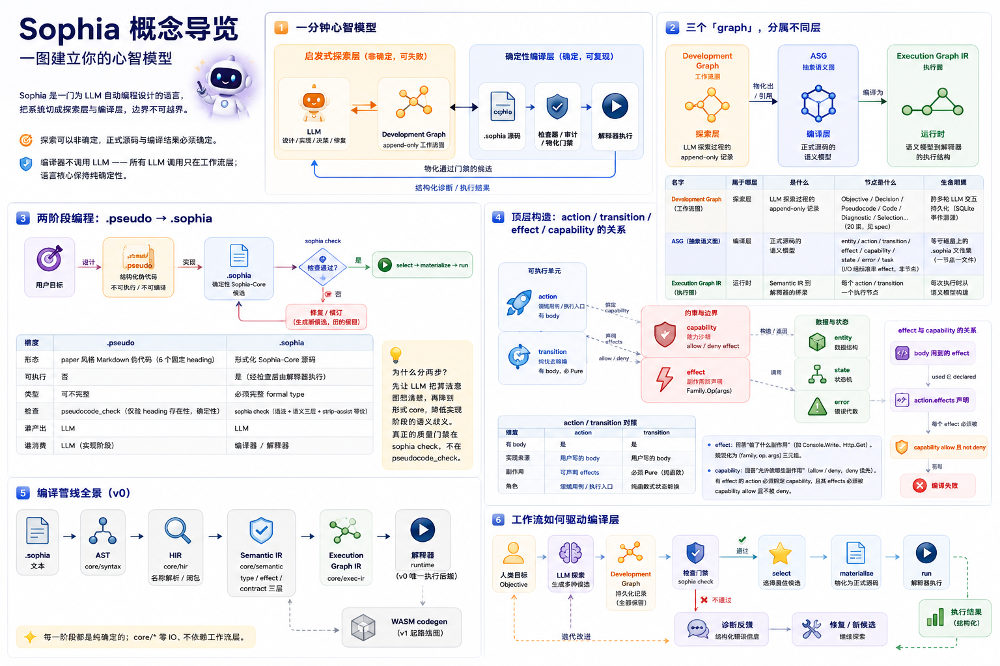
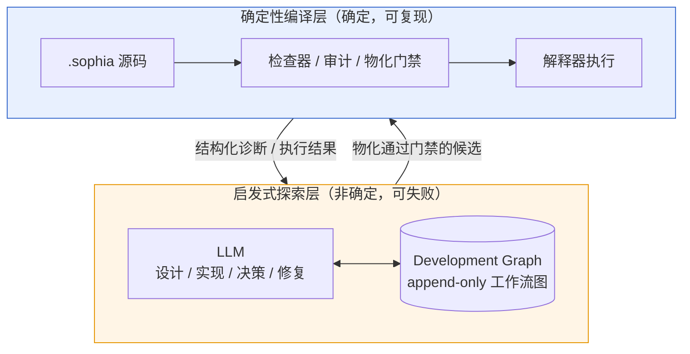
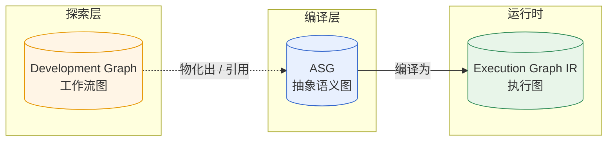
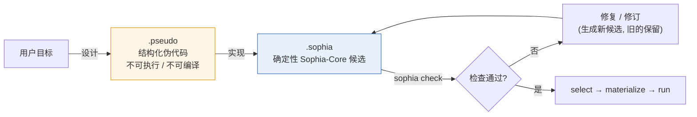
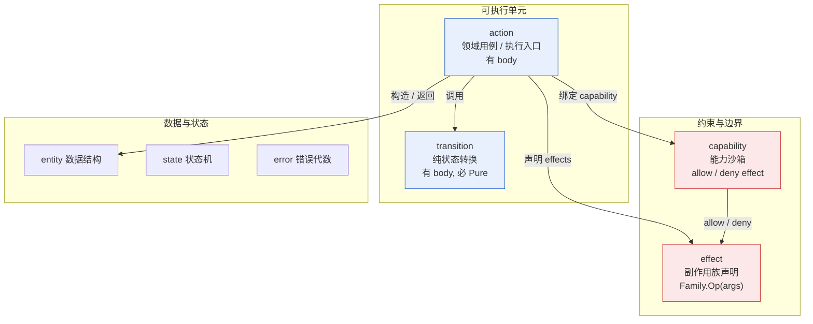
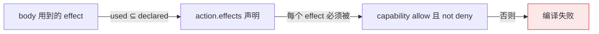
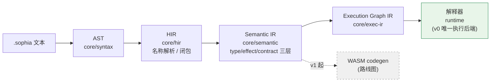
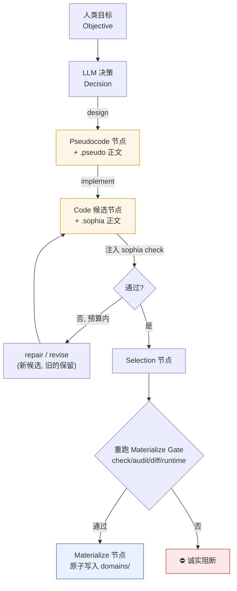

# Sophia 概念导览

> 这是一份**面向读者的概念地图**，帮你建立 Sophia 的心智模型——先读这篇，再按需深入各权威文档。
> 它**不**重复细节，每节都链接到 source of truth（SSOT）。
>
> 权威文档：概念与设计决策见 `language_design.md`；编译器 / 运行时实现见 `language_implementation.md`；
> 工具链 / 目录 / CLI 见 `engineering_architecture.md`；图 schema 与不变量见 `workflow_graph_spec.md`。

---

## 1. 一分钟心智模型

Sophia 是一门为 **LLM 自动编程**设计的语言。它把系统切成两层，边界不可越界：

两个铁律（见 `language_design.md` 第二节）：

1. **探索可以非确定，正式源码与编译结果必须确定。**
2. **编译器不调用 LLM**——所有 LLM 调用只在工作流层；语言核心保持纯确定性。

核心哲学:**把需要"记忆"的东西,变成需要"表达"的东西**。LLM 擅长局部表达,不擅长跨上下文长期记忆。

---

## 2. 三个「graph」，分属不同层

"graph"是本项目里唯一仍被重载的术语——它指三个不同的东西,先拆清楚后面就不会乱。

| 名字 | 属于哪层 | 是什么 | 节点是什么 | 生命周期 |
| --- | --- | --- | --- | --- |
| **Development Graph**（工作流图） | 探索层 | LLM 探索过程的 append-only 记录 | Objective / Decision / Pseudocode / Code / Diagnostic / Selection…（20 类，见 spec） | 跨多轮 LLM 交互持久化（SQLite 事件溯源） |
| **ASG**（抽象语义图） | 编译层 | 正式源码的语义模型 | entity / action / transition / effect / capability / state / error / task（I/O 经标准库 effect，非节点） | 等于磁盘上的 `.sophia` 文件集（一节点一文件） |
| **Execution Graph IR**（执行图） | 运行时 | Semantic IR 到解释器的桥梁 | 每个 action / transition 一个执行节点 | 每次执行时从语义模型构建 |

记忆法:**Development Graph 是"怎么把活干出来"的过程记录;ASG 是"干出来的成品"的语义结构;Execution Graph 是"成品怎么跑"的执行结构。**

> SSOT:Development Graph → `workflow_graph_spec.md`;ASG → `language_design.md` §5.2;Execution Graph IR → `language_implementation.md` §8。

---

## 3. 两阶段编程：`.pseudo` → `.sophia`

LLM 不直接从自然语言生成形式代码,而是先稳定**算法意图**,再降到**形式 core**。

| 维度 | `.pseudo` | `.sophia` |
| --- | --- | --- |
| 形态 | paper 风格 Markdown 伪代码（6 个固定 heading） | 形式化 Sophia-Core 源码 |
| 可执行 | 否 | 是（经检查后由解释器执行） |
| 类型 | 可不完整 | 必须完整 formal type |
| 检查 | `pseudocode_check`（仅验 heading 存在性，确定性） | `sophia check`（语法 + 语义三层 + strip-assist 等价） |
| 谁产出 | LLM | LLM |
| 谁消费 | LLM（实现阶段） | 编译器 / 解释器 |

为什么分两步:`.pseudo → .sophia` 的转换者是 LLM(不是编译器),先让它把算法语义想清楚,再降到形式 core,降低实现阶段的语义歧义。真正的质量门禁在 `sophia check`,不在 `pseudocode_check`。

> SSOT:`language_design.md` 第四节。

---

## 4. 顶层构造:action / transition / effect / capability 的关系

`.sophia` 的顶层构造都是 ASG 的节点(一个一文件,平级)。它们承担**不同职责**,平级不代表同质。

### action / transition 对照

| 维度 | `action` | `transition` |
| --- | --- | --- |
| 有 body | 是 | 是 |
| 实现来源 | 用户写的 body | 用户写的 body |
| 副作用 | 可声明 effects | 必须 `Pure`（纯函数） |
| 角色 | 领域用例 / 执行入口 | 纯函数式状态转换 |

> 注:早期曾设计过一个 `node` 顶层构造(用于 agent 编排)并配套 `Llm`/`Tool`/`Stream` effect,
> 因偏离语言定位**已彻底移除**;`effect` 顶层构造保留(与 agent 无关)。详见 `language_design.md` §13.5。

### effect 与 capability 的关系

- **effect** 回答"做了什么副作用"(如 `Console.Write`、`Http.Get`)。规范化为
  `(family, op, args)` 三元组。内置 `Console` 族 + 标准库 effect 族(`File` / `Http`)由编译器内置表承载;
  用户可用 `effect` 顶层构造声明领域 effect 族。文件 / 网络 / 数据库等 I/O 是**标准库**(见
  `stdlib_design.md`),不是语言原语。
- **capability** 回答"允许做哪些副作用"(`allow` / `deny`,deny 优先)。
- 规则:有 effect 的 action 必须绑定一个 capability,且其 effects 必须被 capability `allow` 且不被
  `deny`。

> SSOT:`language_design.md` §5.3(ASG 节点示例,含完整 TodoDomain)、§6.3–6.4(effect / capability)、
> 第十三节(`effect` 顶层构造 + 不引入 `node` 的决策)。

---

## 5. 编译管线全景（v0）

把前面的概念串起来,一段源码从文本到执行经过:

每一阶段都是纯确定的;`core/*` 零 IO、不依赖工作流层。

> SSOT:`engineering_architecture.md` 第三节(分层)、`language_implementation.md` 第八 / 九节。

---

## 6. 工作流如何驱动编译层

启发式探索层(LLM + Development Graph)和确定性编译层不是两个孤岛——工作流通过门禁把候选"物化"进编译层:

要点:

- 图是 **append-only** 的——修复 / 修订都建新节点,旧节点(含失败路径)永久保留,保证可复现与可审计。
- LLM 只负责**动作选择 + 内容生成**;**通过与否的判定全部由确定性门禁做**(`sophia check` / constraint audit / materialize gate),不依赖人工兜底。
- 物化是唯一写 `domains/` 的路径,且写盘前**重跑全部门禁**。

> SSOT:`language_design.md` 第十节(启发式工作流)、`workflow_graph_spec.md`(图 schema 与不变量)。

---

## 7. 下一步读什么

| 你想了解 | 读 |
| --- | --- |
| 语言为什么这样设计、概念全貌 | `language_design.md` |
| 编译器 / 解释器怎么实现的 | `language_implementation.md` |
| 目录结构、CLI、crate 分层 | `engineering_architecture.md` |
| Development Graph 的精确 schema 与不变量 | `workflow_graph_spec.md` |
| 当前进展到哪了 · v1 要做什么扩展（需求驱动） | `dev_checklist_v1.md`（当前）/ `dev_checklist_v0.md`（v0 归档） |
| 工程决策为什么这么定 | `engineering_notes.md` |
| 三类测试（单元 / e2e / 基准）怎么组织 | `unit_test.md` / `e2e_test.md` / `benchmark_test.md` |
| 怎么构建 / 跑起来 | 仓库根 `INSTALL.md` |
