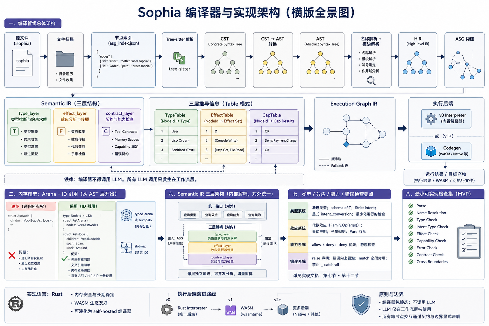

# Sophia 语言实现



> 本文档定义 Sophia 编译器和运行时的实现层（AST、IR、类型系统实现、检查管线、运行时模型等）。
> 语言概念和工作流概念见 `language_design.md`。
> 工程目录、CLI、工具链组装见 `engineering_architecture.md`。

---

## 一、实现语言

**Rust 是 Sophia 的实现语言。**

理由：

- Sophia-Core 编译器的核心资产（Semantic IR、Execution Graph IR）需要长期稳定的内存模型和类型安全保证；
- 起步阶段的执行后端是 Rust 进程内解释器；v1 起的第一个 codegen target 是 WASM，Rust + wasm-bindgen / wasmtime 是最直接的工具链；
- 编译器自身未来可演化为 self-hosted。

**承认的代价**：LLM 编排生态在 Python/TypeScript 更成熟，启发式工作流引擎的部分基础设施（结构化输出、prompt 管理）需要自行实现，没有对等的 Rust 库可以直接复用。这些组件归属工程架构层，不污染编译器核心。

---

## 二、编译管线总体架构

```text
源文件 (.sophia)
    ↓ 文件扫描
    ↓ 节点索引 (asg_index.json)
    ↓ Tree-sitter 解析
    ↓ CST
    ↓ CST → AST 转换
    ↓ AST
    ↓ 名称解析 + 模块解析
    ↓ HIR
    ↓ ASG 构建
    ↓ Semantic IR（type / effect / contract 三层）
    ↓ Execution Graph IR
    ↓ Interpreter（v0 唯一执行后端）
                    或
                  ↓ Codegen（v1 起：WASM；后续可选 native）
                  ↓ target artifact
```

| 阶段     | 输入            | 输出             |
| -------- | --------------- | ---------------- |
| 文件扫描 | 目录结构        | file list        |
| 节点索引 | file list       | `asg_index.json` |
| 解析     | `.sophia` 文件  | CST → AST        |
| 名称解析 | AST + index     | resolved AST     |
| HIR     | resolved AST    | HIR              |
| ASG 构建 | HIR             | ASG              |
| 语义检查 | ASG             | checked Semantic IR |
| Exec IR  | Semantic IR     | Execution Graph IR  |
| 解释 / codegen | Exec IR  | runtime 结果 / artifact |

**铁律**：编译器不得调用 LLM。所有 LLM 调用只发生在工作流层。

---

## 三、Parser 层

### 3.1 Tree-sitter

使用 Tree-sitter 作为 parser，提供：

- grammar 定义；
- 增量解析（incremental parsing）；
- syntax highlighting；
- 编辑器集成。

输出：Concrete Syntax Tree (CST)。

CST 不是面向后续阶段消费的格式，仅作为 lossless 表达。CST → AST 是一个独立转换步骤，丢弃 trivia（空白、注释位置）但保留 span 信息。

---

## 四、AST 层

### 4.1 职责

AST 仅表达表层语法结构：

- syntax structure
- literals
- spans
- declarations
- expressions

AST 不包含类型信息、语义绑定、执行语义。

### 4.2 内存模型：Arena + ID 引用

**从 AST 层开始使用 Arena + ID 引用**，不使用 `Box<Node>` 或 `Rc<RefCell<Node>>`：

```rust
// 避免：递归所有权，难以交叉引用
struct AstNode {
    children: Vec<Box<AstNode>>,
}

// 采用：ID 引用，无所有权问题
type NodeId = u32;

struct AstArena {
    nodes: Vec<AstNode>,
}

struct AstNode {
    children: Vec<NodeId>,
    span: Span,
}
```

工具层：

- `typed-arena` 或 `bumpalo` 负责内存分配；
- `slotmap` 负责稳定 ID（节点删除后 ID 不复用，避免悬空引用）。

这个模式从 AST 层贯穿到 HIR 和 Semantic IR，保持一致的引用语义。

---

## 五、HIR 层

### 5.1 职责

HIR 完成语义归一化：

- 名称解析（name resolution）
- 模块解析（module resolution）
- symbol binding
- scope analysis

HIR 是第一个具有明确语义意义的中间层。

### 5.2 名称解析规则

- 所有引用必须可由 `asg_index.json` 解析；
- 禁止隐式 import；
- 禁止同名 shadowing（包括 body 局部变量）；
- 跨 domain 引用必须通过 boundary 或 task include 显式声明。

---

## 六、Semantic IR

### 6.1 内部分层

Semantic IR 是 Sophia 最核心的架构层。它的职责涵盖类型推导、effect 传播、capability 满足检查、错误传播、跨节点契约校验。这一组职责很容易塌陷成"上帝对象"。

为避免塌陷，Semantic IR 内部采用**三层结构**，对外仍暴露统一接口：

```
semantic/
├── type_layer/        ← 类型推断与约束求解
├── effect_layer/      ← 效应分析与传播
└── contract_layer/    ← tool contracts、memory scopes、capability 满足情况
```

### 6.2 推导信息存储：Table 模式

每层的**推导信息**存储在独立的 Table 中，**不直接修改 IR 节点**：

```rust
TypeTable     ← 类型推断结果，按 NodeId 索引
EffectTable   ← effect 传播链
CapTable      ← capability 满足情况
```

IR 节点本身保持不可变，存储的是**声明信息**（类型签名、effect 声明、capability 要求），不是推导结果。

好处：

- Semantic IR 可以被并发分析；
- 增量失效时只重算受影响的 Table 条目；
- 节点级 invariant（不可变）和分析级 invariant（可重算）解耦。

---

## 七、类型系统实现

### 7.1 渐进类型

Sophia-Core 支持渐进类型。`Unknown` 类型在运行时退化为动态检查。

引入 `schema of T` 作为一等类型，表示"结构符合 schema T 的 LLM 输出"。类型不匹配在 Execution Graph IR 层触发 fallback 边，而不是 runtime panic。

### 7.2 Intent Type Check

Intent assignability 使用**严格相等**：

- `Raw<Text>` 不能赋给 `Sanitized<Text>`；
- `Sanitized<Text>` 不能隐式降级为 `Text`。

表达式推导保留 intent：`Raw<Text> + Text` 推导为 `Raw<Text>`；相同 intent 的 `Sanitized<Text> + Sanitized<Text>` 推导为 `Sanitized<Text>`。

显式 conversion action 使用 `intent_conversion: true`，必须满足：

- 一入一出；
- 同 inner type；
- 不同 intent；
- 无 effect；
- body 直接 `return` 输入值。

边界规则：

- action call、entity construction、return 和 Console / 库写出 boundary 必须满足 intent 规则；
- `Console.Write` 只能输出字面量、`Sanitized<T>` 或 `Redacted<T>`；标准库写出操作同理（如 `File.Write`
  要求 `Sanitized<Text>`，见 `file_lib.md`）。

### 7.3 Effect Check

采用代数效应（Algebraic Effects）模型。

- Action body 内使用的所有 effect 必须包含在 `action.effects` 中；
- 被调用 action 的 observable effects 必须是调用方 effects 的子集；
- `Pure` 与其他 effect 互斥；`Pure` 不要求调用方重复声明；
- effect 的内部表示是 `(family, op, args)` 三元组（如 `Console.Write` 即 `(Console, Write, [])`、
  `Payment.Charge(1)` 即 `(Payment, Charge, [1])`）。可引用的 effect 族来自**两处合并**：内置 `Console`
  族 + 标准库 effect 族 `File` / `Http`（`hir::builtins::BUILTIN_EFFECT_OPS` 预置），以及用户 `effect`
  顶层声明（`language_design.md` 第十三节）。名称解析校验引用的 `Family.Op` 已声明、
  实参个数相符。相等 / 子集算法只比较三元组，与 effect 来源无关（实现细节见第二十节）。

### 7.4 Capability Check

- Action effects 必须被 capability allow 且未命中 deny；
- `deny` 优先于 `allow`；
- 不支持动态 capability。

### 7.5 Error Check

- `raise` 必须在 action `errors` 中声明；
- 被调用 action 的 errors 必须由调用方继续声明（直到 error handle 落地）；
- `match` 必须显式穷尽，禁止 `_` catch-all。

### 7.6 最小可实现检查集

| 检查              | MVP 要求                                                                                                                   |
| ----------------- | -------------------------------------------------------------------------------------------------------------------------- |
| Parse             | 每个文件一个顶层 node，未知块报错                                                                                          |
| Name Resolution   | 所有引用必须可由 index 解析                                                                                                |
| Type Check        | 字段赋值、return、action call 类型匹配；block scope；非 Unit action 全路径 return/raise                                  |
| Intent Type Check | 不允许弱 intent 写入强 intent                                                                                              |
| Effect Check      | body 使用的 effect 必须显式声明                                                                                            |
| Capability Check  | action effect 必须被 capability allow，且未命中 deny                                                                       |
| Error Check       | `raise` 必须声明；被调用 action 的 errors 必须由调用方继续声明                                                             |
| Strip Assist      | 比较 strip 前后的 Semantic IR 与 Execution Graph IR；v1 起增加对 WASM artifact 的字节级比对                                |

---

## 八、Execution Graph IR

### 8.1 职责

Execution Graph IR 显式描述运行时执行结构。**当前实现只承载同步确定性执行**：
每个 action / transition 一个执行节点，body 中的 callable 调用形成 `Control` 边，供解释器 / WASM
后端校验调用关系与 Trace 投影。下列更丰富能力属于远期愿景，不是 v1/v2 近期目标：

- execution DAG
- task dependencies
- awaits
- retries
- cancellation
- scheduling
- checkpoints
- concurrency boundaries

```text
Task A
  ├── Task B
  ├── Task C
  │     └── Task D
  └── Task E
```

Execution Graph IR 是 Semantic IR 与 Runtime 之间的桥梁。没有表层语法和演示需求触发前，不为
await / 并发 / checkpoint 等远期语义实现调度器。

### 8.2 边的类型系统

边的类型是 Execution Graph IR 的**一等概念**，不是隐含在 retry/cancellation 语义里的附属物。
当前仅产出 `ControlEdge`；其余边类型是远期词汇表，需等语言层出现可生成它们的表层构造后再进入设计评审阶段：

```rust
DataEdge<T>        // 携带类型化数据
StreamEdge<T>      // 流式传输（token-by-token）
ControlEdge        // 纯控制流，不携带数据
ConditionalEdge    // 带谓词的路由边
FallbackEdge       // 节点执行失败时触发
```

`schema of T` 类型不匹配触发 `FallbackEdge` 是远期执行图语义；当前起步子集不生成 fallback 边。

---

## 九、Runtime 架构

### 9.1 结构

```text
Sophia Runtime
    └── 同步解释器 / WASM 后端
```

当前 Sophia Runtime 提供：

- 同步 execution graph 执行（callable 级 Control 调用边）；
- runtime validation；
- effect tracking；
- tracing；
- runtime inspection。

Tokio / async 只出现在 LLM 调用、LSP 协议服务等工具链 / 协调层 IO 中；这不是 Sophia 语言或 runtime
的异步执行语义。cancellation / retries / checkpointing 等属于远期愿景，需要语言表层构造、
Execution Graph 边语义和 host/WASM ABI 同时明确后重新设计。

### 9.2 Interpreter

起步阶段使用解释执行，路径：

```text
Semantic IR
    ↓
Execution Graph IR
    ↓
Interpreter
```

Interpreter 职责：

- runtime validation
- tracing
- semantic inspection
- execution debugging

v0 没有 codegen；v1 起的 codegen 路线见第十二节。

### 9.3 异步边界划分

明确区分 **Sophia 执行语义的同步模型** 与 **Rust 工具链实现中的 async IO**：

**同步（纯函数，不引入 Tokio）**：

- 全部 `core`（parser、HIR、Semantic IR、Execution Graph IR）
- `check` 和 `audit` 的核心分析逻辑

**Rust async（工具链 / 协调层 IO，可使用 Tokio；不进入 Sophia runtime 语义）**：

- `llm`（LLM API 网络请求）
- `lsp`（tower-lsp 协议服务）
- e2e / benchmark harness 中的 LLM 驱动

编译器核心保持同步的好处：

- 便于单元测试，无需构造异步测试运行时；
- 便于推理，无竞态条件；
- 与当前 WASM codegen 的同步确定性 artifact 模型一致。WASM 的异步机制演进可作为远期输入观察，
  但不是当前 Sophia v1/v2 的设计目标。

### 9.4 执行 Trace 与 Execution Graph 的映射

Trace 是 Execution Graph 执行的**投影**，不是独立的观测层。每条 trace 记录必须携带对图中具体节点和边的引用：

```rust
struct ExecutionSpan {
    seq: u32,                    // 进入顺序序号（确定性，替代墙钟时间线）
    node_id: ExecNodeId,         // Execution Graph IR 中被进入的节点
    edge_id: Option<ExecEdgeId>, // 触发本次进入的调用边；顶层入口为 None
    callable: String,            // 节点对应的 callable 名（便于人读）
    depth: u32,                  // 调用深度（顶层入口为 0）
    outcome: SpanOutcome,        // 投影回图：正常返回 / 领域错误 raise
}
```

这使得 trace 数据可以直接映射回图结构，支持"哪个节点最慢"、"哪条边触发了 fallback"这类查询，而不只是时间线上的字符串 span。

> **实现状态（反哺）**：**已实现**（起步子集形态）。`core/exec-ir` 已为执行图边引入稳定
> `ExecEdgeId(u32)`（按构建序分配，`call_edge_id` / `edge` 查询）；`runtime` 新增 `trace` 模块，
> 解释器在每次 callable 进入时开一条 span（pre-order）、执行完写回结局，`run_action(..., host) ->
> (Outcome, Trace)` 返回完整投影。每条 span 携带 `node_id`（进入的节点）、
> `edge_id`（触发它的调用边，顶层入口 `None`）、`depth` 与 `outcome`。**确定性优先**：起步阶段
> span **不记真实墙钟 `start`/`duration`**（`Instant`/`Duration` 不确定、破坏可复现），只记图结构
> 投影与进入顺序 `seq`；`tokens_used` / `cost_usd` 属 LLM 节点计量，待 LLM 执行节点引入时一并接入。
> 真实计时 / 计量作为可选侧通道，不污染确定性核心。Trace 属解释器的可观测性职责（9.2），不在执行
> 正确性路径上——v0 解释器无 trace 也产出正确结果。

---

## 十、Graph Infrastructure

### 10.1 Core Graph Storage

使用自定义 Graph Storage：

```rust
NodeId(u32)
TypeId(u32)
SymbolId(u32)
TaskId(u32)

Vec<Node>
Vec<Edge>
```

配套基础设施：

- `slotmap`：稳定 ID
- `typed-arena` / `bumpalo`：arena allocation

### 10.2 Visualization

`petgraph` 用于：

- visualization
- graph debugging
- temporary graph transforms

`petgraph` 不参与核心存储，只用于工具调试。

---

## 十一、增量分析

### 11.1 优先级：起步阶段不引入

起步阶段不实现增量分析。理由：

- Sophia 工作流中，每次 LLM 生成的 CodeNode 是全新候选文件集合，不是对既有文件的增量编辑；
- 增量分析在"用户手动编辑"场景价值大，在"LLM 每次重新生成"场景价值有限；
- 真正需要增量的地方是 LSP 的 hover/completion，那属于后续阶段。

### 11.2 接口预留

虽然起步阶段不实现增量，但查询接口从一开始就用"可查询函数"形式，而不是"可变缓存"形式：

```rust
// 采用：query 风格，为未来 Salsa 化预留
fn resolve_symbol(db: &dyn Db, id: SymbolId) -> Symbol;

// 避免：直接操作可变缓存
fn get_symbol_from_cache(&mut self, id: SymbolId) -> Symbol;
```

这样后续迁移到真正的增量系统时，调用方不需要改动。

### 11.3 起步实现

- module cache
- symbol cache
- type cache

### 11.4 后续：基于 Salsa 思想的增量层

- incremental semantic analysis
- dependency tracking
- semantic invalidation
- query caching

---

## 十二、Codegen

### 12.1 起步阶段：无 codegen，只有解释器

**v0 不输出任何外部 artifact。** `sophia run` 由 Rust 进程内解释器执行；runtime input/output validation 由解释器直接消费 Semantic IR / Execution Graph IR 的 metadata，不经过任何中间语言。

不在起步阶段做 codegen 的理由：

- 解释器是 LSP、`sophia run`、测试 harness、`.sophia` 行为 oracle 的共同执行后端；先把它做对，后续 backend 才有等价基线；
- Sophia 的 body 子语言简单，解释器开销不是瓶颈；
- 推迟 codegen 让 IR 层有机会先稳定，避免 backend 对未稳定 IR 的耦合污染。

### 12.2 v1：WASM 作为第一 codegen target

v1 引入 WASM backend，理由：

- Sophia 的语义子集（无 async、无线程、效应显式声明）几乎落在 WASM MVP 的甜蜜区；
- Rust 已经成熟的 wasm-bindgen / wasmtime / wasmer 工具链可直接复用；
- WASM artifact 可由 Node、Python（pyodide / wasmtime-py）、浏览器、边缘 runtime 共同 host，覆盖面比绑定单一语言生态广；
- 与 Sophia 的 semantic-first 立场一致：codegen 是把语义投影到一个通用的、可被多种 host 嵌入的执行格式，而不是绑死某个生态。

WASM emit 形态（v1 草案）：

- Entity / state / error 投影到 WASM 模块的 type section + 一组 metadata 表；
- Action 编译为 WASM function；effect 通过 imports 暴露给 host；
- 标准库 I/O（`File`/`Http` 等）通过 host import 的 capability 接口访问；
- runtime input/output validation 通过 host 侧的 schema 描述（与解释器共享同一份 metadata）执行。

### 12.3 后续可选 backend

排在 WASM 之后的可选 backend：

- **native（cranelift / LLVM lowering）**：性能场景；
- **TS / Python 等具名语言 emit**：仅当出现明确的"必须把 Sophia 程序部署到该生态"的需求时才考虑；属于按需添加，不是核心路线。

### 12.4 Strip-assist 等价门禁

`sophia check` 比较 strip 前后的 Semantic IR / Execution Graph IR 哈希：

- 移除所有 Semantic Assist 字段后，Formal Core、IR、解释器执行结果必须不变；
- v1 起额外比对 WASM artifact 的字节序列。

---

## 十三、序列化

### 13.1 Serialization Framework

使用 `serde`。

### 13.2 Binary Exchange Format

使用 MessagePack。用途：

- graph snapshots
- runtime state exchange
- distributed execution（不实现，仅在 IR 层定义 checkpoint/resume 语义）
- semantic cache persistence

---

## 十四、诊断系统

### 14.1 选用 miette

使用 `miette` 作为诊断框架：

- structured compiler diagnostics
- source spans
- contextual error messages
- colored output

### 14.2 诊断分层

编译器诊断和工作流诊断使用**不同的错误类型，不得混用**。

**编译器诊断**：携带源码位置（span），适用于 Sophia-Core 分析阶段：

```rust
#[derive(Diagnostic)]
#[diagnostic(code(sophia::type::mismatch))]
struct TypeMismatch {
    #[label("expected {expected}")]
    expected_span: SourceSpan,
    #[label("found {found}")]
    found_span: SourceSpan,
    expected: String,
    found: String,
}
```

**工作流诊断**：携带节点 ID 和图上下文，适用于工作流引擎层：

```rust
#[derive(Diagnostic)]
#[diagnostic(code(sophia::gate::failure))]
struct GateFailure {
    node_id: NodeId,
    gate: GateKind,
    #[help]
    reason: String,
}
```

两套诊断类型在 CLI 层统一渲染，但在各自 crate 内保持独立，不相互依赖。

### 14.3 面向 LLM 的错误信息格式

错误信息必须同时服务编译诊断和 LLM 修复循环：

```text
ERROR CHECK-TYPE-001
位置:
  domains/TodoDomain/actions/AddTodo.sophia:42:12

问题:
  Raw<Text> 被赋给 Todo.title 字段。

期望:
  Sanitized<Text>

实际:
  Raw<Text>

原因:
  Todo.title 要求文本已经通过 sanitization conversion。

修复选项:
  1. 构造 Todo 前调用 conversion action SanitizeTitle。
  2. 如果调用方已经保证 sanitization，则把 action input type 改为 Sanitized<Text>。
  3. 不要把 Todo.title 弱化为 Raw<Text>；这会违反 entity invariant TitleNotEmpty。

相关节点:
  domains/TodoDomain/entities/Todo.sophia
  domains/TodoDomain/actions/SanitizeTitle.sophia
  domains/TodoDomain/tasks/ImplementAddTodo.sophia
```

`repair-context` 只生成结构化上下文，不调用模型。

---

## 十五、Materialize Gate 的类型状态模式

Materialize Gate 用 **Rust 类型系统在编译期保证 gate 顺序**，而非运行时 if-else 验证。这防止"跳过 gate"的操作在运行时才暴露：

```rust
use std::marker::PhantomData;

struct CodeNode<S: NodeState> {
    id: NodeId,
    _state: PhantomData<S>,
}

// Gate 状态作为类型参数
struct Unchecked;
struct CheckPassed;
struct AuditPassed;
struct Selected;

impl CodeNode<Unchecked> {
    fn run_check(self, checker: &Checker) -> Result<CodeNode<CheckPassed>> { ... }
}

impl CodeNode<CheckPassed> {
    fn run_audit(self, auditor: &Auditor) -> Result<CodeNode<AuditPassed>> { ... }
}

impl CodeNode<AuditPassed> {
    fn select(self) -> CodeNode<Selected> { ... }
}

impl CodeNode<Selected> {
    fn materialize(self, target: &Path) -> Result<MaterializeNode> { ... }
}
```

`materialize` 只能在 `CodeNode<Selected>` 上调用；编译器阻止任何跳过 gate 的路径。

---

## 十六、起步子集

第一个编译器里程碑必须交付下面这套受限子集。它定义了"语言设计目标的最小可编译切片"，让 Sophia-Core 在最早期就能跑起 `parse → check → build → run` 全链路，并随后增量扩展到 `language_design.md` 描述的完整能力。

更广的设计项（`task` 执行、跨 domain boundary、Semantic Identity / Evolution Boundary、独立 Sophia IR 后端等）属于扩展点，不进入起步子集 checker / build。

`transition` 作为**可检查、可解释执行的 callable** 已在起步子集内：它与 `action` 共享签名 / body 子语言 / 三层检查 / Execution Graph 节点 / 解释器执行路径，差别仅在 transition 默认纯函数语义（`Pure`）。`transition` 的调用经构造式语法（`Name { field = expr }`）或直接调用（`Name(args)`）；其**合约证明**（`requires` / `ensures` 静态证明、state transition graph 约束）不在起步子集内（见 16.2 / 16.6）。`task` 的名称解析与语义闭包（§8 Task Closure）已在子集内，但 `task` 不是执行入口，不被 `run`。

### 16.1 Entity

- 文件路径 `domains/<Domain>/entities/<Entity>.sophia`；
- entity 顶层名、文件名、ASG 节点名一致并使用 PascalCase；
- `fields` 中每字段必须显式声明类型；
- 字段类型可以是：`Unit`、`Bool`、`Int`、`Text`、`Null`、`list of T`、`one of { M, ... }`、同 ASG 中已声明的 entity / state 类型，及标量上的 Intent wrapper；
- action input/output 可使用 entity 类型与 Intent wrapper 类型；
- body 表达式支持字段访问（`account.balance`）和完整 entity 构造（`Account { balance = ..., is_locked = ... }`）；
- 构造 entity 时必须提供所有字段；未知字段、缺失字段、字段类型不匹配都报错；
- `meaning` / `not` 等 Semantic Assist 字段纳入 strip-assist 等价门禁；
- 解释器使用同一份 entity metadata 在 action 边界做 runtime input/output validation，无需中间语言。

不在起步子集内：`invariants` 静态或运行时证明、`entity.with` 更新语法、跨 domain entity boundary 检查。

### 16.2 State

- 文件路径 `domains/<Domain>/states/<State>.sophia`；
- 语法 `state Name { value ValueName { ... } }`，`value` 关键字必须显式出现；
- action input/output、entity field、error variant field 可使用已声明 state 类型；
- body 表达式支持 state value（`TodoStatus.Pending`、`TodoStatus.Done`）；
- checker 拒绝未知 state 类型、未知 state value、重复 state、空 state、重复 value；
- 解释器把 state value 表示为标记联合（tag = value 名称字符串），runtime validation 校验输入是否属于声明集合。

不在起步子集内：state value 上的 formal assist、per-value invariant、state transition graph 约束、state 与 `transition` 节点的合约证明。

### 16.3 Error Algebra（最小子集）

- 文件路径 `domains/<Domain>/errors/<Error>.sophia`；
- 语法 `error Name { variant VariantName { field: Type } }`；
- variant 字段类型使用现有类型、entity 类型和 intent wrapper 类型；
- action `errors { VariantName }` 必须引用已声明 variant；
- body 支持 `raise VariantName { field = expr }`；
- checker 拒绝未知 variant、未在 action `errors` 中声明的 raise、缺字段、未知字段、字段类型不匹配；
- action 调用传播错误约束：被调用方声明的 errors 必须由调用方声明；
- 解释器把 `raise` 表示为携带 variant tag 与字段的 control-flow break。

不在起步子集内：error handle 语法和错误穷尽性检查、外部 IO 错误到领域错误的强制映射、runtime harness 对预期错误结果的结构化断言。

### 16.4 Intent Types

- `Raw`、`Parsed`、`Validated`、`Sanitized`、`Verified`、`Authorized`、`Secret`、`Redacted` 可包装起步子集类型、entity 类型和 state 类型；
- Intent assignability 严格相等；
- 表达式推导保留 intent；
- 显式 conversion action 使用 `intent_conversion: true`；
- action call、entity construction、return、Console / 库写出 boundary 必须满足 intent 规则；
- `Console.Write` 只能输出字面量、`Sanitized<T>` 或 `Redacted<T>`；标准库写出操作同理（如 `File.Write`
  要求 `Sanitized<Text>`）。

不在起步子集内：跨 domain / library intent compatibility、用户自定义 conversion proof、HTTP response 等更丰富外部边界、基于 lattice 的 intent 子类型关系。

### 16.5 表达式

起步子集只接受 `language_design.md` 第七节 列出的 body 子语法（`let` / `set` / `return` / `raise` / `if/else` / `match` / `repeat N times` / `print` 与完整 entity 构造）。可解析的表达式类型限于：

- 标量：`Unit`、`Bool`、`Int`、`Text`、`Null`
- 结构：`list of Int`、`list of Text`、`one of { M, ... }`
- entity 变量、字段访问、entity 构造
- 显式 `to_text(Int)` 转换
- 比较 / `and` / `or` / `not`、整数算术（二元 `+ - *` 与一元取负 `-x`）、`Text + Text`、`list + [item]`、`list.append(item)`

> 算术算子集**有意不含除法 `/` 与取模 `%`**（它们引入除零 / 截断语义，留待扩展点）。一元取负 `-x`（语义 Int→Int）是起步子集的算术原语，与二元 `-` 同优先级层级；故"绝对值"等需求用比较 + 取负表达（`if d < 0 { -d } else { d }`），无需除法。

实现要求：

- entity / action / error 字段赋值使用 balanced delimiter 解析；嵌套构造、列表与字符串字面量中的逗号不会拆分顶层字段；
- `one of { T, Null }` 成员**直接构造**（成功值直接 `return <值>`、`Null` 直接 `return Null`），无 `Some`/`None`/`Ok`/`Err` 包装子；判断"有值"在谓词里用 `!= Null`、在 body 里用 `match` 的 `Null` 分支；
- match 穷尽性遵循 `language_design.md` 第七节 的规定（`Bool` / `state` / `one of` 成员，永久禁止 `_`）；`one of` 的成员经类型 pattern（`Int x =>`）/ variant pattern（`V { f } =>`）/ `Null =>` 分派（见 `docs/type_system.md` §三）。

### 16.6 起步子集 + 标准库 I/O 扩展 / 仍在起步子集外的 body 设计项

**标准库 I/O 调用（特殊根 method_call + host 委派，零新语法）**：body 级调用形如 `<Root>.<Op>(args)`，
`<Root>` 是库的 body 内置特殊根标识符（HIR 名称解析放行、不进 ASG index），type 层并入对应 effect、
给出返回类型，解释器经 `HostRegistry` 委派。所有 I/O 库共用这一条路径：

- **`Http`（已落地，见 `docs/http_lib.md`）**：`Http.Get(url) → Raw<Text>`，并入 effect `Http.Get`
  （无 arg——capability 粒度到"能否 GET"，URL 多为运行时绑定值；见 `http_lib.md` §2.6）；`url` 须为
  `Text`。返回的 `Raw<Text>` 不可信，下游须经 intent 转换（既有严格相等检查兑现 reject 拦截，零新检查）。
  解释器经 `HostRegistry` 调用注册过的 `Http.Get` host；mock host 用确定性桶（预置 url→body，未命中即
  `Err` 硬错误阻断，**绝不伪造成功**）；真实网络由 `register_native_hosts` 注册的 native host
  （`reqwest::blocking`）提供，CLI `run` 据入口 effect 含 `Http.Get` 才注入；真实网络不进确定性测试。
  实现见 `type_layer::infer_effect_op`、`interp::try_effect_op` + `runtime::host`。
- **`File`（已落地，见 `docs/file_lib.md`）**：`File.Read(path) → Raw<Text>` / `File.Write(path,
  Sanitized<Text>) → Unit`，与 `Http` 同构（特殊根 + effect/capability + intent 边界 + host 委派）。
  解释器经 `HostRegistry` 调用注册过的 `File.Read`/`File.Write` host；mock host 用内存桶（`seed_file`，
  未命中即 `Err`）；真实文件 IO 由 `register_native_hosts(&mut host, project_root)` 注册的 native host
  （`std::fs`）提供，路径限制在项目根 sandbox 内。

> **历史变更（2026-05-31）**：v0 起步期曾有 `storage` 顶层节点 + `DB.Read/Write` 内置 effect +
> `storage.<Name>.get/save` body 语法（按 storage 名分桶的内存 KV）。因 `storage` 语义不清（在 关系DB /
> KV / 持久化 / 内存 间摇摆、无持久化后端）已**移除**；持久化能力未来以语义清晰的 `DB` 库重新提供
> （见 `stdlib_design.md` §六）。本地状态 / 文件读写的演示需求由 `File` 库承接。

**仍在起步子集外的 body 设计项**：

- `entity.with`；
- `requires` / `ensures` 证明；
- error handle 与错误穷尽性检查；
- transition 合约证明（`requires` / `ensures` 静态证明、state transition graph 约束）；
  注意 transition **调用**（构造式 `Name { ... }` 或 `Name(args)`）本身在子集内，可解释执行

无法静态证明的 `ensures` 不在起步子集做证明：起步子集只对 `ensures` / `requires` 做名称解析与谓词类型检查（须为 `Bool`），不产生证明义务，也不产生 `requires_runtime_check` 诊断——后者随合约证明子系统一并落地（见 16.4 之后的扩展点）。这是有意的子集边界，而非静默通过形式验证。

---

## 十七、Schema 版本机制

### 17.1 `.pseudo` 版本

`.pseudo` 文件以 HTML 注释形式记录 schema 版本：

```markdown
<!-- sophia-pseudo: v1 -->

## Purpose
...
```

`pseudocode_check` 在解析时先提取版本注释。版本不匹配时给出明确的迁移提示，而不是 heading 缺失错误。版本号随语言大版本管理，不独立演化。

### 17.2 ASG index

`asg_index.json` 是可重建缓存，不是语义源。最小结构：

```json
{
  "version": 1,
  "nodes": {
    "Todo": {
      "kind": "Entity",
      "domain": "TodoDomain",
      "path": "domains/TodoDomain/entities/Todo.sophia"
    },
    "CompleteTodo": {
      "kind": "Action",
      "domain": "TodoDomain",
      "path": "domains/TodoDomain/actions/CompleteTodo.sophia"
    }
  }
}
```

索引必须按路径排序后生成，JSON key 输出必须稳定排序，避免同源产生不同缓存。

---

## 十八、不变量

实现层覆盖语言核心与工作流图两组不变量：

- **语言核心**：parser / HIR / Semantic IR 的不可变 IR 节点 + 可重算 Table；name resolution、type、intent、effect、capability、error 检查（第七节）。
- **工作流图**：见 `workflow_graph_spec.md` 第三节 的 N1–N6 与 I1–I10。其中 I3 / I4 / I7 直接由 GraphStore `append_edge` / `append_node` 强制，I9 / I10 由 CI 测试守护。

---

## 十九、构建顺序建议

下面的顺序让最早期就能跑通 `parse → check → build → run` 主链路，再增量打开图、事件、LLM 与 gate。每一步都可独立合入，不必等到整套完成才能开始下一步。

1. 实现 `syntax`：tree-sitter grammar、CST、AST、span。
2. 实现 `hir`：名称解析、模块解析、scope。
3. 实现 `semantic` 三层：type / effect / contract，所有推导写入独立 Table。
4. 实现 `exec-ir` 与解释器，跑通起步子集（第十六节）的 `parse → check → run`。
5. 在解释器内落地 runtime input/output validation：直接消费 entity / state / error metadata，不经过中间语言。
6. 实现 GraphStore 与节点 / 边 schema：NodeMeta、Provenance、四维度模型。
7. 实现 ContextSnapshotNode 与 active context 推导；先不接入 LLM。
8. 实现"小节点"：DecompositionNode、ConstraintNode、AcceptanceCriterionNode。
9. 实现核心目标节点：ObjectiveNode、MilestoneNode；字段全部走边。
10. 实现事件节点：AcceptanceEventNode、WithdrawalEventNode、ActivationEventNode。
11. 实现评估族：AssessmentNode + FirstSliceNode + ConstraintNode + DecisionNode 的拆解协议。
12. 实现 DiagnosticNode（kind: pseudo_check / code_check / constraint_audit / artifact_diff / regression_gate）。
13. 接入 LLM 调用：所有 design / implement / repair / decision prompt 通过 ContextSnapshotNode 接 active context。
14. 实现 SelectionNode、MaterializeNode 与 Materialize Gate 的类型状态链。
15. 实现 LSP 起步功能（hover、diagnostics、goto）。

> step 1–15 为 **v0（解释执行）** 构建顺序，核心已全部落地（见 `dev_checklist_v0.md`，已归档冻结）。

### 19.1 v1 构建顺序（WASM codegen + 语言 / 标准库扩充）

v1 把语言从"解释执行原型"推进为"可编译可部署的严肃语言"（见 `engineering_architecture.md` §14.2
的两条并行工作流）。两条线可交错推进，但都以"解释器作为等价 oracle"为基线，不引入第二条语义真相源：

**工作流 A（WASM codegen）**
1. 冻结并文档化 v0 的 Semantic IR / Execution Graph IR 作为 codegen 输入契约（codegen 不得反向要求改 IR 形状）。
2. 实现最小 WASM emit：标量 / 算术 / 控制流 body → WASM function；entity / state / error 投影到 type section + metadata 表。
3. 差测试（differential testing）：同一 `.sophia` 经解释器与 WASM 后端执行，逐 hidden case 比对结果必须一致（解释器是 oracle）。
4. 标准库 I/O effect（`File`/`Http`）经 WASM imports 暴露给 host；capability 边界在 host import 层兑现。
5. strip-assist 等价门禁扩展到 WASM artifact 字节级比对（`sophia build` 落地）。
6. 增量查询架构（Salsa 思想）支撑 LSP 低延迟（与 codegen 解耦，可并行）。

**工作流 B（语言 / 标准库扩充，需求驱动 + 逐项设计评审）**

B **不是固定实现序列**，而是由具体演示需求触发、逐项完成设计评审后推进的最小扩展（详见 `dev_checklist_v1.md`
§二，含 D1/D2/D3 演示需求与逐项任务分解）。v1 范围由三个演示需求封顶：D1（可失败结果建模）/ D2
（网络获取 + intent 安全，旗舰 LLM-native 演示）/ D3（严肃管线综合题），反推出最小扩展集：

7. **F1 类型语法统一（`one of` / `list of` / `<>`专属 intent）+ 可失败返回**〔来源 D1/D3〕：`<>` 专属
   Intent Type；结构类型用 `of` 关键字族（`list of T` / `one of { M, ... }` / `schema of T`）；废弃
   `Optional<T>` / `List<T>` / `Schema<T>` / `Some` / `None`，新增 `Null` 内置类型与 match 类型 pattern。
   可失败返回写作 `one of { T, SomeError }`（成员直接构造、直接 match，无包装子）。设计见
   `docs/type_system.md`。
8. **F2 `Http` effect 族 + host import**〔来源 D2〕：`Http.Get → Raw<Text>`，与内置 `Console` 族同构
   进 `BUILTIN_EFFECT_OPS`（标准库 effect 族），复用现有 effect/capability + intent 边界（零新语法）+
   `HostRegistry` host 委派。
9. **S1 HTTP host 标准库**〔来源 D2〕：为 `Http.Get` 提供真实 host（基于 `reqwest`，仅 workflow/runtime
   层，`core` 零 IO）。标准库是**功能库而非协议栈**（只做用得到的功能、不自建底层协议），严格按演示
   需求增量。
10. **S2 标准库提示词脚手架**〔来源 D2，提示词工程〕：每个标准库功能配一份标准化、**按需取用**的库介绍
    prompt 资产（复用 §8.3 preamble 机制 + `prompt/assets/`）——LLM 对标准库无先验知识，无此则无法使用。
11. **标准库重定位 + `File` 库**〔(B)「I/O = 库」模型〕：确立文件 / 网络 / 数据库都是标准库（非语言
    原语），`Console`（`print`）保留为内置输出原语；**移除**语义不清的 `storage` 顶层节点 + `DB` 内置
    effect + `Persisted` intent；新增 **`File` 库**（`File.Read/Write`，与 `Http` 同构，v1 内实现）。
    见 `stdlib_design.md` / `file_lib.md`、`engineering_notes.md` 2026-05-31 决策。

> **显式推迟 v2+（无 v1 演示需求触发）**：`task` 执行入口、`entity.with`、跨 domain / library intent
> 数据流、`requires`/`ensures` 合约证明子系统；持久化 `DB` 库（需先澄清语义）。出现对应演示需求时再
> 各自走设计评审流程。
>
> 每项 B 扩展遵循 `effect` / 标准库的落地范式：**先单独写设计 → 讨论确认 → 再实现全链路 + 回归测试 +
> 文档同步**，不预写实现细节。准入原则（`language_design.md` §1）：减少 LLM 记忆/猜测负担、形成 ASG
> edge、支持确定性检查、改善 gate；仅让传统程序员更熟悉 / 更短的特性默认不进入。

> 每个 v1 步骤独立可合入、独立可测试；A 的差测试与 B 的扩充各自给 v0 基线"加项"而非"改写"。

---

## 二十、`effect` 顶层声明的实现

> 对应 `language_design.md` 第十三节（`effect` 顶层构造的**设计**）。本节是其**实现**：`effect`
> 声明与 `Family.Op(args)` 通用引用在各层的处理。

### 20.1 各层处理

按分层纪律（`core` 零 IO、确定性）贯穿全链路：

- **syntax**：`effect_def` 顶层规则（`operation` / `param` 块）；effect 引用为通用 `effect_ref`
  （`Family.Op` + 可选实参 + 保留字 `Pure`）。AST 有 `Item::Effect` 与 `EffectDef` /
  `EffectOperation` / `EffectParam`；lowering 丢弃 trivia、保留 span。
- **hir**：`NodeKind::Effect` 进入 `AsgIndex`。**effect 声明符号表**（`Family.Op → 参数形状`，
  `AsgIndex::effect_ops`）：名称解析校验 `effects`/`allow`/`deny`/`exclude` 引用的 `Family.Op` 已
  声明、实参个数相符（`UnresolvedEffect` 诊断）。内置 `Console` 族 + 标准库 effect 族 `File` / `Http`
  作为 Rust 常量表（`builtins::BUILTIN_EFFECT_OPS`）预置进符号表——`core` 零 IO，不能自举解析源文件，
  故内置 / 库 effect 族均以 Rust 数据承载（与标量 / wrapper / 内置函数表同构，是唯一真相源）；用户
  `effect` 声明并入同一表。
- **semantic**：effect 规范化表示为 `(family, op, args)` 三元组；实参区分**字面量**与**绑定名**
  （`EffectArg::{Lit, Binding}`）。effect 层做 `used ⊆ declared`；capability 匹配用
  `Effect::covered_by`——family/op 相同，实参逐位置比较：两侧字面量须相等（带参 effect 如
  `Payment.Charge(1) ≠ Payment.Charge(2)`），任一侧为绑定名则通配（运行时值静态未知，capability 授予该操作）。
- **runtime**：effect 的运行时实现由 `HostRegistry` 按 family/op 分派。可执行的可观测 effect 为内置
  `Console.Write`（`print` 触发）与标准库 `Http.Get`（body 级 `Http.Get(url)` 触发，mock/native host 均经
  注册表注入，真实网络见 `http_lib.md`）；`File.Read/Write` 随 `File` 库落地（见 `file_lib.md`）。
