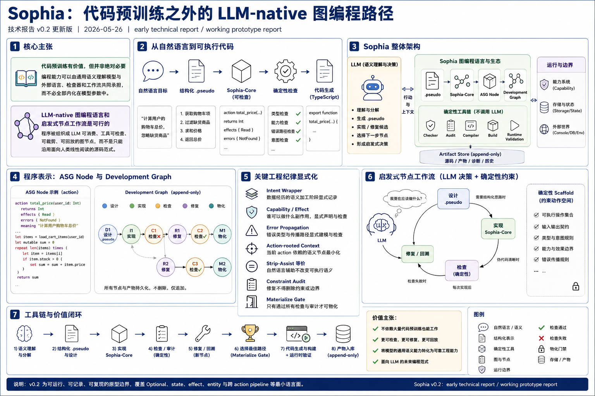

# Sophia：代码预训练之外的 LLM-native 图编程路径（v0.3）

**技术报告 v0.3 版**  
**日期：2026-05-28**  
**状态：early technical report / working prototype report**

---

## 摘要

当前主流 AI 编程路径依赖大量代码库预训练。这是一条快速、高效、已经被实践证明很有价值的路径：模型通过吸收海量代码，内化语法、库惯例、项目结构、调试模式和常见工程决策。但捷径不等于唯一路径，也不一定是长期最优路径。Sophia 探索的是：如果不把“编程能力”主要理解为模型参数中内化的代码分布，而是把它拆成语义理解、程序表示、确定性检查、上下文裁剪和启发式节点工作流，是否存在另一条让 LLM 掌握编程的路线？

本文主张两点。第一，代码预训练有价值，但并非绝对必须。一个具备较强通用语义理解能力、但代码预训练较弱的模型，可以在合适的外部编程基底和工作流中完成有用的自动编程任务。第二，传统人类编程语言范式不是 LLM 编程的天然终点；一种更适合 LLM 理解和操作的图编程语言，以及与之配套的启发式节点工作流，是可行的。

Sophia 是这一主张的原型实现。它把程序组织为形式化 ASG node 和 append-only development graph，而不是主要组织为面向人类线性阅读的源码文件；它把自然语言目标下沉为结构化 `.pseudo`，再下沉为确定性可检查的 Sophia-Core；它把类型、intent wrapper、capability/effect、error propagation、action-rooted context、strip-assist 等价、constraint audit 和 materialize gate 外部化为机器可检查 artifact。LLM 负责语义理解、任务分解、结构化表达、候选源码生成和启发式节点选择；checker、compiler、audit、build 和 runtime validation 才是正确性裁判。

v0.3 的意义不是证明 Sophia 在 benchmark 成功率上胜过 direct TypeScript。当前 benchmark 只说明这个替代路径已经可运行、可记录、可复现，并覆盖 `Optional`、`state`、effect、entity 和跨 action pipeline 等最小语言面。Sophia 的长期价值在于证明：编程能力不必完全来自代码预训练的内化，也可以部分来自为 LLM 重新设计的程序表示和外部化工程纪律。

---

## 1. 引言

当前最强的 LLM 可以从一句自然语言描述生成一个网页、一个交互式组件，甚至一个简单的 Three.js 小游戏。这类能力容易给人一种印象：编程能力必须高度内化在模型内部，模型越强，越能直接从目标展开传统代码。

这种印象有坚实的现实基础。大量代码库预训练是当前最快、最高效的 AI 编程路径：模型通过吸收海量 TypeScript、Python、Java、README、issue 和 patch，内化了语法、库惯例、项目结构、常见错误、测试模式和修复套路。Sophia 不否认这一路线的价值。相反，代码预训练已经证明自己是一条强大的捷径。

但捷径未必是唯一路径，也未必是长期唯一合理的路径。代码预训练让模型学习的是“人类如何在为人类设计的语言和工具中编程”。这隐含了一个历史前提：现有编程语言、源码组织和工程流程是编程能力的天然基底。Sophia 关注的是另一个问题：

> 如果编程主体是 LLM，我们是否应该继续把人类语言范式当作唯一基底？或者，是否可以设计一种更适合 LLM 理解和操作的图编程语言，让通用语义模型不必先大量内化传统代码库，也能通过外部工具链获得编程能力？

这个问题可以用“聪明实习生”类比理解。一个没有编程经验但足够聪明、理解力足够强的人，并不会因为没背过一个大型代码库就完全不能工作。如果给他清晰的任务拆解、伪代码、模板、编译器、类型检查、测试反馈、错误诊断、权限边界和版本管理，他可以逐步完成真实任务。真正决定他能否独立工作的，不只是脑中预先记住多少代码模式，也包括外部环境是否把任务分解、检查、反馈和回溯做得足够好。

Sophia 把这个类比推向 LLM 编程：代码预训练对应“已经看过大量代码的熟练工程师”；Sophia 探索的是“强语义但弱代码模型”能否在外部编程外骨骼帮助下工作。这里的外骨骼不是普通 prompt wrapper，而是一种 LLM-native graph programming substrate：程序被组织为形式化 ASG node 和 append-only development graph；自然语言目标先下沉为结构化 `.pseudo`，再下沉为可检查的 Sophia-Core；LLM 在图上进行设计、实现、修复、回退、选择和物化；确定性 checker、audit、compiler 和 runtime validation 负责裁判。

本文因此主张两点：

1. **代码预训练有价值，但并非绝对必要。** 编程能力的一部分可以由通用语义理解模型与外部语言、检查器和工作流共同承担，而不必全部内化在模型参数中。
2. **LLM-native 图编程语言和启发式节点工作流是可行的。** 程序可以被组织成 LLM 可消费、工具可检查、可裁剪、可回放的图节点，而不是只能沿用面向人类线性阅读的源码范式。

这也说明 Sophia 不应被理解为“一个框架比直接写 TypeScript 成功率更高”。如果主张只剩 benchmark 胜负，那么 direct TypeScript baseline 可以加入 typecheck loop、test feedback、retry、scaffold 和 prompt discipline 来追平许多小任务。Sophia 的价值不在于多过几个算法题，而在于证明：代码预训练之外，存在一套更适合 LLM 的程序表示和节点工作流，能把模型的通用语义能力转化为可检查、可修复、可回放的编程能力。

本文贡献如下：

1. 提出代码预训练之外的 LLM 编程问题设定：代码预训练是有效捷径，但编程能力不必完全由模型参数内化。
2. 提出 Sophia，一种 LLM-native 图编程语言和启发式节点工作流，把程序组织为 ASG node、`.pseudo`、Sophia-Core 和 development graph。
3. 给出 v0.3 原型实现，引入目标图工作流、评估协议（L1–L5）与场景桥接。
4. 定义 v0.3 的评估协议与运行方式，结果暂留空，由运行记录统一维护。

## 2. 核心定位

Sophia 是代码预训练之外的编程路线原型。它试图区分两件事：

- **会写传统代码的流畅性**：来自代码语料中内化的语法、库和惯例；
- **完成编程任务的能力**：还包括需求理解、状态建模、边界保持、错误传播、能力控制、版本回溯和根据反馈修复。

第一类能力很适合通过代码预训练获得。第二类能力则可以部分外部化：通用语义模型承担理解、分解和局部表达；语言和工作流承担结构、边界、检查、回溯和修复门禁。

Sophia 因此不是：

- 不是为了让人类更舒服地手写代码的 DSL；
- 不是 prompt DSL；
- 不是自然语言编程；
- 不是又一个把 TypeScript 包起来的 coding agent；
- 也不是以“算法题成功率超过 direct-ts”为中心价值的框架。

为实现上述路线，Sophia 把 LLM 自动编程中最容易丢失、漂移或被错误修复的工程纪律变成形式结构：

- 数据经历过什么：intent wrapper；
- 谁允许做什么副作用：capability/effect；
- 当前 action 依赖哪些语义节点：action-rooted context；
- 错误路径是否声明和传播：error algebra 子集；
- 自然语言辅助是否改变程序：strip-assist 等价；
- 修复是否删除约束或边界：artifact diff / constraint audit；
- 失败路径是否可回放：append-only graph。

---

## 3. 设计原则

**LLM-native，而非 human-first。**  
Sophia 不追求人类手写简洁性、阅读舒适度或 IDE 惯例。语法、节点、诊断和上下文都优先服务 LLM 的局部语义恢复、自动修复、上下文裁剪和约束保持。

**自然语言辅助，不决定语义。**  
`meaning`、`purpose`、`.pseudo` 和 repair notes 可以帮助 LLM 理解，但不能改变 runtime 行为。可执行语义只来自 Formal Core。

**Formal Core 必须确定。**  
相同 `.sophia` 源码、编译器和 target 必须产生相同检查结果和 codegen artifact。编译器、checker、audit 和 build 不调用 LLM。

**所有边界显式化。**  
输入、输出、错误、副作用、能力、状态、storage intent 和 action call 必须出现在形式结构中，而不是存在于对话记忆或注释惯例中。

**图，而不是聊天记录。**  
Sophia 把设计、实现、检查、修复、审计、选择和物化保存为 append-only graph。失败节点不删除，修改产生新节点。

**启发式节点工作流，而非固定流水线。**  
LLM 不只是填 body，也负责在 development graph 中进行启发式节点选择：何时设计伪代码、何时实现、何时修复、何时回到设计、何时选择和物化。确定性 scaffold 只约束动作空间，不替代 LLM 的节点决策能力。

**特性准入以机器可证价值为准。**  
新语言特性只有在能减少 LLM 记忆/猜测负担、形成 ASG edge、支持确定性检查、改善 repair/materialize gate 时才应进入 Sophia-Core。仅让传统程序员更熟悉或更短的特性默认不进入。

---

## 4. 已实现边界（完整纳入）

本节纳入此前版本已实现的可测试原型边界，不是完整 Sophia。

已实现顶层 ASG node：

- `domain`
- `entity`
- `state`
- `storage`
- `error`
- `capability`
- `action`

已实现类型：

- `Unit`、`Bool`、`Int`、`Text`
- `to_text(Int)`
- `List<Int>`、`List<Text>`
- `Optional<T>`，包含 `Some(expr)` 和 `None`
- 已声明 entity / state 类型
- intent wrapper：`Raw`、`Parsed`、`Validated`、`Sanitized`、`Verified`、`Authorized`、`Persisted`、`Secret`、`Redacted`

已实现 body 子集：

- `let`、`let mutable`、`set`
- `return`、`raise`
- `if/else`
- `match`
- `repeat N times`
- `print`
- 完整 entity construction
- 直接 action-call expression

已实现确定性检查：

- 文件布局、每文件一个顶层 node、路径/name/kind 一致；
- 重复声明和支持类型检查；
- block-scoped local、禁止 shadow 可见变量、mutable reassignment；
- return type checking 和非 Unit action 的全路径 return/raise；
- entity construction 字段完整性和类型兼容；
- action-call input、effect、error propagation 和 recursion rejection；
- 最小 error algebra：声明 variant 并检查 `raise`；
- intent assignability、显式 `intent_conversion: true` action；
- Console boundary 和 DB.Write storage value boundary；
- capability allow/deny；
- unsupported syntax diagnostics。

已实现工具链：

- `.pseudo` 检查、outline、repair context 和 LLM-facing scaffold；
- design、implementation、repair 和 graph decision 的 Ollama 调用；
- action-rooted semantic context；
- append-only graph workflow；
- deterministic TypeScript backend；
- runtime input/output validation；
- hidden verifier benchmark runner；
- strip-assist TypeScript artifact 等价门禁；
- constraint audit 和 artifact diff gate。

最近状态文档记录的本地验证：

- `npm run typecheck` 通过；
- `npm test` 通过：35 个 test files，295 个 tests；
- `npx prettier --check "**/*.{md,json,yml,yaml}"` 通过。

---

## 5. v0.3 边界与新增

- 目标图工作流（Goal Graph Workflow）
  - 节点与操作：`ObjectiveNode`、`MilestoneNode`、`ChangeRequestNode`、`ImpactAnalysisNode`、`AcceptanceNode`，以及分解/接受/失效/重新拆解/阶段激活/变更记录/影响分析/变更接受/验收记录等操作。
  - Active context：`buildGoalContext` 计算当前有效目标、阶段、已接受变更、out-of-scope 与 regression constraints，输入到决策 prompt。
  - 材料化：目标图的演化轨迹可被完整回放与审计。
- 评估协议（L1–L5）
  - L1：线性纯函数任务（basic_pure）。
  - L2：单循环/列表/副作用（list/loop/effect）。
  - L3：分支/match/optional/state，以及 orchestration/pipeline 的纯任务。
  - L4：目标/流程语义转换为单任务契约（goal_workflow_translation）。
  - L5：变更应用类单任务契约（change_application）。
- 场景语义到单任务契约的桥接
  - 将 L4/L5 的 workflow 场景（scenario.json）对应的关键语义，转化为统一套件下的基准任务（task.json），避免分裂统计口径。

---
## 6. `.pseudo` 与 `.sophia` 的边界

Sophia 的两阶段流程不是为了制造一个更容易赢 benchmark 的 wrapper，而是为了把 LLM 的语义设计与形式实现分开。

`.pseudo` 是结构化伪代码。它必须写清任务意图、输入输出语义、算法步骤、循环次数、分支条件、状态更新、副作用意图、禁止事项和验收条件。它不承担完整类型系统、formal effect、capability、error algebra、文件路径或 scaffold contract。

`.sophia` 是唯一可编译源码。它必须把 `.pseudo` 的语义下沉为 Formal Core：类型、action、capability、effects、errors、body 和 ASG edges。

关键边界：

- `.pseudo` 不可执行、不可编译；
- `.pseudo -> .sophia` 是 LLM-assisted implementation，不是编译；
- `.sophia` 与 `.pseudo` 不一致时，以 `.sophia` 为程序语义；
- `.pseudo` 可用于 audit、repair 和追溯，但不能决定 runtime；
- implementation 阶段不接收 validation-only hidden expected output。

一个重要修正是移除 design 阶段的 formal syntax 污染。伪代码生成阶段不再接收 Sophia type/effect syntax、source paths、implementation labels、formal scaffold 或 `program { ... }` 风格伪 DSL。implementation 阶段可以接收 deterministic structure plan，但该 plan 只固定显式 contract、路径、命名、state/effect 等结构，不生成业务算法。

---

## 7. ASG 与 action-rooted context

Sophia 的语义模型是 ASG。当前用文件系统实现：一个顶层语义节点一个 `.sophia` 文件，domain-first 布局。

这种设计不是为了代码整洁，而是为了让工具可以从 action root 计算确定性语义邻域：

- 当前 action；
- input/output 使用的 entity/state；
- bound capability；
- declared effects；
- called actions；
- propagated errors；
- storage / intent boundary；
- relevant diagnostics。

LLM 不需要读取整个仓库，也不需要从巨大源码文件中猜哪些片段相关。上下文闭包由工具生成，可排序、可复现、可测试。

未来 `task` 顶层节点会把 closure root 从 action 扩展到 task；当前仅承诺 action-rooted context。

---

## 8. 外部化编程纪律示例：Intent Types

Sophia 的主张不是只靠某一个类型特性成立；Intent Types 是“把编程能力外部化”的一个代表性例子。它展示了 Sophia 如何把模型容易忘记的语义历史，从对话记忆或命名约定中拿出来，变成机器可检查的语言事实。

已实现的 intent 边界包括：

- entity field、action input/output、storage value 可以使用 intent wrapper；
- `Raw<T>`、`Secret<T>` 等不能隐式赋给 `Sanitized<T>`、`Redacted<T>` 等更强 intent；
- 只有显式 `intent_conversion: true` action 可以执行 intent transition；
- action call 时 intent 类型必须匹配；
- Raw/Secret 不能直接输出到 Console boundary；
- DB.Write storage value 必须匹配 storage 声明的 intent；
- capability `deny` 覆盖 `allow`。

这类能力的论证方式不是“跑出来比 direct-ts 多过几题”，而是构造 accept/reject 矩阵：

| 候选错误类别                               | TypeScript + tsc/test 可能状态 | Sophia 目标状态 |
| ------------------------------------------ | ------------------------------ | --------------- |
| Raw input 直接写入 Sanitized storage       | 接受                           | 静态拒绝        |
| Secret 未 Redacted 直接 Console 输出       | 接受                           | 静态拒绝        |
| 跳过 authorization / validation conversion | 接受                           | 静态拒绝        |
| storage value intent mismatch              | 接受                           | 静态拒绝        |
| capability deny 后仍使用 effect            | 接受                           | 静态拒绝        |
| called action error 未传播                 | 接受                           | 静态拒绝        |

这类 accept/reject 矩阵不是 Sophia 的全部主张，但它是证明“图语言 + 外部化纪律”具有独立价值的一类关键实验：baseline 可以通过更多代码预训练学会避免这些错误，但 Sophia 试图把它们直接变成语言和 checker 的结构。

---

## 9. Capability、Effect 与 Error

Sophia 的另一个核心方向是把 ambient authority 变成显式能力边界。

传统 TypeScript 中，一个函数只要 runtime 环境允许，就可以访问 Console、Date、fetch、DB client、filesystem 或 secret source。类型签名通常不表达这些能力，lint 和测试也难以保证修复时不会偷偷引入新的副作用。

Sophia 要求：

- action 声明 effects；
- action 绑定 capability；
- effect 必须被 capability allow；
- capability deny 生效并覆盖 allow；
- action call 传播被调用 action 的 effects；
- `raise` 必须引用已声明 error variant；
- 调用会 raise 的 action 时 caller 必须声明 propagated error。

这些机制的价值不是让 toy benchmark 返回正确数字，而是在无人监管 repair 中防止 LLM 为了通过局部问题引入越权副作用、删除错误路径或弱化边界。

---

## 10. Strip-Assist 等价

Sophia 允许自然语言辅助字段，因为 LLM 需要它们恢复语义。但自然语言不能成为程序语义。

因此，Sophia 的关键可信度属性是 strip-assist 等价：

> 移除 Semantic Assist 字段后，Formal Core 和生成 artifact 必须不变。

当前已实现 TypeScript artifact 等价门禁。更完整的未来形态应比较 IR hash 和 codegen artifact hash。这个机制把“自然语言只是辅助”从口号变成机器可检查属性，也是 Sophia 区分 prompt DSL / 注释驱动编程的重要边界。

---

## 11. Development Graph

Sophia 不把无人监管编程过程保存在聊天历史里，而是保存为 append-only Development Graph。

当前节点包括：

- GoalNode；
- DecisionNode；
- PseudocodeNode；
- PseudocodeCheckNode；
- CodeNode；
- CheckResultNode；
- AuditNode；
- ArtifactDiffNode；
- SelectionNode；
- MaterializeNode；
- RawLlmNode。

节点不可变，失败路径保留。repair、revise、select、materialize 都生成新节点或边。这样做的价值在于：

- 失败可复盘；
- 修复不可偷偷覆盖历史；
- LLM 决策可分析；
- materialize gate 可强制检查；
- 后续 edit transition / evolution boundary 可以建立在已有 graph 上。

长期非 toy 路线不是“从零合成更多函数”，而是让 graph 支持真实项目的多轮演化：字段新增、intent 收紧、error 扩展、action 拆分、跨 domain 依赖升级，以及 semantic drift 检测。这是第二个核心主张的自然延伸：如果语言本身是图结构，开发过程也应是图上的启发式搜索、修复和演化，而不是一次性文本生成。

---

## 12. 基准与评估（本报告暂不列结果）

- 目的：证明原型“可运行、可记录、可复现”，并覆盖最小语言面与 v0.3 的 workflow 桥接能力；不是证明“基准胜过 direct-ts”。
- 任务分组：L1–L5（见第 5 节）。
- 运行方式：
  - 单任务：`experiment run --task <path/to/task.json> --model <model> --mode <full|direct-ts>`
  - 套件串行：`experiment run-suite --suite benchmarks --model <model> --mode <full|direct-ts>`
  - 注：workflow 场景语义以单任务契约纳入统一统计口径。
- 结果：留空（待运行记录统一填充 JSONL 与 summary）。

---

## 13. 相关工作定位

**Coding agents。**  
SWE-agent、Aider 等系统改进 LLM 使用现有语言和工具的方式。Sophia 的互补假设是：不仅 agent-computer interface 需要为 LLM 设计，编程语言本身也可能需要为 LLM 自动编程设计。

**代码预训练路径。**  
主流 code LLM 证明了大规模代码预训练可以快速获得强编程能力。Sophia 不否认这一路径，而是提出互补路线：让模型通过通用语义能力与外部化程序结构协作，减少对传统代码库分布内化的绝对依赖。

**Flow engineering。**  
多阶段生成、测试反馈、repair loop 已是代码生成系统常见工程实践。Sophia 借鉴这些实践，但其差异不在“也有 loop”，而在 loop 操作的是有类型、可检查、可审计的 Sophia-Core artifact。

**Program synthesis / sketching / typed holes。**  
Sophia 与 sketching 有亲缘关系：先固定语义容器，再让模型填充受限局部 body。但 Sophia 不做完整形式搜索，也不要求完整证明；它以工程化 checker、audit 和 graph gate 支撑 LLM 自动编程。

**Effect systems / refinement / information-flow types。**  
Sophia 的 intent、capability 和 effect 方向接近这些传统类型系统思想，但目标是 LLM-native workflow：让模型更少依赖记忆和自律，让工具能在无人监管下拒绝危险候选。

**LLM structured output frameworks。**  
LMQL、Guidance、DSPy 等关注如何组织或约束 LLM 调用。Sophia 不是写 LLM 应用的语言，而是让 LLM 写程序时使用的编程基底。

---

## 14. 局限

当前 v0.3 仍然是 early prototype：

- benchmark 规模小，且不应作为主价值证明；
- `task`、`transition`、Evolution Boundary、Semantic Identity 和跨 domain library protocol 尚未实现；
- body-level storage operation 和 `DB.Read` runtime API 尚未实现；
- error handle / error exhaustiveness 尚未实现；
- intent wrapper 在 TypeScript runtime shape 中仍是擦除表示；
- 当前 intent 检查还是局部 checker 能力，跨 domain / library 数据流追踪尚未完成；
- strip-assist 目前是 TypeScript artifact 等价，还没有独立 IR hash；
- graph 主要覆盖 synthesis / repair，edit transition 尚未成为一等动作。

这些限制也说明下一步工作不应是继续堆算法 benchmark，而应围绕非 toy 判据推进。

---

## 15. 后续路线

**S1：Intent safety adversarial suite。**  
把 现有的 intent 安全回归样例中的 Raw/Secret/DB.Write/Console/capability/error propagation fixture 转成 adversarial benchmark。目标不是 Sophia 运行成功，而是 Sophia 静态拒绝不安全 candidate，同时 TypeScript + typecheck + 非对抗性测试 baseline 会接受。

**S2：Edit transitions 与 Evolution Boundary。**  
把编辑作为 graph 一等节点，支持字段新增、intent 收紧、error 扩展、action 拆分等多轮演化。目标是在无人审查下拒绝未经授权的 semantic drift。

**S3：跨 domain / library boundary。**  
实现最小 `sophia.lock`、跨 domain boundary、publish/consume 和 strip-assist formal-only 视图。目标是证明 Sophia 能维护多 domain 项目，而不是只从零合成 toy task。

**S4：更强 strip-assist 等价。**  
引入 IR hash 或 formal-only hash，确保自然语言辅助字段不会改变编译语义。

---

## 16. 结论

Sophia v0.3 延续并完整覆盖 v0.2 的核心主张：编程能力不必完全由代码预训练内化，亦可由 LLM 与外部化的图语言/工作流协作完成。v0.3 的目标图工作流把“目标—阶段—变更—验收”的真实开发节律纳入可回放与可审计的语义结构；评估协议（L1–L5）与场景桥接保证评估口径一致。后续工作将围绕对抗式安全验证、编辑演化边界与跨域语义一致性推进，把“语言与工作流的机器可证价值”做实。
