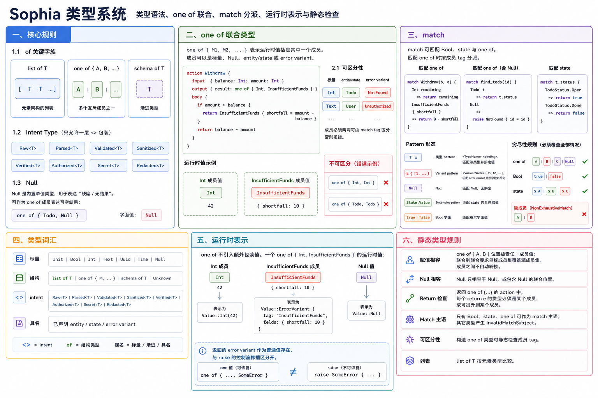

# Sophia 类型系统



本文档描述 Sophia 当前类型系统的截面规则：类型语法、`one of` 联合、`match` 分派、运行时表示与静态检查。

---

## 一、核心规则

`Wrapper<T>` 形式专属于 Intent Type。所有结构类型使用 `of` 关键字族表达。

### 1.1 `of` 关键字族

| 类型 | 语法 | 含义 |
| --- | --- | --- |
| 列表 | `list of T` | 元素同构的列表 |
| 联合 | `one of { A, B, ... }` | 多个互斥成员之一 |
| 渐进 | `schema of T` | 渐进类型 |

`Unknown` 是裸关键字，无参数。

### 1.2 Intent Type

Intent 包装使用 `<>` 形式，且只允许一层：

```
Raw<T> | Parsed<T> | Validated<T> | Sanitized<T>
Verified<T> | Authorized<T> | Secret<T> | Redacted<T>
```

Intent 类型按包装名与内部类型严格相等比较。

### 1.3 `Null`

`Null` 是内置单值类型，用于表达“缺席/无结果”。它是裸类型关键字，可出现在任意类型位置；典型用法是作为
`one of` 成员表达可空结果：

```sophia
one of { Todo, Null }
```

`Null` 的字面值写作 `Null`。

---

## 二、`one of` 联合类型

`one of { M1, M2, ... }` 表示运行时值恰是其中一个成员。成员可以是标量、`Null`、已声明 entity/state、
或 error variant。

```sophia
action Withdraw {
  input  { balance: Int; amount: Int }
  output { result: one of { Int, InsufficientFunds } }
  body {
    if amount > balance {
      return InsufficientFunds { shortfall = amount - balance }
    }
    return balance - amount
  }
}
```

- 成员直接构造和返回：成功值、entity、state、`Null`、error variant 都直接作为联合成员出现。
- 可恢复失败使用 `one of {..., SomeError}` 作为返回值，调用方必须显式处理。
- `raise` 是不可恢复、自动向上传播的控制流通道，由 `errors {}` 约束；返回 error variant 与 `raise`
  是正交机制。

### 2.1 可区分性

`one of` 成员必须两两可由 match tag 区分：

- 标量按类型名区分，如 `Int`、`Bool`、`Text`；
- entity/state 按声明名区分；
- error variant 按 variant 名区分；
- `Null` 是唯一字面。

因此 `one of { Int, Text }` 可区分；`one of { Int, Int }`、`one of { Todo, Todo }` 不可区分，checker
应报错。

---

## 三、`match`

`match` 可匹配 `Bool`、state 与 `one of`。匹配 `one of` 时按成员 tag 分派。

```sophia
match Withdraw(b, a) {
  Int remaining                   => return remaining
  InsufficientFunds { shortfall } => return 0 - shortfall
}
```

```sophia
match find_todo(id) {
  Todo t => return t.status
  Null   => raise NotFound { id = id }
}
```

Pattern 形态：

- 类型 pattern：`<TypeName> <binding>`，匹配该类型成员并绑定值。
- Variant pattern：`<VariantName> { f1, f2, ... }`，匹配 error variant 并按字段名绑定。
- `Null`：匹配 `Null` 成员，无绑定。
- State-value pattern：`StateName.Value`，匹配 state 的具体取值。
- Bool 字面：`true` / `false`。

穷尽性规则：

- `match` 一个 `one of` 必须覆盖全部成员；
- `match` 一个 `Bool` 必须覆盖 `true` 与 `false`；
- `match` 一个 state 必须覆盖全部取值；
- `_` 通配 pattern 不存在；缺成员产生 `NonExhaustiveMatch` 诊断。

---

## 四、类型词汇

```
标量：     Unit | Bool | Int | Text | Uuid | Time | Null
结构：     list of T | one of { M, ... } | schema of T | Unknown
intent：   Raw<T> | Parsed<T> | Validated<T> | Sanitized<T> | Verified<T>
           | Authorized<T> | Secret<T> | Redacted<T>
具名：     已声明 entity / state / error variant
```

`<>` 表示 intent，`of` 表示结构类型，裸名表示标量、渐进占位或具名类型。

---

## 五、运行时表示

`one of` 不引入额外包装值。一个 `one of { Int, InsufficientFunds }` 的运行时值就是
`Value::Int(...)` 或携带 variant tag 与字段的错误值。`match` 根据值的实际 tag 分派。

`Null` 表示为 `Value::Null`。返回的 error variant 作为普通值存在，与 `raise` 的控制流传播区分开。

---

## 六、静态类型规则

- 赋值相容：`one of { A, B }` 位置接受任一成员值；联合到联合要求目标成员集覆盖源成员集。成员之间不自动转换。
- `Null` 只相容于 `Null`，或包含 `Null` 的联合位置。
- Return 检查：返回 `one of {...}` 的 action 中，每个 `return e` 的类型必须是某个成员，或可提升到某个成员。
- Match 主语：只有 `Bool`、state、`one of` 可作为 `match` 主语；其它类型产生 `InvalidMatchSubject`。
- 可区分性：构造 `one of` 类型时静态检查成员 tag。
- 列表：`list of T` 按元素类型比较。
