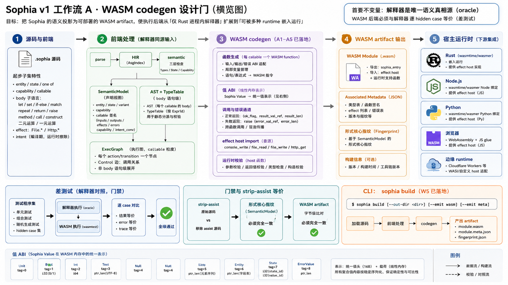

# Sophia v1 工作流 A · WASM codegen 设计评审



> **状态：设计评审已完成 + 实现 W1–W5 全部落地（A1–A5 达成，2026-05-31）。** 本文档定义 v1 **工作流 A
> （WASM codegen）**的实现计划与落地记录：把 Sophia 的语义投影为可部署的 WASM artifact，使执行后端从
> 「仅 Rust 进程内解释器」扩展到「可被 Node / Python / 浏览器 / 边缘 runtime 嵌入运行」。它对应
> `dev_checklist_v1.md` 工作流 A 的 A1–A6、`language_implementation.md` §12.2 的 emit 形态、
> `engineering_architecture.md` §14.2。**A1–A5 已落地**（契约冻结 / emit / 差测试 / effect host import /
> artifact 门禁 + `sophia build`）。后续又补齐 registry-aware build、动态 host import、ValueWire provider
> ABI、非浏览器 WASM runner、build bundle manifest，以及 `sophia run/smoke --backend wasm` 直接执行 build
> artifact。**A6（增量查询，与 codegen 解耦）待独立设计评审**。
>
> **三段式纪律（用户既定方法论）**：本文是 codegen 的**设计评审**——先定输入契约 / 值 ABI / 函数
> ABI / effect ABI / 工具链 / 差测试与门禁落点，确认后再分阶段实现。§十的七个决策点已全部确认采纳，
> 按 §九 W1→W5 推进。本文**不含实现代码**。
>
> **首要不变量（贯穿全文）**：**解释器是唯一语义真相源（oracle）**。WASM 后端的任何输出都必须与
> 解释器逐 hidden case **等价**（差测试）；codegen **不得反向要求改 IR / AST 形状**
> （`language_implementation.md` §12.1）。引入第二条语义真相源是被禁止的。
>
> **生产化边界**：当前支持项目根内的 build artifact 运行：`sophia build .` 产出
> `sophia-runs/build/program.wasm` + `program.sophia-build.json` + 三方 host asset，`sophia run <Action>
> --root . --backend wasm` / `sophia smoke --root . --action <Action> --backend wasm` 校验 manifest 后执行。
> 当前不支持任意 `.wasm` 路径执行，也不支持脱离项目源码 / 当前 registry 的离线 bundle loader；这些列入
> §十一的未来扩展方向。

---

## 一、目标与边界

### 1.1 交付什么（v1 完成判据 1 + 3）

- **判据 1**：起步子集程序可经 WASM 后端编译，且与解释器结果**逐 hidden case 等价**（差测试全绿）。
- **判据 3**：strip-assist 等价在 **artifact 层**成立——移除全部 Semantic Assist 字段后，emit 的
  WASM 字节序列**逐字节不变**（扩展现有形式核心指纹门禁，见 `language_design.md` §5.1）。

落地后 `sophia build` 从空操作变为真正 emit WASM artifact（`engineering_architecture.md` §9.1 命令表）
——**已落地（W5）**。

### 1.2 不做什么（边界）

- **不引入 async / 并发 / await / 线程**：Sophia 当前语言 / runtime 语义是同步确定性执行，WASM codegen
  只需复刻这套同步语义。WASM 异步机制的演进可作为 v4/v5 级远期输入观察，但不是本文或 v1/v2 的设计目标。
- **不引入第二种 codegen target**：native（cranelift / LLVM）、具名语言 emit（TS / Python）推迟到
  v2+ 出现明确部署需求（`engineering_architecture.md` §14.3 / §第十二节末）。
- **不发明并行的 body IR**：见 §三的输入契约决策——codegen 与解释器一样从 AST + 语义元信息消费
  body，不另造一层 lowered body IR（避免第二条真相源 + 过度设计）。
- **不引入重型外部工具链进 `cargo test`**：差测试的 WASM 执行器须是普通 cargo 依赖、纯 Rust、
  确定性（见 §七工具链决策）。真实部署 host（wasmtime / 浏览器）是 artifact 的下游消费者，不进门禁。
- **不在 codegen 内调用 LLM**：`core` / `tools` 保持纯确定性（铁律，`language_implementation.md` §2）。

---

## 二、现状盘点（codegen 的起点）

落地 codegen 前先钉清「解释器到底执行了什么」——这是 WASM 必须复刻的语义。

### 2.1 执行链路

```
parse(.sophia) → HIR(AsgIndex) → semantic(SemanticModel + 三层检查) → exec-ir(ExecGraph) → 解释器 run
```

- **`SemanticModel`**（`core/semantic/src/model.rs`）：按名索引的**声明视图**——entity 字段类型、
  state 值集、error variant 字段、capability allow/deny、callable 签名（inputs/outputs/effects/errors/
  capability/intent_conversion）。这是 codegen 的主输入契约。
- **`ExecGraph`**（`core/exec-ir`）：**callable 粒度**的执行图——每个 action/transition 一个节点，
  body 中对其它 callable 的调用是 `Control` 边。**body 语句级执行不在图上展开**（设计如此）。
- **解释器**（`runtime/src/interp.rs`）：消费 AST body + `SemanticModel`，对**运行时 `Value`** 直接
  求值。Execution Graph 用于校验调用（节点存在 + 调用边物化）与 trace 投影。

### 2.2 运行时值模型（WASM 必须等价复刻）

`runtime::Value`（`runtime/src/value.rs`）：

| 值 | 内容 | 备注 |
| --- | --- | --- |
| `Unit` | — | |
| `Bool(bool)` | | |
| `Int(i64)` | 64 位有符号 | |
| `Text(String)` | UTF-8 | `.length` = `chars().count()`（Unicode 标量数，**非字节数**） |
| `Null` | — | `one of` 的 Null 成员 |
| `List(Vec<Value>)` | 同构元素 | `.append(item)` |
| `ErrorValue { variant, fields }` | 被**返回**的 error 成员（`one of` 失败成员） | 区别于 `raise` |
| `Entity { name, fields }` | 字段名 → 值（`BTreeMap`，稳定序） | |
| `State { state, value }` | 标记联合（state 名 + value 名） | |

**关键事实**：**intent 是编译期静态属性，运行时被擦除**（`Raw<Text>` / `Sanitized<Text>` / `Text` 的
运行时值都是 `Text`）。故 WASM 值表示**不带 intent 标签**——与解释器一致。

### 2.3 body 子语言（WASM 必须复刻的执行语义）

- **语句**：`let` / `set` / `return` / `raise` / `if`-`else`（`if` 必有 `else`）/ `match`（穷尽、禁
  `_`）/ `repeat`（有界循环）/ `print`（Console.Write）/ 表达式语句。
- **表达式**：字面量（Str / Int / Bool / Null）/ `Ident` / `List` / `Field`（含伪字段
  `Text.length`、`StateName.Value`）/ `MethodCall`（`list.append`、特殊根 `File.*`/`Http.*`）/
  `Call`（跨 callable + 内置 `to_text`）/ `Construct`（entity / error variant / transition 调用）/
  `Not` / `Neg` / `Binary`。
- **二元算子**（`eval_binary`）：`And`/`Or`（短路语义见解释器实现）、`Eq`/`Ne`/`Lt`/`Le`/`Gt`/`Ge`、
  `Add`（Int+Int / Text+Text 拼接 / List 追加）、`Sub`/`Mul`、一元 `Neg`。**无除法 / 取模**。
- **结局**：每次 callable 执行产出 `Outcome::Returned(Value)` 或 `Outcome::Raised(RaisedError)`；
  `raise` 跨调用边界经错误通道冒泡，在调用边界物化。
- **runtime validation**：调用前校验实参数量 + 类型（`check_value`），返回后校验 output 类型。

### 2.4 effect 委派

副作用经 `HostRegistry` 委派：标准库 native/mock host 与三方 `host.wasm` provider 都注册为
`(family, op) -> HostFn`。Console 是内置 host import；File/Http 来自当前 `LibraryRegistry` 的标准库
operation；三方库由 discovery 注册 provider。WASM 中这些都是 host import（见 §六），codegen 只消费
registry，不硬编码具体库分支。

### 2.5 strip-assist 现状

`tools/check/src/strip_assist.rs`：对同一批源码解析原始 + 移除 assist 两份，比对 `SemanticModel`
形式核心指纹（`formal_fingerprint`）+ 语义三层诊断。WASM artifact 层在此之上加**字节级比对**。

---

## 三、输入契约（A1：冻结，不改 IR 形状）

> A1 要求「冻结并文档化 v0 的 Semantic IR / Execution Graph IR 作为 codegen 输入契约」。F1（类型统一）
> 与 F2/S1/S2 + File 库都已落地，IR 形态已稳定（含 `OneOf` / `Null` / `ErrorValue` / `File`·`Http`
> effect），现在可一次冻准。
>
> **A1 已落地（W1，2026-05-31）**：契约**代码化冻结**为 `tools/codegen` 的 `CodegenInput`
> （`tools/codegen/src/contract.rs`）——单一只读入口，捆绑下述三输入，由 `CodegenInput::new(model,
> asts)` 内部用 `ExecGraph::from_model` 构图（与解释器 `Interpreter::new` **同源**，保证两后端看到
> 同一张执行图）。W1 契约冻结测试（`tools/codegen/tests/contract.rs`）守护「图与模型 callable 一致 +
> emit 诚实占位」。

**codegen 消费、不改写**以下三者：

1. **`SemanticModel`**（声明视图）——entity/state/variant/capability/callable 签名。codegen 据此生成
   函数签名、类型投影、runtime validation 的 host 描述。
2. **`ExecGraph`**（callable 粒度执行图）——决定生成哪些 WASM function（每节点一个）、调用关系
   （`Control` 边 → WASM `call`）。
3. **AST body + `TypeTable`**（语句级）——codegen 像解释器一样遍历 body AST 生成函数体指令；类型推导
   结果（`TypeTable`，按 `ExprId`）在需要静态分派时查询（如 `Add` 的 Int vs Text）。

### 决策点 ①：body 是否需要一层新的 lowered IR？

- **方案 A（采纳建议）**：**不引入新 body IR**，codegen 直接遍历 AST body（与解释器同源）。理由：
  ① 起步子集 body 极简（无闭包 / 无复杂控制流），AST → WASM 指令是直接的结构归纳；② 引入第二层
  body IR 会形成「解释器读 AST、codegen 读新 IR」的**双真相源**风险，违反单一路线；③ 解释器已经是
  「AST → 行为」的可执行规范，codegen 只需对同一 AST 做「AST → 指令」的平行投影，差测试兜底等价。
- **方案 B（否决）**：新建 `core/body-ir`（lowered 三地址 / SSA）。否决：YAGNI——起步子集不需要；
  且与「Execution Graph IR 不在 body 层展开」的既有设计一致（body 由解释器消费 AST，不下沉）。

> 若未来 body 子语言显著复杂化（如引入更丰富控制流 / 优化需求），完成设计评审后再评估 body IR。当前不做。

### 决策点 ②：值在 WASM 里怎么表示（值 ABI）？见 §四。

---

## 四、值 ABI：Sophia `Value` 在 WASM 线性内存中的表示

这是 codegen 最核心的设计。WASM MVP 只有 4 个数值类型（i32/i64/f32/f64）+ 线性内存，没有 GC、没有
聚合类型值。Sophia 的 `Value` 是带标签的递归结构（含 String / List / Entity / 嵌套）。

### 决策点 ③：值表示方案

- **方案 A（采纳建议）——标签化堆值 + i32 句柄（handle）**：
  - 所有 Sophia 值在**线性内存的 bump 区**分配，统一表示为 `[tag: i32][payload...]`；WASM 栈 /
    局部变量 / 函数参数 / 返回值一律传 **i32 句柄**（指向该值在内存中的偏移）。
  - tag 枚举与 `Value` 变体一一对应：`Unit=0, Bool=1, Int=2, Text=3, Null=4, List=5, ErrorValue=6,
    Entity=7, State=8`。
  - payload 布局（确定性，决定 strip-assist 字节稳定性）：
    - `Bool`：`[tag][i32 0/1]`；`Int`：`[tag][i64]`；`Null`/`Unit`：`[tag]`；
    - `Text`：`[tag][len:i32][utf8 bytes...]`；
    - `List`：`[tag][len:i32][handle...]`（元素句柄数组）；
    - `Entity`：`[tag][name_ptr:i32][nfields:i32][(key_ptr:i32, val_handle:i32)...]`（字段按字段名
      字典序——与 `BTreeMap` 一致，保证确定）；
    - `ErrorValue`：`[tag][variant_ptr:i32][nfields:i32][(key_ptr,val_handle)...]`（同序）；
    - `State`：`[tag][state_ptr:i32][value_ptr:i32]`。
  - 字符串 / 名字字面量进 **data section**（常量池），运行期不可变；动态字符串（`Text+Text`）在 bump
    区新建。
  - **内存管理：bump-only，不回收**。一次 `run` 调用内分配的值不释放，调用结束整块重置（起步子集
    无长生命周期 / 无循环外分配压力，repeat 有界）。**不引入 GC / 引用计数**（YAGNI；与无并发一致）。
- **方案 B（否决）——WASM GC / reference types**：否决：① WASM GC 提案虽进 baseline，但工具链 + host
  支持仍不均匀，违反「覆盖面广」初衷；② 起步子集值生命周期简单，bump 足矣，引入 GC 是过度设计。
- **方案 C（否决）——值序列化为 JSON 字符串在边界传递**：否决：丢失类型结构、与解释器语义易漂移、
  慢；只在 host 边界（§六）用规约编码。

> **等价红线**：`Text.length` 必须是 **Unicode 标量计数**（`chars().count()`），不是 UTF-8 字节数——
> 内存里存字节但 length 指令要走标量计数（host import 或生成的计数循环）。`Int` 全程 i64。

### 决策点 ④：错误结局（raise vs 返回的 ErrorValue）怎么编码？

- `return one of {...}` 的失败成员 `ErrorValue` 是**普通返回值**（tag=6 的堆值，照常返回句柄）。
- `raise` 是**控制流中断**，跨调用边界冒泡。WASM 没有异常（MVP）。**采纳**：每个 callable 的 WASM
  函数返回 `i32 句柄`，并用一个**带内 out-param / 双返回约定**区分 returned vs raised：
  - 方案：函数签名 `(params...) -> i32`，约定返回句柄指向一个 **Outcome 包装值**
    `[kind: i32 (0=Returned,1=Raised)][value_handle: i32]`；调用方 `call` 后检查 kind，raised 则
    直接把同一 Outcome 继续上抛（不解包），returned 则取 value_handle 继续。
  - 这复刻解释器的 `Outcome` + 错误通道冒泡，且不需要 WASM 异常扩展。`raise` 在编译期已知必然终止
    路径，emit 为「构造 ErrorValue → 包成 Raised Outcome → return」。

---

## 五、函数 ABI 与 body 指令生成（A2：最小 emit）

### 5.1 模块结构

一个 `.sophia` 程序 emit 为**一个 WASM module**：

- **type section**：函数签名（起步子集统一为「i32 句柄入参 × N → i32 Outcome 句柄」）；entity / state /
  error 的结构不进 WASM type section（WASM 无对应聚合类型），而是进**生成的常量元信息表**（名字 /
  字段名进 data section，供值 ABI 与 host validation 引用）。
- **import section**：effect host 函数（§六）+ 必要的运行时 helper（见 §5.3 决策）。
- **function section + code section**：每个 `ExecGraph` 节点（action/transition）一个 function；body
  指令由 AST 遍历生成。
- **memory section**：单一线性内存（initial pages + bump 指针全局变量）。
- **export section**：每个 callable 导出（`run <Action>` 的入口），命名 `action_<Name>` /
  `transition_<Name>`；导出 bump 重置入口 + 内存。
- **data section**：字符串 / 名字常量池。

### 5.2 body → 指令（结构归纳，复刻解释器）

每个 AST 构造的指令生成与解释器的 `eval` / `exec_stmt` **一一对应**：

| AST | WASM 指令策略 |
| --- | --- |
| `let x = e` | eval e → 句柄存 WASM 局部 |
| `set x = e` | eval e → 覆写局部（HIR 已保证存在 + mutable） |
| `return e` | eval e → 包成 Returned Outcome → `return` |
| `raise V {..}` | 构造 ErrorValue → 包成 Raised Outcome → `return` |
| `if c {..} else {..}` | eval c → `if`/`else` 块（WASM 结构化控制流） |
| `match s { arms }` | eval s → 按 tag 链式 `block`/`br_if`（穷尽，最后一臂兜底）；绑定入局部 |
| `repeat n {..}` | eval n → `loop` + 计数器（`n.max(0)` 次）；body 内 return/raise 经块 `br` 提前退出 |
| `print e` | eval e → 转字符串句柄 → `call $console_write`（host import） |
| `Binary` / `Not` / `Neg` | 取整 i64 运算 / 比较 / 布尔；`Add` 按 `TypeTable` 静态分派 Int/Text/List |
| `Call f(args)` | eval args → `call $action_f` → 检查 Outcome.kind（raised 则上抛） |
| `MethodCall Family.Op` | eval args → `call` 当前 registry 派生的动态 host import；失败语义见 §六 |
| `Field` / `Construct` | 值 ABI 的字段读取 / 堆值构造 |

控制流用 WASM **结构化控制流**（`block`/`loop`/`if`/`br`/`br_if`），不用任意跳转——与起步子集
（无 goto）天然契合。

### 决策点 ⑤：运行时 helper（length / 字符串拼接 / 值相等 / 值构造）放哪？

- **方案 A（采纳建议）——生成进 module 自身（WASM 内的 runtime prelude 函数）**：把「值分配 /
  字符串拼接 / 结构相等比较 / Unicode 长度 / Outcome 包装」等公共操作 emit 为模块内的私有 WASM
  函数（一次性 prelude），body 指令 `call` 它们。**好处**：artifact 自包含、可被任何 host 运行、
  字节确定（strip-assist 友好）；**坏处**：prelude 字节固定开销。
- **方案 B（否决）——作为 host import 注入**：否决：把核心值语义（如相等比较）外置到 host 会让
  「artifact 行为依赖 host 实现」，削弱「WASM 是语义投影」的自洽性，且各 host 需各实现一份。
  **只有真正的 I/O（effect）才走 host import**（§六），纯值操作留在 module 内。

> 例外：`Text.length` 的 Unicode 标量计数若用纯 WASM 实现需 UTF-8 解码循环——可接受（prelude 函数）；
> 不外置给 host，保持值语义自包含。

---

## 六、effect ABI（A4：effect 经 host import）

effect 是 Sophia 与外部世界的唯一接口，天然映射为 **WASM host import**——这也是 capability 边界的
兑现处。当前实现已经从固定 `EffectHost` 方法集收敛为 registry 驱动的单一路径：解释器和 WASM runner 都
通过同一个 `HostRegistry` 调用 host operation。

### 6.1 import 接口（固定 import + registry 动态 import）

module 固定声明两个 `sophia_host` import：

| import | 签名 | 语义 |
| --- | --- | --- |
| `console_write(ptr:i32, len:i32)` | `Text` 字节片 | Console 输出 |
| `read_copy(dst:i32)` | 复制上一段 host 返回字节 | host 返回大对象的 copy-back 通道 |

除 Console 外，库 operation import 由当前 `LibraryRegistry` 派生，只生成程序实际引用到的 host operation：

| import 形态 | 签名 | 语义 |
| --- | --- | --- |
| `sophia_lib:<library>.<host_fn>` | `(args_ptr:i32, args_len:i32) -> i32` | 以 `ValueWire` 编码参数，返回值长度；调用方随后用 `read_copy` 取回返回字节 |

这一路径覆盖标准库和三方库：File/Http 是标准库 operation，不再是 codegen 内的特殊分支；三方
`host.wasm` provider 也注册为同一种 `HostFn`。capability allow/deny 仍由语义层检查，runner 侧只按
已检查过的 registry/operation 链接 import。

### 6.2 ValueWire 边界

host import 边界不暴露 WASM 内部堆值布局，而使用 `runtime::value_wire` 的稳定编码：

- `ArgsWire = argc:u32 + ValueWire*`。
- 当前支持 `Unit` / `Bool` / `Int` / `Text`；intent 在边界擦除，与解释器运行时值模型一致。
- runner import 回调解码参数，调用 `HostRegistry::call(family, op, args)`，把返回 `Value` 编码后暂存，
  由 `read_copy` 复制回 guest 内存。
- 类型不匹配、缺 import、provider trap、host 返回错误等都转成硬错误 / trap，**绝不伪造成功**。

### 6.3 host 侧实现（谁提供 import）

- **标准库 native/mock provider**：File/Http 等 operation 通过 Rust host function 注册进
  `HostRegistry`。确定性测试可注册 mock provider；CLI 真实运行注册 native provider。
- **三方 `host.wasm` provider**：provider 必须导出 `memory` / `sophia_alloc` / `sophia_read_copy` /
  `host_fn(args_ptr,args_len)->result_len`。`runtime::WasmHostFn` 负责装载 provider、按 ValueWire 传参与
  取回返回值，再作为普通 `HostFn` 注册进 `HostRegistry`。
- **WASM program runner**：`sophia-runtime::WasmProgramRunner` 是非浏览器 host 的生产执行器；差测试、
  `sophia run --backend wasm` 和 `sophia smoke --backend wasm` 复用同一路径。

---

## 七、工具链与差测试（A3：解释器为 oracle）

### 决策点 ⑥：emit 怎么生成 + 怎么在测试里执行 WASM？

- **emit（生成 .wasm 字节）**：**采纳** 纯 Rust 的 WASM 编码库（如 `wasm-encoder`——`bytecodealliance`
  维护、轻量、无系统依赖、确定性字节输出）。**不**走「生成 .wat 文本 + 外部 `wat2wasm`」（引入外部
  工具链、非确定空白）。编码库选型在实现首步定版并登记 `engineering_notes`（按需引入依赖纪律）。
- **执行（差测试跑 .wasm）**：**采纳** 纯 Rust 的 WASM 执行器（当前为 `sophia-runtime::WasmProgramRunner`，
  内部基于 `wasmi`，解释型、纯 Rust、无
  系统依赖、可进 `cargo test`）。**不**在门禁里用 wasmtime（含 cranelift JIT，重、可能引系统依赖）
  ——wasmtime 留给真实部署 host（不进 cargo test）。执行器选型同样实现首步定版。

> 选型原则（与既有纪律一致）：进 `cargo test` 的依赖必须纯 Rust、确定性、无重型系统依赖；真实部署
> 工具链（wasmtime / 浏览器）是 artifact 的下游消费者，不进门禁。最终库名 / 版本以实现时锁定为准，
> 本设计评审只定**形态**（编码库 + 解释执行器，均纯 Rust）。

### 7.1 差测试（differential testing）——判据 1 的兑现

新增差测试夹具（位置见 §九）：对每个差测试程序 + 每个 hidden case：

1. 解释器执行 → `Outcome`（oracle）；
2. WASM 后端 emit + `sophia-runtime::WasmProgramRunner` 执行（mock host 注入同一份 seed）→ `Outcome'`；
3. **断言 `Outcome == Outcome'`**（值结构逐一比对，含 Returned 值 / Raised variant）。

任一不一致 → 差测试失败、如实归因（**绝不**调和差异 / 伪造一致）。差测试程序复用**已有的可执行
覆盖**：benchmark L1–L6 题集 + e2e 用例的参考解（它们已被解释器跑通），无需新造程序——直接拿来做
「解释器 vs WASM」的逐 case 比对。这天然覆盖标量 / 结构 / 跨调用 / 错误代数 / `one of` / Console·File·Http。

> 起步阶段差测试是**确定性部分**接入 CI（`dev_checklist_v1.md` 三、验证方式：「工作流 A 额外要求差
> 测试逐 hidden case 等价，纳入确定性门禁」）。真实 LLM 的 e2e/benchmark 仍是 example、不进 CI。

### 7.2 strip-assist artifact 层（A5 / 判据 3）

扩展 `tools/check` 的 strip-assist 门禁：对同一程序，emit 原始版 + 移除 assist 版两份 `.wasm`，
**断言字节序列逐字节相等**。前提是 emit 必须**确定性**（值布局字典序、常量池稳定序、无时间戳 / 无
HashMap 迭代序）——§四 / §五的布局决策都为此服务。这把现有「形式核心指纹相等」推进到「artifact
字节相等」（`language_design.md` §5.1 / `language_implementation.md` §12.4）。

---

## 八、`sophia build` 落地（A5，已完成）

`cli/src/commands.rs::build` 从空操作改为：① 先 `check`（含 IR 层 strip-assist）；② **strip-assist
artifact 层门禁**（`sophia_codegen::check_artifact_strip_equivalence`——移除 assist 前后 emit 的 `.wasm`
逐字节相等，判据 3）；③ 以项目根 `full_registry_for(root)` 构建 registry-aware artifact；④ emit
`sophia-runs/build/program.wasm`、`program.sophia-build.json` 和三方 `hosts/<lib>/host.wasm` asset；⑤ codegen
未覆盖构造（`to_text`/`List`，无 v1 演示需求）诚实报 `NotYetImplemented`、**不伪造产出**（解释执行仍可用）。
`smoke` 的 build 步随之变为真正 emit，且 `smoke --backend wasm` 复用同一个 build artifact 运行路径。

`program.sophia-build.json` 记录 `wasm_sha256`、`registry_fingerprint`、动态 import 清单、provider 类型与
三方 host wasm hash。`run --backend wasm` / `smoke --backend wasm` 在执行前校验这些字段；源码或 registry
漂移、artifact 缺失、host asset hash 不一致都硬错误并提示重建。

> artifact 门禁就近放在 `tools/codegen`（codegen 拥有字节 emit），与 `tools/check` 的 IR 层门禁同源、
> 互补：判据 3 = IR 层指纹不变 ∧ artifact 层字节不变。`materialize` 的 `artifact_diff` gate 现仍比对 IR 层
> strip-assist；把 WASM 字节 diff 纳入同一 gate 是增量，按需评估。

---

## 九、实现阶段与落点（讨论确认后执行）

> 与 v1 工作流 A 的 A1–A6 对齐；每阶段独立可合入、独立可测，合入前 fmt + clippy(-D warnings) + test
> 全绿，且**差测试逐 hidden case 等价**。**解释器为 oracle**贯穿始终。

| 阶段 | 内容 | 落点 | 验收 |
| --- | --- | --- | --- |
| **W1（A1）** | 冻结输入契约：文档化 `SemanticModel` / `ExecGraph` 作为 codegen 输入；新建 `tools/codegen` crate 骨架（依赖 core，纯确定性、无 IO） | `docs/wasm_codegen.md`（本文转定稿）+ `tools/codegen` | 契约文档 + 空 crate 编译 ✅ **已完成** |
| **W2（A2）** | 最小 emit：值 ABI（§四）+ 函数 ABI + 标量 / 算术 / `if` / `match` / `let`-`set` / `return`-`raise` / 跨调用 body → WASM；entity/state/error 值构造 + 字段访问 | `tools/codegen/src/*` | 单元：emit 出合法 module（执行器加载通过） ✅ **已完成**（W2a–W2d：全部 8 类值 + 全算子 + 全控制流 + entity/state/Text/`repeat`；`to_text`/`List` 无需求 YAGNI 占位） |
| **W3（A3）** | 差测试夹具：解释器 vs WASM 逐 hidden case 等价，复用 benchmark/e2e 参考解 | `tools/codegen/tests/diff.rs` + `sophia-runtime::WasmProgramRunner` | L1–L5 + D1 等价全绿 ✅ **已完成**（emit + 生产 runner 执行 + 与解释器 oracle 逐 case 比对；现有 24 题等价，覆盖 benchmark L1–L6〔D1/D2/D3〕+ G2/G5 全部形态。仍是逐 case 等价回归，覆盖随新构造扩展） |
| **W4（A4）** | effect host import + capability 边界：Console 固定 import，库 operation 按 registry 动态 import；差测试覆盖 D2（Http）/ D3（File）/ G2（Console）/ G5（File） | codegen import 段 + `HostRegistry` + `runtime::value_wire` | 含 effect 的题差测试等价 ✅ **已完成**（固定 `console_write`/`read_copy` + 动态 `sophia_lib:<library>.<host_fn>`；File/Http 与三方 `host.wasm` provider 同构为 HostFn；ValueWire 边界；失败 trap / 硬错误） |
| **W5（A5）** | strip-assist artifact 字节级比对；`sophia build` emit `.wasm` + manifest + host asset；`run/smoke --backend wasm` 执行 build artifact | `tools/codegen` + `cli/src/commands.rs` + `sophia-runtime` | 字节 diff 门禁 + build 产出 artifact ✅ **已完成**（artifact 门禁落 `tools/codegen`；`sophia build` check→门禁→emit `program.wasm` / `program.sophia-build.json` / `hosts/<lib>/host.wasm`；`run`/`smoke` 的 WASM backend 校验 manifest/hash/registry 后执行） |
| **A6** | 增量查询架构（Salsa 思想，支撑 LSP）——**与 codegen 解耦、可推后**，不在本设计评审细化 | —— | 独立设计评审（按需） |

> A6 与 codegen 解耦（`dev_checklist_v1.md` 工作流 A 注明），不阻塞 W1–W5；本文聚焦 W1–W5。

---

## 十、决策点（七项全部采纳，2026-05-31）

1. **决策点 ①**：body 不引入新 lowered IR，codegen 直接遍历 AST（方案 A）。**采纳**。
2. **决策点 ②/③**：值 ABI = 标签化堆值 + i32 句柄 + bump-only 内存，无 GC（方案 A）。**采纳**。
3. **决策点 ④**：raise 用 Outcome 包装值（kind + handle）在返回通道冒泡，不用 WASM 异常扩展。**采纳**。
4. **决策点 ⑤**：纯值运行时 helper 生成进 module 自身（prelude 函数），只有 I/O effect 走 host import。**采纳**。
5. **决策点 ⑥**：emit 用纯 Rust 编码库、差测试用纯 Rust 解释执行器（重型部署 host 不进门禁）。**采纳**。
6. **新 crate 位置**：`tools/codegen`（确定性工具链层，依赖 core，禁 IO；emit 字节由 CLI 协调层落盘）。**采纳**。
7. **差测试程序来源**：复用 benchmark / e2e 已被解释器跑通的参考解，不新造程序。**采纳**。

> 七项已全部确认采纳，本文从「设计评审草案」转「已定稿」，按 §九 W1→W5 推进；每阶段同步
> `dev_checklist_v1.md`（工作流 A 勾项）+ `engineering_notes.md`（决策日志）。

---

## 十一、未来扩展方向（边界内不做）

当前目标是归拢路径并支持**直接执行项目 build 生成物**，不扩展成通用 WASM launcher。已支持的边界是：

```bash
sophia build .
sophia run <Action> --root . --backend wasm
sophia smoke --root . --action <Action> --backend wasm
```

这些命令仍以项目根源码和当前 `LibraryRegistry` 为语义上下文，执行前校验 build manifest。下列能力保留为
未来扩展方向，需有明确需求后单独设计评审：

1. **entry-scoped artifact**：`sophia build --entry <Action>` 只打包入口可达 callable / host import，产物记录
   入口签名、输入输出 contract 和最小 capability surface。
2. **离线 bundle loader**：允许不依赖项目源码 / 当前 registry 的独立 bundle 执行。前提是 entry manifest 能
   完整承载语义签名、registry fingerprint、host provider asset 和兼容性检查；当前不做 fallback。
3. **任意 `.wasm` 路径执行**：若未来需要 `sophia run path/to/program.wasm`，必须定义 Sophia manifest 旁路
   规范；裸 wasm 缺少 Sophia 类型、entry、registry 与 provider 信息，不能直接进入当前 runner。
4. **WASM trace instrumentation**：`--trace` 的 wasm backend 当前应诚实拒绝；若要支持，优先通过显式 host
   import 或编译期插桩设计，不能让 runner 猜测内部执行语义。
5. **浏览器 / Node loader**：可消费同一个 manifest 与 ValueWire ABI，但不进入 cargo 确定性门禁；应作为
   下游 host 实现，不改变 codegen 或 runtime 的语义真相源。
6. **ValueWire 扩展**：`List` / `one of` / `Entity` / `State` 等跨 host 边界值只在库 contract 真实需要时
   增量加入；当前 Unit/Bool/Int/Text 已覆盖现有 host provider 需求。

---

## 十二、变更记录

- 2026-05-31 — 初稿（设计评审草案，待讨论确认）。定位工作流 A 为 v1 完成判据 1（差测试等价）+ 判据 3
  （artifact 层 strip-assist）；盘点解释器语义（值模型 / body 子语言 / effect 委派）作为 WASM 必须
  复刻的 oracle；提出值 ABI（标签化堆值 + i32 句柄 + bump 内存）、函数 ABI（Outcome 包装返回 + raise
  冒泡）、effect ABI（host import + capability 按入口 effect 注入）、工具链（纯 Rust 编码库 + 纯 Rust
  执行器，重型部署工具链不进门禁）；列 W1–W5 实现阶段（对齐 A1–A5，A6 解耦推后）与七个待确认决策点。
  纯文档，无代码改动。
- 2026-05-31 — **定稿（七个决策点全部采纳）**。设计评审讨论确认：① body 不引入新 lowered IR（直接遍历
  AST，避免双真相源）；②/③ 值 ABI = 标签化堆值 + i32 句柄 + bump-only 内存（无 GC）；④ raise 用 Outcome
  包装值在返回通道冒泡（不用 WASM 异常扩展）；⑤ 纯值 helper 进 module 自身、只有 I/O effect 走 host
  import；⑥ emit 纯 Rust 编码库 + 差测试纯 Rust 解释执行器（重型部署 host 不进门禁）；⑥ 新 crate
  `tools/codegen`（确定性工具链层）；⑦ 差测试复用 benchmark/e2e 参考解。状态从「草案」转「已定稿」，
  按 §九 W1→W5 推进。纯文档。
- 2026-05-31 — **W1 落地（A1：冻结输入契约 + crate 骨架）**。新建 `tools/codegen` crate（确定性工具层，
  依赖 `sophia-syntax` / `sophia-semantic` / `sophia-exec-ir`，**零 IO**）：`CodegenInput`（`contract.rs`）
  把 codegen 的三个冻结输入（`SemanticModel` 声明视图 / `ExecGraph` 执行图 / 全程序 AST + 可重算
  `TypeTable`）捆为单一只读入口，`CodegenInput::new` 内部用 `ExecGraph::from_model` 构图（与解释器
  `Interpreter::new` 同源，保证两后端同一张图）；`CodegenError`（`error.rs`，`InvalidInput` /
  `NotYetImplemented`）；`emit_module` W1 占位**诚实返回 `NotYetImplemented`**（不伪造空模块）。
  工作区注册 `tools/codegen` member + `sophia-codegen` 依赖。W1 契约测试（`tests/contract.rs`）：
  ① 图与模型 callable 一致（含跨调用边 Quad→Double）；② emit 诚实占位。全工作区 338 passed / 0 failed
  （336 + 2），clippy（`-D warnings`）0 警告，fmt clean。下一步 **W2**（最小 emit：值 ABI + 函数 ABI +
  标量 / 算术 / 控制流 body）。
- 2026-05-31 — **W2a 落地（A2 最小 emit：标量核心 + A3 差测试夹具）**。`tools/codegen` 接入纯 Rust WASM
  编码库 `wasm-encoder` 0.243（受 rust-version 1.80 约束，0.251 需 1.85）emit `.wasm`，纯 Rust 解释执行器
  `wasmi` 0.40（dev-dep，1.0 需 1.86）跑差测试。**值 ABI**（`abi.rs`）：标签化堆值（`tag` 完整表）+ i32
  句柄 + bump-only 线性内存；Int `[tag@0][i64@8]` / Bool `[tag@0][i32@4]` / Null·Unit `[tag@0]`；Outcome
  `[kind@0][value@4]`。**emit**（`emit.rs`）：module 含 prelude（alloc / make_* / get_* / value_eq /
  wrap_returned·raised / outcome_* / reset，生成进 module 自身——纯值 helper 不外置）+ 每 callable 一
  function（签名 i32 句柄×N → i32 Outcome 句柄，名字字典序、段顺序固定 → 字节确定）。覆盖：`Unit`/`Bool`/
  `Int`/`Null` 值、字面量 / `Ident` / `Not`·`Neg` / 二元（`And`/`Or` 用 i32 and/or〔起步子集操作数已是
  纯 Bool，与解释器 `as_bool` 一致〕、`Eq`/`Ne` 走 `value_eq`、`Lt`-`Ge` 走 i64 比较、`Add`〔Int，按
  `TypeTable` 静态分派〕/`Sub`/`Mul`）、`if`-`else`、`let`-`set`、`return`、跨 callable `Call`（Outcome
  kind 检查 + raised 原样上抛 + returned 取 value，复刻解释器错误冒泡）。**诚实占位**：`match`/`repeat`/
  `raise`/`print`/`to_text`/Text/List/`Field`/`MethodCall`/`Construct` 返回 `NotYetImplemented`（不伪造）。
  **差测试**（`tests/diff.rs`）：emit→`wasmi` 执行→读回结局，与解释器 oracle 逐 case 比对——5 题
  （abs_difference 算术 + 控制流、within_budget 比较、cross-call、布尔 and + 比较、相等 + not）全部等价。
  全工作区 **344 passed / 0 failed**，clippy（`-D warnings`）0 警告，fmt clean。下一步 W2b（`match` /
  `repeat` / `raise`〔ErrorValue 值布局〕 + Text / List / Entity / State 值 + `Field` / `Construct`），
  再 W4（effect host import）。
- 2026-05-31 — **W2b 落地（A2 错误代数 + `one of` 返回 + `match`）**。在 W2a 标量核心之上扩展 emit：
  ① **ErrorValue 值布局**（`abi.rs`）：具名记录 `[tag][name_ptr][name_len][nfields]` + 各字段
  `[key_ptr][key_len][val_handle]`，字段按 key 字典序（与解释器 `BTreeMap` 一致 → 结构相等可逐位比较 +
  字节确定）。② **常量字符串区**（`emit.rs` `StrInterner`）：variant 名 + 字段名 intern 进 data section
  （按名字典序），bump 堆起始移到常量区之后；ErrorValue 记录引用常量 ptr/len。③ **新 prelude helper**：
  `str_eq`（字节序列相等循环）/ `rec_field`（按名查字段值）/ `rec_name_eq`（记录名比较）——纯值操作仍
  生成进 module 自身。④ **emit 扩展**：`raise V{...}`（构造 ErrorValue → `wrap_raised` → return）、
  返回的 `one of` 失败成员 variant `Construct`（→ ErrorValue 值）、`match`（subject 暂存 + 逐臂 if 链：
  `Bool`/`Null`/标量 `Type` pattern〔Int/Bool/Null/Unit〕/`Variant` pattern〔记录名比较 + 字段按名绑定〕）。
  ⑤ `Eq`/`Ne` 按 `TypeTable` 守标量操作数（非标量相等待后续增量，避免 `value_eq` 误判）。⑥ **诚实占位**：
  `repeat` / Text / List / Entity / State 值 / entity·state `Type`·`State` pattern / entity `Construct` /
  嵌套 variant 构造字段 → `NotYetImplemented`。**差测试**新增 3 题（L4 `raise` 带 Int 字段、D1 `clamp_or_reject`
  的 `one of` 返回、`match` 一个 `one of` 含 variant 字段绑定 + 跨调用），读回扩展为从线性内存解码
  ErrorValue 记录（variant 名 + Int 字段）；解释器 vs WASM 全等价。全工作区 **347 passed / 0 failed**，
  clippy（`-D warnings`）0 警告，fmt clean。至此 benchmark L1–L4 + D1 形态均经差测试等价。下一步 W2c
  （`repeat` / Text / List / Entity / State 值 + `Field` / entity `Construct` + entity·state match pattern），
  再 W4（effect host import）+ W5（artifact diff + `sophia build`）。
- 2026-05-31 — **W2c 落地（A2 聚合值：Entity + State）**。在 W2a/W2b 之上扩展 emit 覆盖结构化建模：
  ① **State 值布局**（`abi.rs`）：`[tag][state_ptr][state_len][value_ptr][value_len]`，state/value 名指向
  常量字符串区。② **常量串区扩充**：entity / state 名 + 字段名 / 值名 intern 进 data section。③ **新 prelude
  helper**：`make_state` + `state_name_eq` / `state_value_eq`（纯值操作仍进 module 自身）；`emit_variant_value`
  泛化为 `emit_record_value`（ErrorValue / Entity 共用具名记录布局，tag 不同）。④ **emit 扩展**：entity
  `Construct`（→ Entity 记录值）、`Field`（`StateName.Value` → State 值 / `entity.field` → `rec_field` 取值，
  按 `TypeTable` 判 base 为 entity）、`match` 增 entity `Type` pattern（tag==Entity + 记录名）/ state `Type`
  pattern（tag==State + state 名）/ `State` 值 pattern（`StateName.Value`，state 名 + value 名双匹配）。
  ⑤ **诚实占位**：`repeat` / Text 值 / List / `Text.length` 伪字段 / 标准库 I/O / 嵌套记录构造字段 →
  `NotYetImplemented`。**差测试**新增 4 题（entity 构造 + 字段访问〔L2 rectangle_area〕、entity 返回值读回、
  state 入参 + state match + 返回 State〔L2 traffic_next〕、L5 checkout_limit 组合题〔entity 入参内部构造 +
  跨调用 + 错误代数〕）；差测试夹具扩展 `Arg` 枚举（Int / State，State 入参经预留高地址区写名 + `make_state`
  注入）+ 从线性内存读回 State / Entity 值。**至此 benchmark L1–L5 + D1 全部形态经差测试与解释器等价**。
  全工作区 **351 passed / 0 failed**，clippy（`-D warnings`）0 警告，fmt clean。下一步 W2d（`repeat` + Text /
  List 值 + `Text.length` + `to_text`），再 W4（effect host import）+ W5（artifact diff + `sophia build`）。
- 2026-05-31 — **W2d 落地（A2 Text 值 + `repeat`）**。在 W2a–W2c 之上扩展 emit：① **Text 值布局**
  （`abi.rs`）：`[tag][bytes_ptr][byte_len]`，bytes 指向常量串区（字面量）或 bump 堆（拼接结果）。
  ② **字符串字面量入常量区**：预 emit 遍历全 callable body intern `Expr::Str`（`intern_*_strings`）。
  ③ **新 prelude helper**：`make_text` / `text_length`（UTF-8 **Unicode 标量计数**——统计非延续字节，与
  解释器 `chars().count()` 一致）/ `text_concat`（bump 新建 `a++b`，逐字节拷贝）/ `get_text_ptr·len`；
  `value_eq` 增 Text 分支（`str_eq` 字节比较）。④ **emit 扩展**：`Str` 字面量（→ Text 值）、`Add` 按
  `TypeTable` 静态分派（Int 加 / Text 拼接）、`Field` 的 `Text.length` 伪字段、`match` Text `Type`
  pattern、`Eq`/`Ne` 放行 Text；**`repeat`**（倒计数 i32 循环，`n.max(0)` 次，body 内 return/raise 经
  WASM `return` 提前退出，与解释器一致）。⑤ **诚实占位**：`print` / `to_text`〔Int→十进制串待后续〕/
  `List` / 标准库 I/O / 嵌套记录构造字段 → `NotYetImplemented`。**差测试**新增 4 题（Text 拼接 + `.length`
  含多字节 Unicode、Text 返回 + 相等、`repeat` 累加循环、`repeat` 含早退）；夹具 `Arg` 增 `Text` +
  从内存读回 Text。全工作区 **355 passed / 0 failed**，clippy（`-D warnings`）0 警告，fmt clean。至此
  **全部 8 类值 + 全部纯逻辑语句/表达式形态**经差测试与解释器等价（D2/D3 的 effect 部分待 W4）。下一步
  W4（effect host import：console/file/http + capability 按入口 effect 注入），再 W5（artifact diff +
  `sophia build`）。`to_text` / `List` 无 v1 演示需求触发，按需再补（YAGNI）。
- 2026-05-31 — **W4 落地（A4 effect host import：Console / File / Http）**。emit 把副作用映射为 WASM
  **host import**（§六）：5 个 `sophia_host` import——`console_write(ptr,len)` / `file_write(pp,pl,cp,cl)` /
  `file_read(pp,pl)->len` / `http_get(up,ul)->len` / `read_copy(dst)`，**字节级 ABI**（host 只收发字节
  缓冲、不识值布局，保持 host 简单 + 语言无关）。函数索引空间前移 `IMPORT_COUNT=5`（imports 0..4 →
  prelude → callables），`helper` 常量统一 `+IMPORT_COUNT`、call 站零改动。所有 module **统一声明**这 5 个
  import（结构确定），**真实 vs mock host 由实例化方提供**；capability 边界在编译期语义层已兑现（emit 不
  重复检查）。emit 扩展：`print`（取 Text 字节 → `console_write`）/ `File.Write`（两段字节 → `file_write`
  → Unit）/ `File.Read`·`Http.Get`（取 arg 字节 → import 返回长度 → `alloc` + `read_copy` + `make_text`，
  结果 `Raw<Text>` 运行时即 Text 值，与解释器一致）。host 失败 → trap（解释器为硬错误阻断，差测试 mock
  命中才返回，绝不伪造）。**差测试**新增 3 题（G2 `print` Console.Write、D2 `Http.Get` + intent_conversion +
  `.length`、D3 `File.Read`/`File.Write` 往返 + intent + 写出边界），差测试夹具加纯 Rust mock host
  （`Store<HostState>` + `Linker::func_wrap` 桥接 5 import，seed_file/seed_http 同 `InMemoryHost` 语义、
  未命中 trap），解释器 oracle 改 `run_action` 注入同一份 seed。全工作区 **358 passed / 0 failed**，
  clippy（`-D warnings`）0 警告，fmt clean。**至此 benchmark L1–L6（D1/D2/D3）+ G2/G5 全部形态经差测试与
  解释器等价**——A2 emit + A3 差测试 + A4 effect 三项达成，判据 1 的语言面已全覆盖。下一步 W5（strip-assist
  artifact 字节比对 + `sophia build` emit `.wasm` + `smoke` 串通），完成判据 3 + `sophia build` 落地。
- 2026-05-31 — **W5 落地（A5 strip-assist artifact 层 + `sophia build` emit；工作流 A W1–W5 收尾）**。
  ① `tools/codegen` 新增 `emit_from_sources(sources, registry, strip)` +
  `check_artifact_strip_equivalence(sources, registry)`——移除全部
  Semantic Assist 字段前后 emit 的 `.wasm` **逐字节相等**（判据 3）；前提是 emit 确定性（W2 起的值布局字典序 /
  常量池稳定序 / 段顺序固定 / 统一声明 import），此刻兑现为「同程序 emit 字节确定」。② **`sophia build`** 从
  v0 空操作改为：check（含 IR 层 strip-assist）→ artifact 层门禁 → emit `sophia-runs/build/program.wasm`；
  未覆盖构造（`to_text`/`List`，无 v1 演示需求）诚实报 `NotYetImplemented`、不伪造产出（解释执行仍可用）。
  `sophia.toml` `[build] target` 切 `wasm`，`smoke` build 步随之 emit，`engineering_architecture` §9.1 命令表
  更新。`tools/codegen` 加 `sophia-hir` 依赖（`emit_from_sources` 需 `resolve_program`），CLI 加
  `sophia-codegen` 依赖。后续按库插件生产路径要求，API 已直接迁移为显式接收 `LibraryRegistry` 的单一路径：
  标准库确定性测试传 `standard_registry()`，CLI build 传 `full_registry_for(root)`。codegen 测试 + 确定性 2 题、
  CLI pipeline build emit + 未覆盖诚实报告 2 题。全工作区 **362 passed /
  0 failed**，clippy（`-D warnings`）0 警告，fmt clean。**至此工作流 A 的 A1–A5 全部落地**——A1 契约冻结 /
  A2 emit / A3 差测试 / A4 effect host import / A5 artifact 门禁 + build：**v1 完成判据 1（WASM 与解释器逐
  case 等价，起步子集全覆盖）+ 判据 3（strip-assist artifact 层）达成**。A6（增量查询，与 codegen 解耦）待
  独立设计评审；真实部署 host（wasmtime / 浏览器）随实际部署需求接入；`to_text`/`List` 按需再补（YAGNI）。
- 2026-06-03 — **WASM 生产运行路径合并入本文**。三方库上下文一致性、动态 host import、ValueWire provider
  ABI、非浏览器 `WasmProgramRunner`、build bundle manifest 与 `run/smoke --backend wasm` 已落地；独立
  运行方案文档删除，已完成问题并入 `dev_checklist_v1.md`，未来扩展方向并入本文 §十一。当前支持
  项目根 build artifact 直接执行，不支持任意裸 `.wasm` 路径或离线 bundle loader。
