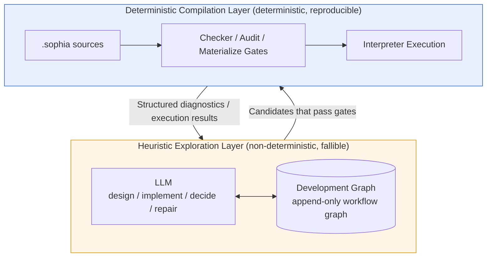
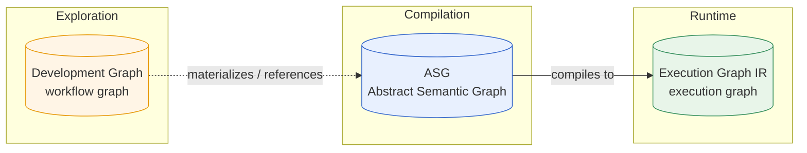
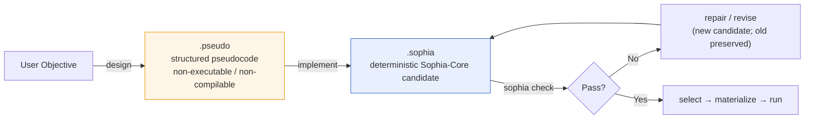
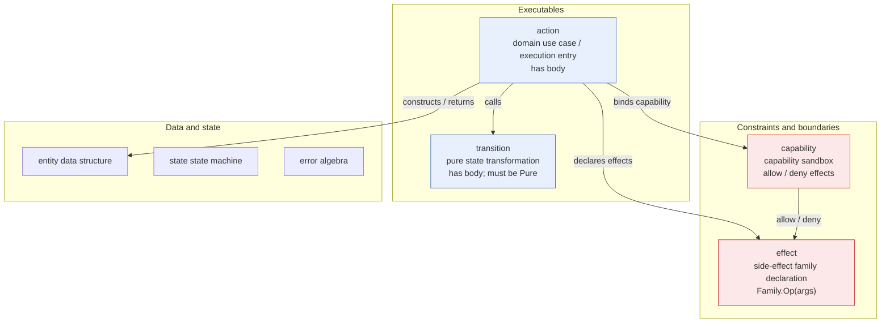
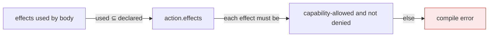
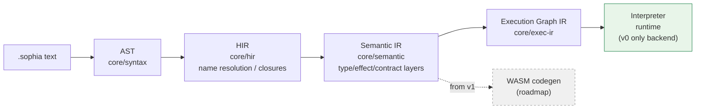
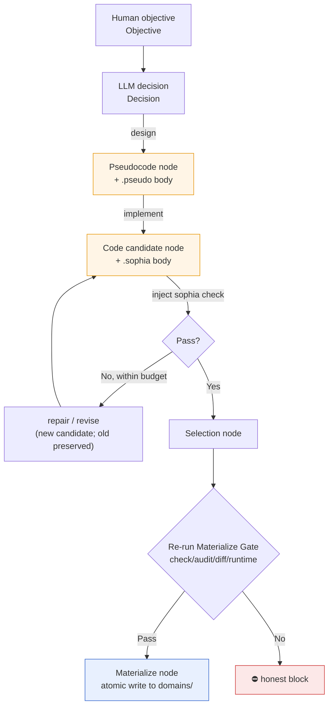

# Sophia Concepts Overview

> This is a reader-oriented concept map to help you form a mental model of Sophia—read this first, then dive into the authoritative docs as needed. It does not repeat details; each section links to a single source of truth (SSOT).
>
> Authoritative docs: concepts and design decisions in `language_design.md`; compiler/runtime implementation in `language_implementation.md`; tooling/layout/CLI in `engineering_architecture.md`; graph schema and invariants in `workflow_graph_spec.md`.

---

## 1. One-minute mental model

Sophia is a language designed for LLM-based autonomous programming. It splits the system into two layers with a hard boundary:

Two iron laws (see `language_design.md` §2):

1. Exploration may be non-deterministic; formal sources and compiled results must be deterministic.
2. The compiler does not call the LLM—LLM calls happen only in the workflow layer; the language core stays purely deterministic.

Core philosophy: turn what needs “memory” into what needs “expression.” LLMs are good at local expression and bad at long-term, cross-context memory.

---

## 2. Three “graphs,” each in a different layer

“Graph” is the only overloaded term—clarify the three meanings up front:

| Name | Layer | What it is | What nodes are | Lifecycle |
| --- | --- | --- | --- | --- |
| Development Graph | Exploration | Append-only record of LLM exploration | Objective/Decision/Pseudocode/Code/Diagnostic/Selection… (20 kinds; see spec) | Persisted across rounds of LLM interactions (SQLite event sourcing) |
| ASG (Abstract Semantic Graph) | Compilation | Semantic model of formal sources | entity/action/transition/effect/capability/state/error/task (I/O via stdlib effects, not nodes) | Equals the `.sophia` file set on disk (one node per file) |
| Execution Graph IR | Runtime | Bridge from Semantic IR to interpreter | One execution node per action/transition | Built from the semantic model each run |

Mnemonic: Development Graph records “how the work gets done”; ASG is the semantic structure of “the finished product”; Execution Graph is the execution structure of “how the product runs.”

SSOT: Development Graph → `workflow_graph_spec.md`; ASG → `language_design.md` §5.2; Execution Graph IR → `language_implementation.md` §8.

---

## 3. Two-stage programming: `.pseudo` → `.sophia`

The LLM does not generate formal code directly from natural language; it first stabilizes algorithmic intent, then lowers to the formal core.

| Dimension | `.pseudo` | `.sophia` |
| --- | --- | --- |
| Form | Paper-style Markdown pseudocode (6 fixed headings) | Formal Sophia-Core source |
| Executable | No | Yes (executed by the interpreter after checks) |
| Types | May be incomplete | Must be complete formal types |
| Checks | `pseudocode_check` (heading existence only; deterministic) | `sophia check` (syntax + three semantic layers + strip-assist equivalence) |
| Producer | LLM | LLM |
| Consumer | LLM (implementation stage) | Compiler/interpreter |

Why two stages: The transformer from `.pseudo` to `.sophia` is the LLM (not the compiler). Having it nail down algorithmic semantics first reduces ambiguity during implementation. The actual quality gate is `sophia check`, not `pseudocode_check`.

SSOT: `language_design.md` §4.

---

## 4. Top-level constructs: relationship of action / transition / effect / capability

Top-level constructs in `.sophia` are ASG nodes (one per file, peers). They have different duties—being peers does not mean homogeneity.

### action vs transition

| Dimension | `action` | `transition` |
| --- | --- | --- |
| Has body | Yes | Yes |
| Implementation source | user-authored body | user-authored body |
| Side effects | may declare effects | must be `Pure` (pure function) |
| Role | domain use case / execution entry | pure functional state transformation |

Note: An earlier `node` top-level construct (for agent orchestration) with `Llm`/`Tool`/`Stream` effects was designed and then removed because it deviated from language positioning; the `effect` top-level construct remains (unrelated to agents). See `language_design.md` §13.5.

### Relationship of effect and capability

- effect answers “what side effect is performed” (e.g., `Console.Write`, `Http.Get`). It normalizes to a `(family, op, args)` triple. The built-in `Console` family + standard-library families (`File`/`Http`) are carried by compiler built-ins; users may declare domain families via the top-level `effect` construct. File/network/database I/O are provided by the standard library (see `stdlib_design.md`), not language primitives.
- capability answers “which effects are allowed” (`allow`/`deny`, deny takes precedence).
- Rule: an action with effects must bind a capability, and its effects must be allowed by the capability and not denied.

SSOT: `language_design.md` §5.3 (ASG examples with full TodoDomain), §6.3–6.4 (effect/capability), §13 (top-level `effect` construct + decision to not introduce `node`).

---

## 5. Compiler pipeline panorama (v0)

Connecting the dots from text to execution:

Each phase is purely deterministic; `core/*` has zero I/O and does not depend on the workflow layer.

SSOT: `engineering_architecture.md` §3 (layering); `language_implementation.md` §8/§9.

---

## 6. How the workflow drives the compilation layer

The heuristic exploration layer (LLM + Development Graph) and the deterministic compilation layer are not islands—the workflow materializes candidates into the compilation layer through gates:

Key points:

- The graph is append-only—repairs/revisions create new nodes; old nodes (including failures) are preserved for reproducibility and auditability.
- The LLM only chooses actions and generates content; pass/fail is decided entirely by deterministic gates (`sophia check` / constraint audit / materialize gate), not by humans.
- Materialization is the only path to write into `domains/`, and all gates are re-run just before writing.

SSOT: `language_design.md` §10 (heuristic workflow); `workflow_graph_spec.md` (graph schema and invariants).

---

## 7. What to read next

| You want to know | Read |
| --- | --- |
| Why the language is designed this way; full conceptual map | `language_design.md` |
| How the compiler/interpreter is implemented | `language_implementation.md` |
| Directory structure, CLI, crate layering | `engineering_architecture.md` |
| Exact schema and invariants of the Development Graph | `workflow_graph_spec.md` |
| Current progress; what v1 will add (demand-driven) | `dev_checklist_v1.md` (current) / `dev_checklist_v0.md` (archived v0) |
| Why engineering decisions were made | `engineering_notes.md` |
| How the three test categories are organized | `unit_test.md` / `e2e_test.md` / `benchmark_test.md` |
| How to build/run | repo root `INSTALL.md` |
