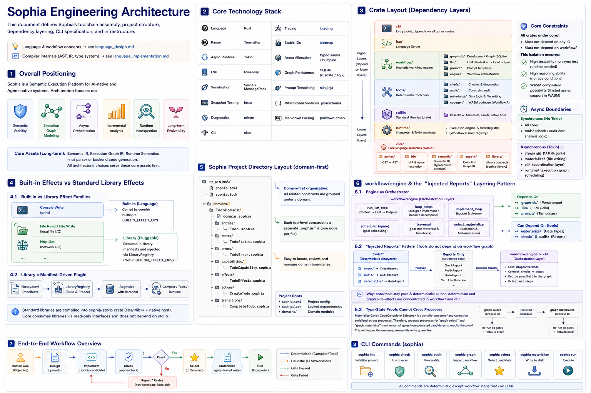

# Sophia Engineering Architecture



> This document defines Sophia’s toolchain composition, project directory structure, dependency layering, CLI specification, and surrounding infrastructure.
> Language and workflow concepts are in `language_design.md`.
> Compiler internals (AST, IR, type system) are in `language_implementation.md`.

---

## I. Overall positioning

Sophia is designed as a Semantic Execution Platform for AI-native and agent-native systems. The architecture focuses on:

- Semantic stability
- Execution-graph modeling
- Async orchestration
- Incremental analysis
- Runtime introspection
- Long-term evolvability

The long-term core assets are Semantic IR, Execution Graph IR, and Runtime Semantics—not the parser nor backend code generation. All engineering trade-offs serve these cores first.

---

## II. Core tech stack

| Layer | Technology |
| --- | --- |
| Implementation language | Rust |
| Parser | Tree-sitter |
| Async runtime | Tokio |
| LSP | tower-lsp |
| Serialization | Serde + MessagePack |
| Snapshot testing | insta |
| Diagnostics | miette |
| CLI | clap |
| Tracing | tracing |
| Stable IDs | slotmap |
| Arena allocation | typed-arena / bumpalo |
| Graph persistence | SQLite (rusqlite/sqlx) |
| Prompt templates | minijinja |
| JSON Schema validation | jsonschema |
| Markdown parsing | pulldown-cmark |

---

## III. Crate layout

Strict layering by dependency direction:

```
sophia/
├── core/               ← pure language semantics; zero external I/O deps
│   ├── syntax/         ← Tree-sitter binding + CST → AST
│   ├── hir/            ← HIR + name/module resolution
│   ├── semantic/       ← Semantic IR (type / effect / contract layers)
│   ├── exec-ir/        ← Execution Graph IR
│   └── library/        ← Library contract types (sophia-library): manifest parsing + LibraryRegistry (no Value; zero I/O)
│
├── workflow/           ← heuristic workflow engine; depends on core
│   ├── graph-db/       ← Development Graph persistence (SQLite + event sourcing)
│   ├── llm/            ← LLM client abstraction + structured outputs
│   ├── prompt/         ← Prompt template management (core syntax baseline; no library content)
│   └── engine/         ← Orchestration (snapshot→LLM→emit; loop/scheduler/select-materialize)
│
├── tools/              ← deterministic toolchain; depends on core
│   ├── check/          ← checker + diagnostics
│   ├── audit/          ← constraint audit
│   ├── materialize/    ← gate logic + file writes
│   └── codegen/        ← WASM codegen (Workflow A)
│
├── stdlib/             ← standard library contents (sophia-stdlib): libs/<lib>/ manifests + assets + native hosts; depends on core+runtime
├── lsp/                ← Language Server; depends on core + tools
├── cli/                ← entrypoint; depends on all above crates
└── runtime/            ← interpreter + Tokio substrate + HostRegistry (Plan B host registry)
```

### 3.1 Core constraints

Crates under `core` must not depend on any I/O and must not depend on `workflow`. This isolation ensures:

- Testability (no need to construct async test runtimes).
- Reasonability (no race conditions).
- Possibility to compile to WASM in the future (limited async in WASM).

### 3.2 Async boundary

Sync (no Tokio):

- All of `core`
- `tools` (core analysis of check/audit)

Async (uses Tokio):

- `llm` (LLM API network requests)
- `graph-db` (SQLite)
- `materialize` (file writes)
- `cli` (coordination layer)
- `runtime` (execution-graph scheduling)

### 3.3 Orchestration layer `workflow/engine` and the “inject-report” pattern

A layering detail surfaced in implementation and is now codified:

- `workflow/engine` is the orchestrator: it fixes the boundary between “deterministically build ContextSnapshot” and “non-deterministic LLM call” into a single path (`run_llm_step`), and layers design/implement/repair/decompose single steps (`loop_steps`), the implement-loop budgeted cycle (`implement_loop`), the goal-advancement scheduler spine (`scheduler`), the goal-tree traversal layer above the spine (`traversal`), and selection/materialize orchestration (`select_materialize`). It depends on `graph-db` + `llm` + `prompt`, and may depend on `tools` (e.g., materialize’s type-state chain). `engine` is the only crate allowed to depend on both `workflow` and `tools`; `graph-db`/`llm`/`prompt` do not depend on each other.

- Inject-report pattern (tools do not depend on the workflow graph): `tools/*` (check/audit/materialize) are deterministic analyzers that do not depend on the Development Graph and do not decide graph consequences. They produce structured reports (`CheckReport`/`AuditReport`/`GateReport`, `VerifierOutcome`), which the orchestration layer (engine or CLI) consumes to emit `DiagnosticNode`s and `checks→` edges. Symmetrically, orchestrators that need checks (e.g., implement-loop) get deterministic results via injected callbacks (`CodeChecker`) rather than directly using a checker—ensuring “orchestration does not run checkers” and “tools are graph-agnostic.” This keeps `core`/`tools` purely deterministic and testable, concentrating all non-determinism and graph side effects into `workflow`/`cli`.

- Type-state proofs cannot cross processes: the Materialize Gate’s `CodeCandidate<Selected>` is a compile-time proof of passing gates, but it cannot be serialized across processes. Therefore `graph select` and `graph materialize` (separate processes) must each re-run all gates from the persisted candidate to reconstruct the proof—safer for the only irreversible write (see §9.2 and `language_design.md` §10.10).

---

## IV. Built-in effect vs standard libraries

### 4.1 Built-in effect families vs library effect families

The only built-in effect family is `Console` (output primitive; triggered by `print`), carried by `core/hir`’s `builtins::BUILTIN_EFFECT_OPS` (the `(family, op, arity)` table). File/network I/O effect families are provided by libraries (`File`/`Http`, see `stdlib_design.md`) and are not in `BUILTIN_EFFECT_OPS`: they are declared via library manifests (`library.toml`) and injected into `AsgIndex` via `AsgIndex::new(registry)` / `AsgIndex::build(inputs, registry)`—the core hardcodes no specific libraries.

```
Console.Write          ← stdout (print; built-in; BUILTIN_EFFECT_OPS)
File.Read / File.Write ← local file read/write (File library; manifest-driven; see file_lib.md)
Http.Get               ← network GET (Http library; manifest-driven; see http_lib.md)
```

Users may declare domain effect families via the top-level `effect` construct; name resolution merges them with built-in/library effects into one symbol table (see `language_design.md` §13).

Historical change (2026-05-31): (i) built-in `DB.Read/Write` + `storage` top-level (unclear in-memory KV) removed; (ii) `File`/`Http` formerly hardcoded in `BUILTIN_EFFECT_OPS` were migrated out via the library-plugin refactor—now manifest-driven by `LibraryRegistry` (see `stdlib_design.md` §II).

### 4.2 Libraries = manifest-driven plugins; standard library is a crate

Libraries (standard + third-party) are unified as manifest-driven plugins: a library = a directory + `library.toml`. Layers derive from `LibraryRegistry` (frozen after build), not hardcoding. The standard library is the `sophia-stdlib` crate (`libs/<lib>/` compiled into the binary + native hosts). The contract types live in the `sophia-library` crate (core can depend; no `Value`). The host registry (Plan B; `(family,op) → Box<dyn HostFn>`) lives in `sophia-runtime`. `core` consumes read-only `&AsgIndex`/`&LibraryRegistry` (carrying library contracts) and does not depend on `sophia-stdlib`. See `stdlib_design.md` / `stdlib_implementation.md`.

---

## V. Sophia project directory structure

User projects follow a domain-first layout:

```
my_project/
├── sophia.toml
├── sophia.lock
├── domains/
│   └── TodoDomain/
│       ├── domain.sophia
│       ├── entities/
│       │   └── Todo.sophia
│       ├── states/
│       │   └── TodoStatus.sophia
│       ├── errors/
│       │   └── TodoError.sophia
│       ├── capabilities/
│       │   └── TodoCapability.sophia
│       ├── transitions/
│       │   └── CompleteTodoTransition.sophia
│       ├── actions/
│       │   └── CompleteTodo.sophia
│       └── tasks/
│           └── ImplementCompleteTodo.sophia
└── sophia-runs/
    ├── generated/
    ├── asg_index.json
    ├── task_closures/
    ├── build/
    └── graph/                  ← Development Graph event stream (SQLite)
```

### 5.1 Layout constraints

- One file defines one top-level formal node.
- Node files must reside under their domain directory.
- PascalCase for domain directories and node filenames/names.
- Domain definition file is fixed as `domain.sophia`.
- Relationships between top-level nodes are expressed via explicit references forming ASG edges—no file nesting or implicit owners.
- Entity is not the top-level container; domains are the aggregation boundary; ASG nodes are the semantic units.
- Forbid implicit imports.
- Forbid same-name shadowing.
- Cross-domain references must be explicitly declared via boundaries or task includes.
- `asg_index.json` is a rebuildable cache, not a semantic source.

### 5.2 sophia.toml

Minimal config:

```toml
[project]
name = "mini_todo"
version = "0.1.0"
sophia_version = "0.1"

[source]
domain_root = "domains"
generated_dir = "sophia-runs/generated"

[layout]
strategy = "domain_first"
one_top_level_node_per_file = true
forbid_global_kind_dirs = true

[build]
target = "interpreter"
out_dir = "sophia-runs/build"

[check]
require_strip_assist_equivalence = true
forbid_implicit_imports = true
forbid_shadowing = true
require_explicit_cross_domain_boundary = true
```

---

## VI. Development Graph persistence

### 6.1 SQLite + event sourcing

Development Graph uses SQLite with event sourcing.

Not pure JSON files because:

- Ancestor-chain queries (needed by DecisionNode), budget stats, score ranking require complex queries.
- Node counts grow quickly; full reads degrade.
- Concurrent writes across processes (CLI + LSP) need locking; SQLite supports this natively.

Use `rusqlite` or `sqlx`; single file; zero config; ideal for local dev.

### 6.2 Event-sourcing model

Append-only semantics map naturally to event sourcing:

```rust
enum GraphEvent {
    NodeCreated   { id: NodeId, kind: NodeKind, payload: Bytes },
    EdgeAdded     { from: NodeId, to: NodeId, kind: EdgeKind },
    StatusChanged { id: NodeId, status: NodeStatus },
    SelectionMade { node: NodeId, reason: String },
    GateAttempted { node: NodeId, gate: GateKind, result: GateResult },
}
```

Each event is appended to SQLite table `graph_events`. Current state is derived by replay or accelerated via a materialized view.

### 6.3 GraphStore interface constraints

GraphStore must implement the engineering consequences in `workflow_graph_spec.md` §3:

- `update_node` exposes no payload writes.
- `append_edge` validates `(from.role, to.role, type)` before writing.
- `append_node` validates `(role, provenance)` and `creation_status`.
- `supersedes` chains are acyclic; endpoints share the same role.
- LLM-provenance nodes must have a `consumed→ ContextSnapshot` edge.

---

## VII. LLM structured outputs

### 7.1 Model-agnostic LLM abstraction

Workflow engine often requires JSON outputs from LLMs (DecisionNode, repair results, etc.):

```rust
#[async_trait]
trait LlmClient {
    async fn complete(&self, req: CompletionRequest) -> Result<CompletionResponse>;

    async fn complete_structured<T: DeserializeOwned>(
        &self,
        req: CompletionRequest,
        schema: &JsonSchema,
    ) -> Result<T>;
}
```

`complete_structured` is key.

### 7.2 Fallback for local models

Support local models (e.g., Ollama qwen). They lack native Structured Outputs APIs, so we implement a retry + schema-validation fallback:

1. Ask LLM for JSON with the schema embedded in the prompt.
2. Parse and validate with `jsonschema`.
3. On failure, retry with error messages up to N times.
4. After N retries, return a structured error—never fabricate success.

Rust lacks a drop-in like Python’s `instructor`; we implement this in the `llm` crate.

### 7.3 Fallback node

LLM-call failures must emit `RawLlmNode` (schema `workflow_graph_spec.md` §4.4.8), with an `attempted→` edge to the intended target for auditability. If the backend (remote API or local Ollama) is unavailable, LLM-dependent commands must fail explicitly and preserve `RawLlmNode`; never fabricate a successful `CodeNode`.

---

## VIII. Prompt template management

Prompts are core assets of the workflow and must be versioned and tested like code.

### 8.1 Layout

```
prompt/
├── templates/
│   ├── design_solution.md.jinja
│   ├── implement_design.md.jinja
│   ├── repair_code.md.jinja
│   ├── revise_design.md.jinja
│   ├── decision.md.jinja
│   └── decompose.md.jinja
├── schemas/
│   ├── design_result.json
│   ├── implement_result.json
│   ├── decision_node.json
│   ├── pseudo_check.json
│   ├── repair_result.json
│   └── decompose_result.json
└── assets/
    └── sophia_syntax_baseline.md
```

Each workflow step (design/implement/repair/decision/decompose) must have a strict schema (`additionalProperties:false`). The schema must be faithful: keep fields as strict as server-side deserialization; avoid “schema passes but deserialization fails.”

### 8.2 Engineering requirements

- Use `minijinja`; do not concatenate strings.
- One schema per template; the schema file is fed to `complete_structured`.
- Guard template changes via `insta` snapshots to prevent silent drift.

### 8.3 Language-baseline prompt asset (preamble)

Any step that asks the model to produce/repair `.sophia` must inject a Sophia-Core syntax baseline. This is a formal prompt asset under `prompt` shared by all workflows, not scattered.

Why it’s a prompt asset, not stdlib:

| Dimension | Conclusion |
| --- | --- |
| Artifact kind | The syntax baseline is natural-language instructions + neutral examples for LLMs, not formal `.sophia` source parseable by the compiler; putting it in stdlib would pollute the invariant “stdlib = parseable formal contracts.” |
| Consumer | It is consumed only by the workflow / LLM layer; stdlib is consumed by the zero-I/O compiler `core`. |
| Layering | `core` / stdlib must not depend on workflow; the syntax baseline naturally belongs on the workflow side, and putting it in `prompt` preserves the layering. |
| Drift guard | Like templates / schemas, it reuses the `insta` snapshot guard from §8.2; stdlib’s guard is “can it parse,” which does not apply to a natural-language baseline. |

Therefore the syntax baseline lives as a prompt asset under `prompt/assets/`, beside templates and schemas:

```
prompt/
├── templates/
├── schemas/
└── assets/
    └── sophia_syntax_baseline.md   ← language syntax baseline (system preamble shared by all implement/repair steps)
```

Library assets are not in the `prompt` crate: library catalogs/assets (`<lib>.md`) are carried by `sophia-stdlib`’s `LibraryRegistry` (manifest-driven; see `stdlib_design.md`). The `prompt` crate only holds the core syntax baseline; library knowledge and core syntax stay separate, and `prompt` should not depend on library content.

The baseline is exposed via `prompt` APIs: `preamble(name)` (resident baseline) and canonical system prompts `design_system_prompt()` / `implement_system_prompt(stdlib_block)`. Library catalogs/assets are computed from `LibraryRegistry` by the caller and injected (`stdlib_catalog = registry.catalog()`; `stdlib_block = registry.preamble(libs)`). Assets are embedded via `include_str!` for reproducibility.

Two hard constraints (anti-answer-leakage):

1. Only generalizable, standard language facts (syntax forms, type set, stmt/expr subsets, when effects/capabilities are required). Use neutral examples. Never include domain names/identifiers/business logic of any concrete task.
2. Only decisive information: inject the baseline in implement/repair; do not inject it in design (pseudocode is semantics > format), otherwise you’d force formatted pseudocode and create extra repairs later.

### 8.4 Render prompts at call time: `StepPrompts` provider

Prompts are the entire world seen by the LLM. `language_design.md` §10.7/§10.8 require that every LLM call’s prompt be rendered from the current active context at call time—the same source used to build the `ContextSnapshot`. Therefore prompts must be re-rendered on each step; pre-render-once and reuse is invalid.

#### 8.4.1 The defect we must root out

An early scheduler implementation passed pre-rendered static `CompletionRequest`s via `StepRequests` and reused them each round. This violates §10.7/§10.8 and fails in practice:

- No state progression: the Nth-round decision sees the exact same prompt as round 1—no “already designed,” “current pseudocode,” or “last diagnostics.” The LLM cannot autonomously advance (it loops on design or exhausts budgets), breaking multi-step orchestration.
- Snapshot mismatch: `ContextSnapshot` records the current state, but the LLM actually saw prompts rendered from stale state—breaking the guarantee that snapshots fully reproduce what the LLM saw (anti-cheat/audit bedrock).
- Implement cannot see pseudocode: a runtime-produced PseudocodeNode cannot be injected into a prebuilt static implement request, so implement steps lack their target pseudocode.

This is fundamental; the fix is to replace static requests with a call-time provider that renders from current state.

#### 8.4.2 The right design: a `StepPrompts` provider trait

Introduce a provider abstraction defined in `workflow/engine` and implemented in the coordination layer (CLI/examples). The scheduler calls the provider right before each LLM call, passing inputs derived from current graph state; the provider renders a `CompletionRequest` on the spot:

```rust
/// Prompt provider for workflow steps: render requests at call time from current graph state.
pub trait StepPrompts {
    /// decision step; `ctx` is active context at call time; `budget` is remaining; `focus` is the current goal id
    fn decision(&self, ctx: &ActiveContext, budget: BudgetView, focus: NodeId) -> CompletionRequest;

    /// design step (semantic pseudocode; no syntax baseline is injected here)
    fn design(&self, ctx: &ActiveContext, focus: NodeId) -> CompletionRequest;

    /// implement step; `pseudocode` is the PseudocodeNode text produced this round
    fn implement(&self, ctx: &ActiveContext, pseudocode: &str) -> CompletionRequest;

    /// repair step; render from previous candidate files + structured diagnostics
    fn repair(&self, files: &[(String, String)], diagnostics: &[DiagnosticItem]) -> CompletionRequest;
}
```

Key points:

- Render at call time: in `make_decision`/`dispatch_design`/`dispatch_implement`, compute active context and build `ContextSnapshot` deterministically, then call the provider with the same active context—prompt and snapshot share the same source; mismatch is eliminated.
- Schemas are still injected with the request: the orchestration selects the per-step schema (`design_result`/`implement_result`/`repair_result`/`decision`) and the provider focuses on rendering system/user content.
- Pseudocode is passed back: the scheduler holds `PseudocodeArtifact.text` from design and passes it to `implement`—impossible with static requests, natural with providers.
- Repair mirrors others: implement-loop renders repair requests after each failed check using the provider, feeding previous files + diagnostics.
- Layering preserved: engine defines the trait and call sites only; it does not carry prompt templates or extraction rules. Coordination owns templates, baseline assembly, and anti-leak discipline.

Note: The concrete `StepPrompts` in code adds `revise` and `decompose`, passes `GoalProgress` to `decision`, and carries `libraries` (S2 on-demand stdlib) for implement/repair. Signatures in code are the source of truth.

#### 8.4.3 Why not compromises

- Do not keep “static requests + optional provider” as dual paths: that’s a dual stack and violates the single-path principle. `StepRequests` is replaced entirely by the provider trait; schedulers/implement-loop now take `&impl StepPrompts`.
- Do not embed templates in engine: that breaks layering (§3.3).
- Do not aim for “close enough” snapshots: require same-source—compute active context once per step and feed both snapshot and provider from it.

With this, G3 (heuristic-node processing) can truly test autonomous advancement decision→design→implement to a materializable candidate, rather than being locked by static prompts.

### 8.5 Goal-tree traversal layer (non-linear ops above the spine)

The spine (`run_goal_loop`) only advances a single goal. When encountering non-linear ops like `decompose`/`backtrack`, it yields (`Outcome::Yielded`) to an independent traversal layer above the spine: `engine::run_goal_tree` (`traversal` module):

```
run_goal_tree (traversal; non-linear)
  └─ run_goal_loop (spine; single-goal linear)
       ├─ Yielded(Decompose) → decompose_goal (LLM structure → deterministic build_decomposition) → recurse into children
       ├─ Yielded(Backtrack) → record abandonment (GoalResolution::Backtracked)
       └─ CandidateReady / BudgetExhausted / Failed / other Yielded → resolve directly
```

Key points:

- Clean layering: the spine remains a thin linear driver; the traversal layer executes tree ops and recurses only after spine yields. Decision-making still happens in the spine via `DecisionNode` (action-choice/execute separation in §10.8 is preserved).
- Deterministic graph construction for decompose: the LLM produces only the structure (rationale + children[]; schema-validated by `decompose_result`); graph writes are done by `graph-db::build_decomposition` (deterministic helper): create `Decomposition`; connect `parent decomposes→ Decomposition`; for each child, create `Objective` + `member_of→ Decomposition`. This matches the global discipline: LLM emits content; deterministic pipelines materialize graph effects.
- I6 anchor: `Decomposition` is itself an LLM execution-product node (like `Pseudocode`/`Code`/`Assessment`) and thus carries its own `consumed→ ContextSnapshot` (I6), anchored to the call that produced the decomposition—not to the triggering `DecisionNode(decompose)` (distinct calls per §10.8). `build_decomposition` therefore accepts and validates the snapshot; child `Objective`s are structural derivations indirectly anchored via `member_of` and do not each carry a separate `consumed→`. Specs updated accordingly.
- No fabricated human authorization: `backtrack` only records abandonment and preserves the abandoned subtree; it never creates `WithdrawalEvent` (human authority; N4). Binding is not fabricated either: LLM-derived child goals start unbound; once a human accepts the `Decomposition`, binding is inherited along `member_of` (spec §5.3).
- Human-authorization checkpoint (decomposition reviewer): before recursing, the traversal layer calls an injected `DecompositionReviewer`. On Accept, it creates a real human `AcceptanceEvent accepts→ Decomposition`, after which children inherit binding and enter active contexts (necessary for their design/implement prompts to focus on themselves). On Reject, it does not recurse and never fabricates withdrawals. The engine never fabricates authorization beyond the reviewer; `AutoAcceptReviewer` stands in for humans in e2e/hands-off flows while still landing real events.
- Budgets: `TreeBudget` adds `max_depth` (decompose nesting) and `max_goals` (total spine calls) to prevent explosion, on top of `SchedulerBudget`.

#### 8.5.1 Why a separate layer, not inside the spine

- Stuffing tree ops into the spine turns it into a kitchen sink (violates single responsibility). Turning the spine into a tree driver removes the independently testable/reusable “single-goal linear” capability. With two layers, the spine can be reused alone for “advance one fixed goal” (as in the CLI implement-loop), while traversal focuses on non-linear control.

---

## IX. CLI specification

Using `clap`.

### 9.1 Compiler commands (deterministic; no LLM)

| Command | Purpose |
| --- | --- |
| `sophia init` | create std layout + `sophia.toml` |
| `sophia index` | scan node files; generate `asg_index.json` |
| `sophia parse <file>` | parse a node file |
| `sophia graph` | print ASG summary |
| `sophia context --action <ActionName>` | generate action-rooted semantic context |
| `sophia context --task <TaskName>` | generate deterministic task closure |
| `sophia check` | run static checks and strip-assist equivalence gate |
| `sophia build` | after check, emit WASM + artifact-layer strip-assist gate (v1 Workflow A) |
| `sophia run <ActionName>` | run action (interpreter); `--trace` prints Execution Graph trace projection |
| `sophia smoke` | one-shot init → check → build → run |
| `sophia repair-context --error <id>` | generate LLM repair context (no LLM calls) |
| `sophia lsp` | run Language Server via stdio (hover/diagnostics/goto) |

### 9.2 Workflow commands (involving LLM)

Implemented `graph` subcommands:

```bash
sophia graph init
sophia graph start "Objective"
sophia graph nodes
sophia graph context
sophia graph design <NodeId> --model <ModelName> [--mode openai|ollama] [--base-url <url>]
sophia graph implement-loop <NodeId> --pseudo <PseudoId> --model <ModelName> --max-repairs 2
sophia graph select <NodeId>
sophia graph materialize <NodeId>
```

The pipeline `start → design → implement-loop → select → materialize` is end-to-end; `init`/`start`/`nodes`/`context` are deterministic (no LLM).

Conventions solidified:

- Dual-shape `sophia graph`: without subcommands prints ASG summary (compiler-side; backward-compatible); with subcommands operates the Development Graph (SQLite event sourcing; replay across processes).
- Unified LLM backend flags: `--model` (required) / `--mode openai|ollama` / `--base-url` / `--api-key` (or env `SOPHIA_LLM_API_KEY`) → constructs `HttpLlmClient`. CLI uses a one-off current-thread Tokio runtime to cross async boundaries (core/tools remain sync).
- Failures are not fabricated: backend unreachable/schema-invalid beyond retries → fail with `RawLlmNode` (with the pre-created `ContextSnapshot`).
- Intermediate artifacts: `.pseudo` text and candidate `.sophia` bodies are saved under `sophia-runs/graph/artifacts/` (not materialized). Graph nodes store only paths.
- Re-run gates at `select`/`materialize`: both are separate processes; type-state proofs cannot persist across processes; each reloads from artifacts and re-runs all gates (code_check/constraint_audit/artifact_diff/runtime validation). Any failure blocks and emits a `DiagnosticNode`. `materialize` locates the candidate via `selects→` and writes to `domains/` through staging + per-file rename upon passing.

Roadmap (not yet implemented): `pseudo-check`/`pseudo-outline`/`pseudo-scaffold`; `check`/`audit`/`diff`/`verify` for graph nodes; CLI entries for higher-level actions (decompose/backtrack/revise/clarify).

#### 9.2.1 Hidden verifier store and constraint_audit gate wiring (design)

Hidden-case regression data is validation-only and must not be visible to LLMs. Three-fold isolation: (i) graph nodes store only opaque `verifier.ref`; (ii) active-context `ConstraintView` omits `verifier`; (iii) bodies live in `sophia-runs/verifiers/hidden.json`, physically isolated from the graph, read only by deterministic gates. Gate wiring: load bound invariants; for `HiddenCase` verifiers, load from `hidden.json` (absence → honest hard block); run `runtime::run_hidden_case` (interpreter); map to `VerifierOutcome`; feed `audit_constraints`; emit `DiagnosticNode`. Orchestration-only code (CLI) performs the reading/wiring; tools/runtime remain graph-agnostic. Already implemented and covered by CLI integration tests.

---

## X. Language Server

### 10.1 Tech stack

- `tower-lsp`

### 10.2 Features

- goto definition
- hover
- diagnostics
- rename
- autocomplete
- semantic navigation

### 10.3 Architectural principle

The LSP **works from semantic data, not by directly walking the AST**.

LSP is the scenario that truly needs incremental analysis: hover/completion must be low-latency. Incremental analysis is introduced in a later phase; the initial phase uses module/symbol/type caches for the basic feature set.

---

## XI. Formatter

### 11.1 Workflow

```text
AST / HIR
    ↓
Pretty Printer
```

### 11.2 Responsibilities

- stable formatting
- semantic-aware formatting
- deterministic formatting output

Output must be deterministic: same source, same output.

---

## XII. Runtime tracing

### 12.1 Tech stack

The `tracing` crate.

### 12.2 Responsibilities

- runtime inspection
- async task tracing
- execution timelines
- semantic event tracing
- agent execution debugging

### 12.3 Mapping to the Execution Graph

Trace spans must carry references to concrete nodes and edges in the Execution Graph. See `language_implementation.md` §9.4.

---

## XIII. Testing infrastructure

### 13.1 Snapshot Testing

`insta` crate. Snapshot targets:

- AST
- HIR
- Semantic IR
- Execution Graph IR
- rendered prompt templates

### 13.2 Semantic Testing

- type inference validation
- effect analysis validation
- scheduling validation
- runtime trace validation

### 13.3 Append-only invariant tests

CI diff-detection tests guard that nodes and edges are read-only once written to files.

---

## XIV. Phased roadmap

### 14.1 v0: interpreter

```
source → AST → HIR → Semantic IR → Execution Graph IR → Interpreter
```

No codegen. `sophia run` uses the Rust in-process interpreter; runtime I/O validation consumes metadata directly.

### 14.2 v1: WASM codegen + language/stdlib expansion

Two parallel workflows both serving “make Sophia truly usable,” not just papers:

- Workflow A — WASM codegen: first codegen target; project Semantic IR/Exec IR into deployable WASM artifacts; interpreter remains the oracle for equivalence (diff tests). Strip-assist adds WASM byte-level checks.
- Workflow B — Language/stdlib expansion (demand-driven): bounded by three demo needs D1/D2/D3; yields F1 (`one of`/`list of`/`<>`-exclusive intents) + F2 (Http effect family) + S1 (HTTP host in stdlib) + S2 (stdlib prompt scaffolding). Standard library relocation: I/O are libraries; remove `storage` + built-in `DB` + `Persisted`; add `File`.

v1 completion criteria: (i) WASM backend equivalence; (ii) D1/D2/D3 end-to-end in sophia mode (with D2 providing a real accept/reject matrix entry); (iii) artifact-layer strip-assist.

### 14.3 v2: JSON third-party library end-to-end

v2 is the phase for “using Sophia itself to process real external data.” The phase no longer spreads horizontally into more backends, and it does not prioritize the multi-round evolution subsystem. Instead it narrows around one representative end-to-end demand: implement a JSON third-party library, from prerequisite language extensions through an agent-like example. Progress is tracked in `dev_checklist_v2.md`; the design draft is `json_lib_design.md`.

The v2 main line is:

1. Prerequisite language extensions: add the minimal `Text` operations and `while` control flow needed by a JSON parser / validator.
   - `Text` extensions focus on deterministic value operations: `char_at`, `slice`, and possibly `starts_with` depending on design review.
   - `while condition { ... }` is an explicit v2 syntax-extension target for cursor-style parsing loops, avoiding parser implementations that are mostly `repeat input.length times` plus internal branching boilerplate.
   - New capabilities must go through syntax / HIR / semantic / interpreter / WASM codegen / differential tests; interpreter-only support is not acceptable.
2. JSON third-party library implementation: JSON stays out of the language core and is not host-op-first; it validates the manifest-driven third-party-library plugin model.
   - Implement `ValidateJson` first, covering a minimal JSON subset and invalid-input diagnostics.
   - Then evaluate and implement `ParseJson` or limited structured access, depending on recursive data-model feasibility.
   - Library sources, library prompt asset, hidden cases, and interpreter/WASM equivalence tests enter the engineering loop together.
3. Agent-like example: run `Http.Get → Raw<Text> → ValidateJson/ParseJson → domain action` end to end, proving Sophia can process real API responses rather than only toy arithmetic / todo / file round-trip flows.

v2 completion criteria:

1. `Text` and `while` extensions land end to end and pass interpreter/WASM differential tests.
2. The `json` third-party library can be discovered, checked, and executed by a project, with legal and illegal JSON hidden cases.
3. At least one `Http` + JSON + domain-judgment agent-like example passes end to end, with records of whether the LLM can select and use the JSON library from catalog / prompt assets.
4. JSON logic is expressed by default as a pure Sophia library; host ops remain a later performance / completeness option, not part of the v2 MVP.

### 14.4 v3+: optional backends and evolution capabilities

Backends, added only when demanded:

- Native backend: cranelift / LLVM lowering, if deployment performance needs it.
- Named-language emit: TypeScript / Python output, only if a concrete interop need appears.

Evolution capabilities:

- Edit transitions as first-class graph actions plus an Evolution Boundary.
- Semantic Identity and cross-domain/library protocol (`sophia.lock`, publish/consume, formal-only views).
- Stronger strip-assist equivalence: move from IR / artifact comparison toward an independent formal-only hash.

These directions come after v2, which makes Sophia process real external data through libraries. They target real multi-domain, multi-round project evolution and build on the compilable foundation and library practice established in v1/v2. They do not compete with the JSON end-to-end main line.

---

## XV. Architectural principles

| Principle | Statement |
| --- | --- |
| semantic-first architecture | Semantics first; parser/codegen are means |
| runtime introspection | Runtime is observable; traces project to the Execution Graph |
| graph-based execution | Every execution has an explicit graph structure |
| incremental analysis | Not implemented initially; APIs reserved |
| stable semantic infrastructure | Semantic IR is a long-term asset |
| async-native execution | The execution layer is async by default |
| agent-native semantics | Node semantics serve LLM and agent systems |

Core assets: Semantic IR; Execution Graph IR; Runtime Semantics.

---

## XVI. Engineering non-goals

- No aim for compatibility with LangChain/LangGraph.
- v0: no codegen; interpreter only.
- v1: WASM is the only codegen target; native/named-language emits deferred.
- No distributed execution; checkpoint/resume defined at IR level, not cross-process.
- Compiler does not call LLMs; all LLM calls happen in `workflow`; `core` is deterministic.
- `pseudocode_check` does not judge semantic quality; only structural completeness (heading existence).
