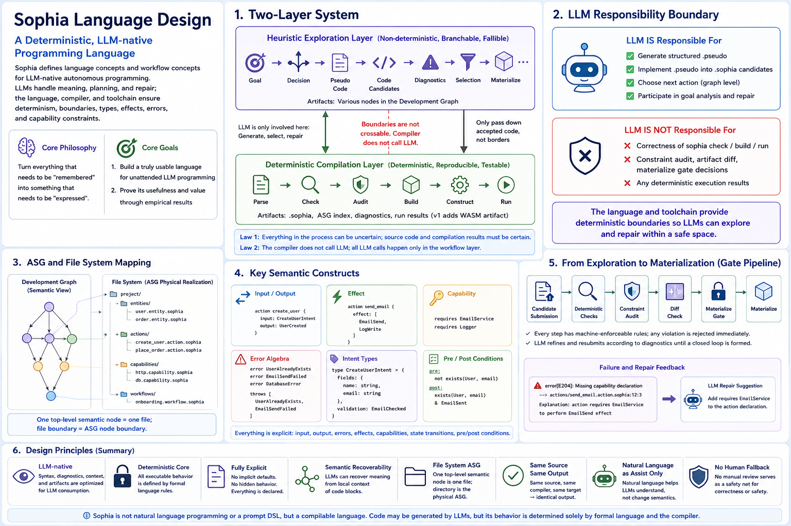

# Sophia Language Design



> This document defines Sophia’s language concepts and workflow concepts—the “big language” layer oriented to LLMs.
> Implementation details (AST, IR, type inference algorithms, checker pipeline) are in `language_implementation.md`.
> Tooling, directory layout, and CLI are in `engineering_architecture.md`.

---

## I. Positioning

Sophia is an LLM-native language for deterministic-semantics programming, aimed at unattended LLM-based programming. The core question it addresses is:

> If an LLM does not have extensive code pretraining and is not good at traditional syntax and conventions, but does have strong natural-language semantic understanding, can we, with a language, checker, and workflow designed specifically for it, make it reliably accomplish autonomous programming without any human review safety net?

Sophia’s answer is:

- Let the LLM handle semantic understanding, task decomposition, structured expression, and repair suggestions.
- Let the language, compiler, and toolchain handle determinism, boundaries, types, side effects, errors, and capability constraints.

An LLM may generate source code, but the behavior of the source is decided only by the formal language and the compiler.

Sophia is not natural-language programming and not a prompt DSL; it is a compiled language. All design choices prioritize LLM success rate, repairability, context scoping, and constraint preservation in unattended automation. Human reading, hand-writing, review, or operations convenience is not a design goal.

### 1.1 Two project goals (primary and secondary)

There are two goals; the first is the serious engineering goal, the second depends on it:

1. Primary: build a truly usable language and toolchain for unattended LLM programming. This is serious language engineering, not a paper toy. “Serious language” implies real codegen and deployable execution backends. That is why v1 introduces WASM codegen: it moves Sophia from “interpreter-only prototype” to “compilable and embeddable in multiple hosts.” WASM is a decided, necessary step, not optional.
2. Secondary: publish papers to demonstrate utility and value. The paper’s value argument (an LLM programming route beyond code pretraining; accept/reject experiments with intent/capability/effect; replayable and auditable graph workflows) presents the outcome of goal 1, not a substitute for it. Benchmark success-rate/time is only one piece of evidence, not the project’s central value.

Therefore prioritization follows goal 1 (make the language truly usable): in v1 we advance in parallel (i) WASM codegen (execution backend expands from interpreter to deployable artifacts) and (ii) language capability/standard library expansion (to support more complex and persuasive programs/benchmarks). Both are parts of “turning a toy into a serious language.” See `engineering_architecture.md` §14 for roadmap details.

---

## II. Two-layer system

Sophia has two layers with a strict boundary:

| Layer | Nature | Artifacts | Responsibility |
| --- | --- | --- | --- |
| Heuristic exploration | Non-deterministic, branching, fallible | Nodes in the Development Graph (objectives, decisions, pseudocode, code, diagnostics, selection, materialization, etc.) | Let the LLM propose candidates in a controlled space and preserve versions and failure paths |
| Deterministic compilation | Deterministic, reproducible, testable | `.sophia` sources, ASG index, diagnostics, interpreter results (v1 adds WASM artifacts) | Parse, check, audit, generate, build, and run formal sources |

Two iron laws:

1. Exploration may be non-deterministic; formal source and compiled results must be deterministic.
2. The compiler must not call an LLM; all LLM calls happen at the workflow layer; the language core remains purely deterministic.

LLM’s irreplaceable duties:

- Generate structured `.pseudo`.
- Implement `.pseudo` into `.sophia` candidates that pass deterministic checks.
- Choose next actions on the Development Graph.
- Participate in goal analysis and repair.

Duties the LLM does not perform:

- Adjudication of `sophia check`, `build`, `run`.
- Decisions in constraint audit, artifact diff, and materialize preflight.

---

## III. Design principles

| Principle | Requirement |
| --- | --- |
| LLM-native surface | Syntax, diagnostics, context, and graph artifacts are primarily for LLMs and tools to consume |
| Unattended Automation | Automatic checking, repair, and materialization gates must not rely on human review as a safety net |
| Deterministic core | All executable behavior must be decided by formal syntax |
| Natural language assists, not semantics | Natural-language fields can assist LLM understanding, but cannot influence compiled artifacts |
| Everything explicit | Inputs, outputs, errors, side effects, capabilities, state transitions, and pre/postconditions must be explicit |
| Recoverable semantics | Code blocks must let an LLM recover semantics from local context |
| File-system ASG | ASG (Abstract Semantic Graph) is the semantic model, physically realized by directories and files |
| Same source, same outputs | Same source, same compiler, same target → consistent outputs |
| Semantically intuitive, no elision, not afraid of verbosity | Prefer intuitive semantics and explicitness; do not mimic human-language abstractions (generics/templates/macros/traits, etc.) |

Core philosophy: turn everything that requires “memory” into something that requires “expression.” LLMs are best at local expression and worst at long-term, cross-context memory.

> Syntax design tenets (LLM-native, 2026-05-30 addendum): Sophia does not mimic human programming languages’ mechanisms created for brevity and reuse of abstractions—no user-extensible generics, templates, macros, traits/typeclasses, operator overloading, or implicit conversions. Instead, we prefer semantically intuitive, explicit, and even verbose syntax: better a few more lines of clear structure readable in place than “clever” one-liners requiring cross-context rules. This targets the LLM capability profile: strong semantics, weak memory. Verbosity is not costly to an LLM; implicitness/elision is. Note the distinction: the closed, built-in set of type constructors (list of, one of, schema of, Intent wrappers) are not a user-extensible generics system—they are fixed, first-class, semantically intuitive constructs, each built-in and not parameterizable by users. `<>` forms are exclusive to Intent wrappers; structural types always use the `of` keyword family (see `docs/type_system.md`).

### 3.1 LLM-native feature admission rules

Sophia is newly designed and does not inherit baggage from human-oriented languages (hand-writing, reading, review, IDE habits, ecosystem conventions, legacy compatibility). Any feature entering the core must satisfy all:

1. LLM-consumable: can enter deterministic context, or reduces what an LLM must memorize/guess.
2. Machine-checkable: can be checked by parser/checker/audit/runtime validation or graph gate.
3. Closure-friendly: dependencies form explicit ASG edges; supports computing minimal semantic closures from an action/task root.
4. Repair-guiding: on failure, produce structured diagnostics that guide LLM repair.
5. No human fallback: correctness/safety/merge/materialize/evolution decisions are not delegated to humans.
6. No legacy convenience: if the primary benefit is familiarity/brevity/similarity to existing languages for traditional programmers, default reject.

### 3.2 Key design trade-offs

| Sophia’s choice | LLM-native reason | Rejected baggage |
| --- | --- | --- |
| Semantic nodes (entity/action/capability/…) | LLM can recover roles from local context without guessing duties from syntax conventions | class/member, import conventions, directory heuristics |
| Not pursuing brevity | Brevity relies on implicit context and reader experience, adding memory burden to LLMs | terse syntax, implicit defaults, “convention over configuration” |
| Semantically intuitive, no elision, not afraid of verbosity | LLMs are strong in semantics, weak in memory; local explicitness is less error-prone; implicitness/elision require memory and are error-prone | generics/templates/macros/traits/op overloading/implicit conversions |
| Graph-based not linear text | Tools compute deterministic semantic neighborhoods from roots and pass minimal closures to LLMs | linear code reading; IDE symbol-jumping |
| One top-level semantic node per file | File boundaries equal ASG node boundaries—stable for prompt/diff/repair/materialize | multiple concepts in one file |
| Explicit effects/capabilities | Turn implicit authority into machine-rejectable declarations | ambient APIs; undeclared throws; implicit authority |
| Intent Types | Turn “what the data has gone through” into types, not conversational memory | comments, naming conventions, mental dataflow |
| Error algebra | Errors are enumerable, propagatable, and checkable nodes | ad hoc string errors; exception conventions |
| Semantic Assist doesn’t decide semantics | Natural language can only assist generation and repair, not change behavior | comment-driven behavior; prompt DSL |
| Two stages `.pseudo → .sophia` | LLM stabilizes algorithmic intent first, then lowers into formal core | generating code directly from NL |

---

## IV. Two-stage programming: .pseudo and .sophia

```text
User Objective
  ↓ design
.pseudo            # structured pseudocode, non-executable, non-compilable
  ↓ implement
.sophia            # deterministic Sophia-Core candidate source
  ↓ sophia check
Check / Repair / Revise  # produce new nodes; old nodes remain unchanged
  ↓ select
  ↓ materialize
  ↓ build / run
```

### 4.1 The role and format of `.pseudo`

`.pseudo` has one role in the workflow: stabilize the task’s algorithmic intent, removing semantic ambiguity for the implementation phase.

`.pseudo` uses paper-style Markdown pseudocode, because:

- The transformer from `.pseudo` to `.sophia` is an LLM, not the compiler. An LLM understands paper-style pseudocode better than rigidly structured fields.
- Forcing structure is using a machine’s method to solve a semantic communication problem. The real gate is `sophia check`, not `pseudocode_check`.

`.pseudo` must contain six fixed headings; the content under each is free-form:

```markdown
<!-- sophia-pseudo: v1 -->

## Purpose
Free-form description of the task objective in natural language

## Inputs
Describe input names and semantics (free-form)

## Outputs
Describe expected outputs (free-form)

## Algorithm
Describe algorithm steps in paper-style pseudocode.
May mix natural language and pseudocode symbols; not required to be executable.

  for each item in list:
    if item satisfies condition:
      append transformed(item) to result
  return result

## Constraints
Semantic constraints the implementation must preserve

## Forbidden
Behaviors or side effects that must not be introduced
```

`pseudocode_check` narrows its duty to parsing Markdown and verifying the existence of the six headings. This is a purely deterministic check with no LLM calls. Heading existence ensures structural completeness, not semantic quality. Semantic quality is a writing-discipline issue and is constrained at the workflow layer by the DecisionNode’s scoring field (`pseudocode_clarity`).

The `.pseudo` file records a schema version in `<!-- sophia-pseudo: v1 -->`. On mismatch, `pseudocode_check` gives explicit migration hints.

### 4.2 Boundary between `.pseudo` and `.sophia`

| Content | `.pseudo` | `.sophia` |
| --- | --- | --- |
| Task intent | must be described | may be aided in `meaning` |
| I/O semantics | must be described; types may be incomplete | must be complete formal types |
| Algorithm steps | must be stepwise described | must lower into body statements |
| Loops/branches | must describe counts/conditions and state updates | must use formal control structures |
| Side effects | describe intent (print, read store, write store) | must write formal effects |
| Error paths | describe semantic branches (missing, done, illegal input) | must write error algebra variants |
| Capability bounds | describe forbidden items and necessary capabilities | must write capability allow/deny |
| Types/constraints | may be rough or blank | must be complete and checkable |
| Executability | non-executable, non-compilable | the only compilable input |

Iron rules:

- The compiler only scans `.sophia`. `.pseudo` can exist only under `sophia-runs/graph` or in experimental inputs.
- If `.pseudo` and `.sophia` differ, `.sophia` is the sole program semantics.
- Content that should not go into `.pseudo`: full Sophia-Core type signatures; formal effect names; scaffold contracts; capability/error algebra details; body syntax; pseudo DSL like `program { ... }`; vague phrases like “handle properly.”

---

## V. Formal Core and ASG

### 5.1 Formal Core vs Semantic Assist

| Layer | Elements | Decides semantics or deterministic tool behavior? |
| --- | --- | --- |
| Formal Core | `domain`, `entity`, `state`, `transition`, `error`, `capability`, `action`, `task`, and their fields/body/requires/ensures/effects, etc. | Yes |
| Semantic Assist | `meaning`, `purpose`, `not`, `because`, `examples`, `anti_patterns`, `plan`, `repair_notes` | No |

Strip-assist equivalence is a hard constraint: removing all Semantic Assist fields must leave the Formal Core, IR, and (from v1) codegen results entirely unchanged. `sophia check` enforces this at the IR layer; from v1, `sophia build` adds byte-level checks on WASM artifacts.

### 5.2 ASG (Abstract Semantic Graph)

Sophia’s semantic model is an ASG with a domain-first physical file layout: one semantic node per file; top level grouped by domain.

The top-level structure is not an OOP class/member tree, but a semantic graph within a domain. Entity, Action, Capability, Error, and State are peers in the filesystem. Peer status does not mean they carry the same duties, nor that actions belong to entities. The peer layout lets tools stably index, slice, and compose semantic context.

| Concept | Role | Must not take on |
| --- | --- | --- |
| `domain` | Domain boundary and namespace | Business execution logic |
| `entity` | Domain concepts, fields, invariants, semantic identity | I/O, owning workflows, hiding effects |
| `transition` | Pure state transitions | file/time/network/secret access |
| `action` | Executable use cases and runtime entries | implicit authority; hiding capability/effect in body |
| `capability` | Capability sandbox and effect-permission boundary | Business algorithms |
| `error` | Closed error algebra | Ad hoc strings scattered in bodies |
| `task` | LLM work unit and closure root | Runtime unit or changer of program behavior |

> File/network/database I/O are not top-level language nodes—they are standard libraries (effect families + hosts), used via `effects`/capabilities (see `stdlib_design.md`).

Main graph edges:

| From | Edge | To | Meaning |
| --- | --- | --- | --- |
| `action` | `uses_type` | `entity` / `state` / scalar | The action’s input/output/body uses the type |
| `action` | `binds_capability` | `capability` | The action may use only effects allowed by the capability and not denied |
| `action` | `declares_effect` | `effect` | Side effects that the action body may produce |
| `action` | `raises` | `error.variant` | Domain errors the action may `raise` |
| `action` | `calls` | `transition` / `action` | Reuse pure transitions or constrained calls to other actions |
| `transition` | `uses_type` | `entity` / `state` | The state shapes of the transition’s I/O |
| `entity` | `has_field` | `field` | Formal data structure of the entity |
| `entity` | `has_invariant` | `invariant` | Semantic constraints the entity must satisfy |
| `task` | `includes` | ASG node | Semantic-closure entry the LLM needs |
| `task` | `excludes` | capability/effect/network/secret | Capability boundaries forbidden for current work |

### 5.3 ASG node examples

Entity:

```sophia
entity Todo {
  meaning: "A Todo is a user-created task item."

  not:
    "A Todo is not a calendar event."
    "Todo must not contain authentication data."

  fields {
    id { type: Uuid }
    title { type: Sanitized<Text> }
    status { type: TodoStatus }
    created_at { type: Time }
    completed_at { type: one of { Time, Null } }
  }

  invariants {
    TitleNotEmpty {
      require { self.title.length > 0 }
    }
    DoneHasCompletionTime {
      when { self.status == TodoStatus.Done }
      require { self.completed_at != Null }
    }
  }
}
```

State:

```sophia
state TodoStatus {
  value Pending { meaning: "This Todo is not completed." }
  value Done    { meaning: "This Todo is completed." }
}
```

Transition (pure function; forbidden from accessing file/network/secret):

```sophia
transition CompleteTodoTransition {
  input  { todo: Todo where todo.status == TodoStatus.Pending; completed_time: Time }
  output { todo: Todo where todo.status == TodoStatus.Done }
  effects { Pure }
  body {
    return todo.with {
      status = TodoStatus.Done
      completed_at = completed_time
    }
  }
  ensures {
    output.todo.status == TodoStatus.Done
    output.todo.completed_at != Null
  }
}
```

Error:

```sophia
error TodoError {
  variant TodoAlreadyDone { id: Uuid; done_at: Time }
}
```

Capability (deny takes precedence over allow):

```sophia
capability TodoCapability {
  allow { Console.Write }
}
```

Action:

```sophia
action CompleteTodo {
  meaning: "Complete an existing pending Todo."
  capability: TodoCapability
  input  { todo: Todo; completed_time: Time }
  output { todo: Todo where todo.status == TodoStatus.Done }
  effects { Console.Write }
  errors  { TodoAlreadyDone }
  body {
    match todo.status {
      TodoStatus.Done    => raise TodoAlreadyDone { id = todo.id; done_at = todo.created_at }
      TodoStatus.Pending => {
        let updated = CompleteTodoTransition { todo = todo; completed_time = completed_time }
        print "completed todo"
        return updated
      }
    }
  }
  ensures {
    output.todo.status == TodoStatus.Done
    output.todo.completed_at != Null
  }
}
```

Task (LLM work unit, not a runtime unit):

```sophia
task ImplementCompleteTodo {
  goal: "Implement and verify CompleteTodo."
  include {
    entity Todo; state TodoStatus; error TodoError
    capability TodoCapability; transition CompleteTodoTransition; action CompleteTodo
  }
  exclude { Http.Get }
}
```

> Persistence/files/network and other I/O are not language nodes but standard libraries (see `stdlib_design.md`). The example above uses only the core language (entity/state/transition/error/capability/action/task) plus the built-in `Console.Write`. If you need “write to disk/fetch external data,” use the `File`/`Http` libraries (`effects { File.Write }`, etc.).

---

## VI. Type system

### 6.1 Gradual typing

Sophia-Core supports gradual typing. LLM outputs are naturally semi-structured; forcing complete type annotations can cause high error rates during generation. `Unknown` degrades to dynamic checks at runtime.

Introduce `schema of T` as a first-class type to denote “LLM outputs structurally conforming to schema T.” Mismatches trigger fallback edges at the Execution Graph IR level, not runtime panics.

### 6.2 Intent Types

Intent Types describe semantic transformations that data has undergone, turning “what data has gone through” from conversational memory into a type-system responsibility:

| Intent | Meaning |
| --- | --- |
| `Raw<T>` | External raw input; unvalidated, unsanitized |
| `Parsed<T>` | Parsed into a structured value |
| `Validated<T>` | Format/business rules validated |
| `Sanitized<T>` | Sanitized; safe for storage/presentation |
| `Verified<T>` | Ownership/identity/external facts verified |
| `Authorized<T>` | Authorization verified |
| `Secret<T>` | Sensitive values; not for ordinary output |
| `Redacted<T>` | Redacted values |

Assignment uses strict equality: `Raw<Text>` cannot be assigned to `Sanitized<Text>`, and `Sanitized<Text>` does not implicitly downgrade to `Text`. Intent conversion must occur via an explicit `intent_conversion: true` action (single input/output; same inner type; different intent; no effects; body returns the input).

Output boundary example: `Console.Write` only accepts literals, `Sanitized<T>`, or `Redacted<T>`. Standard-library write ops follow the same rule (e.g., `File.Write` requires `Sanitized<Text>`; see `file_lib.md`).

### 6.3 Effect system

Adopt algebraic effects rather than capability contagion. Effects are explicitly annotated at call boundaries, and the checker verifies propagation completeness.

Only one built-in effect: `Console.Write` (output primitive; see §13). File/network/database I/O effect families are provided by the standard library (`File`/`Http`/future `DB`) and are used with `effects`/capabilities—the same triple mechanism as the built-in effect.

| Effect | Meaning |
| --- | --- |
| `Pure` | No side effects; mutually exclusive with other effects |
| `Console.Write` | Write to stdout (built-in) |
| `File.Read` / `File.Write` | Local file read/write (standard library `File`; see `file_lib.md`) |
| `Http.Get` | Network GET returning `Raw<Text>` (standard library `Http`; see `http_lib.md`) |

Rules:

- All effects used within an action body must be included in `action.effects`.
- Observable effects of a callee action must be a subset of the caller’s effects; `Pure` does not require restatement.
- Using undeclared effects is a compile error.

### 6.4 Capability

Capabilities are sandboxes. An action must bind a capability; effects must be allowed and not denied by it. `deny` takes precedence over `allow`. Capabilities describe authority boundaries, not business algorithms.

### 6.5 Error algebra

Errors are closed algebraic types:

- An action must explicitly declare error variants it may raise.
- `match` must be explicit and exhaustive; Sophia permanently forbids `_` catch-alls, to avoid silently swallowing new states/errors/branches.
- External I/O errors must be explicitly mapped to domain errors.
- Errors of a callee action must be re-declared by the caller (unless error handling is in place).

### 6.6 Typed execution edges

Execution-graph edges are first-class language concepts, not mere properties of retry/cancellation semantics: edges may carry typed data, stream, pure control flow, predicate routing, or trigger fallback on node failure. `schema of T` mismatches trigger fallback edges rather than runtime panics.

See `language_implementation.md` §8.2 for the full edge type enumeration and runtime semantics.

---

## VII. Body sublanguage

The body sublanguage is intentionally constrained so that LLMs with limited code pretraining can generate, check, and repair reliably.

| Allowed | Forbidden |
| --- | --- |
| `let`, `set`, `return`, `raise`, `if/else`, `match`, `repeat N times` | `while`, `for`, recursion |
| Variables, literals, field access, full entity construction | lambda, closures, higher-order functions |
| Comparisons, boolean expressions | operator overloading, implicit conversions |
| `print` | threads, async/await, shared mutable globals |

| Structure | Behavior |
| --- | --- |
| `let name = expr` | no reassignment allowed |
| `let mutable name = expr` | may be updated later via `set` |
| `set name = expr` | may modify only mutable locals |
| `return expr` | must be compatible with the action’s output; non-Unit actions must return/raise on all paths |
| `if cond { ... } else { ... }` | `cond` must infer to `Bool` |
| `match expr { Pattern { ... } }` | `expr` must be `Bool`, a state, or `one of { ... }`; cases must be exhaustive (no `_`) |
| `repeat N times { ... }` | `N` must be a static integer or a validated bounded value |
| `print expr` | requires `Console.Write` effect and an appropriate capability |
| `EntityName { field = expr, ... }` | must cover all fields; field types must match |
| `raise Variant { field = expr }` | variant must be declared in the action’s `errors` |

Scopes:

- Action inputs are root-scope variables in the body.
- `let`/`let mutable` declare block-scoped locals; `if`/`repeat` bodies create child scopes.
- Child scopes may read outer variables and may `set` outer mutable variables.
- Variables declared within a block do not leak out of that block.
- Match type patterns (`Int name =>`) and variant patterns (`V { field } =>`) bind names visible only within that case.
- Forbid shadowing visible names to avoid semantic drift during LLM repairs due to same-name locals.

---

## VIII. Task closure and semantic paging

Sophia’s toolchain does not let the LLM read the entire project and infer relevance. Instead, it computes a deterministic semantic neighborhood from the root: it hands the LLM the minimal closure for the current task.

### 8.1 Action-rooted semantic context

`sophia context --action <ActionName>` starts from an action root:

1. Include the root action.
2. Include the bound capability.
3. Include entities and states referenced by input/output, entity fields, and error-variant fields.
4. Include the error file referenced in `errors`.
5. Recursively include called actions.
6. Include involved domain files.
7. Output explicit edges (`binds_capability`, `calls`, `declares_effect`, `allows_effect`, `denies_effect`, `raises`, `uses_type`, etc.) explaining why each file is in context.
8. Output `sources`—the source contents for the closure in the same order as `files`.
9. Output in stable order by path, node, and edge.

### 8.2 Task closure

`sophia context --task <TaskName>` yields a coarser-grained semantic neighborhood:

1. Start from nodes in `task.include`.
2. Add formal dependencies.
3. Add referenced types/errors/effects/capabilities/transitions.
4. Add invariants for the involved entities.
5. Apply `task.exclude`; if a formal dependency is excluded, error out (do not silently drop it).
6. Output sorted by node type and name.

Semantic Paging is a toolchain upgrade of task closure: traverse the ASG from the task along graph neighborhoods, not vector-similarity RAG. The goal is to reduce LLM attention diffusion.

---

## IX. Semantic entropy and evolution boundaries

Sophia cares not only about this compilation’s correctness, but also semantic stability after long-term evolution.

### 9.1 Semantic Identity

Entities may declare a semantic identity to detect long-term role drift:

```sophia
entity Todo {
  semantic_identity {
    core_capability: [
      "task.lifecycle.management",
      "user.intent.capture",
      "completion.state.tracking",
    ]
    forbidden_drift: [
      "user.authentication",
      "notification.delivery",
      "analytics.reporting",
    ]
    drift_tolerance: 0.15
  }
}
```

Entropy Detection is a toolchain check and does not participate in runtime semantics. It detects cases where “the entity name remains and types still pass, but responsibilities have been eroded by repeated modifications.”

### 9.2 Evolution Boundary

Declare allowed/forbidden/upgrade-required evolution directions for an entity:

```sophia
entity Todo {
  evolution {
    allowed:        [ "improve title validation precision", "add metadata fields" ]
    forbidden:      [ "add routing or scheduling logic", "introduce network side effects" ]
    requires_gate:  [ "adding new top-level fields", "changing status transition graph" ]
  }
}
```

Evolution Boundary is a forward-looking constraint; Semantic Entropy is retrospective monitoring. The former prevents obvious boundary violations; the latter discovers gradual drift.

---

## X. Heuristic workflow

The workflow is centered around Sophia-Core; it is the protocol for exploration, generation, checking, repair, selection, and materialization. It is not language semantics, but the LLM’s operational model on a Development Graph.

### 10.1 Development Graph

The workflow is not a linear `goal → pseudo → code → check → repair`, but an append-only Development Graph:

```text
ObjectiveNode
  └─ DecisionNode
       ├─ PseudocodeNode
       ├─ CodeNode
       ├─ DiagnosticNode
       ├─ repair_code  → CodeNode(v+1)
       ├─ revise_design → PseudocodeNode(v+1)
       └─ backtrack    → ancestor / sibling

Accepted CodeNode
  ↓
SelectionNode → MaterializeNode → domains/<Domain>/...
```

Graph rules:

- Nodes are immutable: modifying must create a new node.
- Failure paths are not deleted: only marked failed/abandoned/superseded.
- revise/repair/merge all create new nodes and connect them via edges.
- Selection is expressed by SelectionNodes; materialization by MaterializeNodes.
- `domains/` preserves only selected, gate-passing formal sources.
- `sophia-runs/graph/` preserves the exploration process.

### 10.2 Node ontology (dimension model)

Each node exposes three explicit dimensions and a fourth derived by query:

- provenance: node content’s producer (`human`/`llm`/`deterministic`). Forced by creation path; unforgeable by schema itself; immutable after write.
- role: the node’s role (node type) in the ontology.
- versioning: position in a version chain via `supersedes` edges.
- binding (derived): whether the node enters the active context; derived from the version chain + acceptance/withdrawal events. Not a field.

The hard constraint matrix of provenance × role (which roles allow which provenances) is in `workflow_graph_spec.md` §2. Effects:

- ObjectiveNode/MilestoneNode created by an LLM have provenance `llm`.
- To enter active context, they require an AcceptanceEventNode targeting their version chain.

There is no implicit “derived/proposed” field. committed = an AcceptanceEventNode can be found on-chain for it; otherwise it is proposed.

### 10.3 Node catalog

#### Goal cluster

| Node | Purpose |
| --- | --- |
| `ObjectiveNode` | A single traceable objective |
| `ConstraintNode` | A single constraint (kind: invariant/out_of_scope/preference/forbidden) |
| `AcceptanceCriterionNode` | A single acceptance criterion |
| `DecompositionNode` | One decomposition event, carrying rationale and candidate scoring |
| `MilestoneNode` | A phase scope; a container for a set of Objectives and Constraints |

#### Change cluster

| Node | Purpose |
| --- | --- |
| `ChangeRequestNode` | Human-proposed change (kind: new_requirement/correction/etc.) |
| `AssessmentNode` | Structured assessment of a change or objective (risk/blast_radius/recommended_strategy) |
| `FirstSliceNode` | First slice recommended by assessment (subset shaped like a Milestone) |

#### Event cluster (the only carrier for lifecycle advancement)

| Node | Purpose |
| --- | --- |
| `AcceptanceEventNode` | Human acceptance over a set of nodes (drives binding) |
| `WithdrawalEventNode` | Human withdrawal over a set of nodes (drives unbinding) |
| `ActivationEventNode` | Turn a bound milestone into active |
| `ClarificationNode` | Paired LLM question / human answer (distinguished by kind) |

#### Reasoning and execution cluster

| Node | Purpose |
| --- | --- |
| `ContextSnapshotNode` | The active-context view seen by one LLM call (includes SHA-256 digest) |
| `DecisionNode` | One LLM decision or deterministic baseline decision |
| `PseudocodeNode` | One structured `.pseudo` candidate |
| `CodeNode` | One candidate set of `.sophia` files |
| `DiagnosticNode` | Deterministic check results (kind: pseudo_check/code_check/constraint_audit/artifact_diff/regression_gate) |
| `SelectionNode` | Select a CodeNode as a materialize candidate |
| `MaterializeNode` | The event of writing a selected candidate into `domains/` |
| `RawLlmNode` | Fallback node for failed LLM calls (always `creation_status=failed`) |

### 10.4 Edge catalog (overview)

Edge kinds are deliberately limited. Each edge kind only allows specific `(from.role, to.role)` combinations, enforced by the factory. The full validation table (including multi-role T* endpoints and additional constraints) is in `workflow_graph_spec.md` §6.

By use:

| Use | Main edges |
| --- | --- |
| Versioning | `supersedes` |
| Decomposition/phasing | `decomposes`, `member_of`, `groups` |
| Constraints/acceptance | `constrained_by`, `requires`, `excludes`, `validated_by` |
| Change/assessment | `targets`, `assesses`, `affects`, `proposes` |
| Human-authorization events | `accepts`, `withdraws`, `activates` |
| Clarification | `answers`, `asks_about` |
| Reasoning sources | `consumed`, `considers`, `addresses` |
| Revision and repair | `revises`, `implements`, `repairs` |
| Checks/selection/materialization | `checks`, `selects`, `materializes` |
| Failure fallback | `attempted` |

### 10.5 Append-only invariants

- N1: node content is immutable.
- N2: the edge set only grows.
- N3: state changes are expressed via successor nodes + `supersedes`.
- N4: human-authorization events are carried by dedicated nodes (AcceptanceEvent/WithdrawalEvent/ActivationEvent).
- N5: `active`/`bound`/`accepted` are queries, not fields.
- N6: provenance is forced by the creation path and cannot be forged by schema.

Further schema-level invariants ((role, provenance) validation; dangling references; CI diff checks) are in `workflow_graph_spec.md` §3. GraphStore API constraints are in `engineering_architecture.md` §6.

### 10.6 Withdrawal vs Supersedes

- supersedes: “I replace it”—both are on the same version chain; the new node takes over semantics.
- withdraws: “it is no longer valid, with no replacement”—failed decompositions, abandoned spikes, rejected changes.

Withdrawals do not delete old nodes; they only make binding queries return false.

### 10.7 Active Context

Active context is a view computed by the deterministic pipeline from the current graph state and fed to `ContextSnapshotNode` and downstream LLM calls. It stores no fields and is recomputed each time.

Core binding predicate:

```text
N is bound iff
  N is the head of its version chain at T, AND
  ( provenance(N) == human  OR
    exists AcceptanceEventNode a such that
      a accepts→ some y in chainOf(N) ),
  AND there does NOT exist a later WithdrawalEventNode w such that
      w withdraws→ some y in chainOf(N).
```

`provenance == human` is implicitly accepted. An active milestone additionally requires the latest `ActivationEventNode` on-chain. Binding is inherited along `member_of`/`groups`/`requires` in a one-way, explicit manner (Decomposition → child Objectives; Milestone → grouped downstream objectives and required invariants).

The full derivation algorithm, ActiveContext serialization shape, and SHA-256 digest spec are in `workflow_graph_spec.md` §5.

Each LLM-provenance node (Decision/Pseudocode/Code/Assessment/Decomposition) must have a `consumed→ ContextSnapshotNode` edge to ensure:

- Any LLM output can be 100% reproduced with the context it saw.
- Anti-cheat auditing: whether the snapshot contained hidden-case data it shouldn’t have seen.
- Comparable snapshots: discover when different contexts seen by different calls cause different outputs.

### 10.8 Decisions and action choice

LLM decisions must be based on an action-space scaffold, not freeform chat. Prompts provide only the current node summary, ancestor chain, related diagnostics, budget, and the action-rooted semantic context; they do not provide validation-only hidden expected outputs.

The scaffold’s role is to narrow the safe action space, reduce irrelevant memory burden, and provide a checkable JSON shape. It does not choose the next step for the LLM—action choice must be produced by the LLM and recorded as a DecisionNode.

`state_assessment` of a DecisionNode is a discriminated union (schemaed by kind), avoiding forcing code-layer assessment fields onto goal-layer decisions:

| state_assessment_kind | Fields |
| --- | --- |
| `goal` | goal_size, decomposition_pressure, active_milestone_present, outstanding_clarifications |
| `code` | has_pseudocode, has_code, compile_status, error_type, repair_attempts |
| `change` | blast_radius, risk, affects_active_milestone |

Core actions:

| Action | Purpose |
| --- | --- |
| `design_solution` | Write structured `.pseudo` first |
| `implement_design` | Convert `.pseudo` to `.sophia` |
| `repair_code` | Repair candidate code per structured diagnostics |
| `revise_design` | Rewrite pseudocode when errors reflect conceptual issues |
| `decompose` | Split into subgoals when objective is too large |
| `backtrack` | Backtrack when current path exceeds budget or violates parent constraints |
| `select` | Select a gate-passing candidate |
| `materialize` | Write the selected candidate into `domains/` |

Action choice and action execution must be separated: first produce a DecisionNode, then execute the action.

Reference decision principles (non-deterministic node selector):

1. CodeNode passes check/verify → `select`.
2. CodeNode has local errors and within budget → `repair_code`.
3. CodeNode has conceptual errors → `revise_design`.
4. Clear `.pseudo` exists but no CodeNode → `implement_design`.
5. No `.pseudo` and goal is small/medium → `design_solution`.
6. Large goal or cross-domain → `decompose`.
7. Over budget or parent constraints violated → `backtrack`.

Abandoning LLM action choice would reduce Sophia to a fixed-process executor, unable to handle insufficient information, conceptual errors, budget trade-offs, and backtracking. Results that only run the action-space scaffold or a baseline must not be counted as evidence that “LLMs can choose heuristic nodes.”

### 10.9 Budget and scoring

```text
budget {
  max_depth: 6
  max_children_per_node: 3
  max_repair_attempts_per_code_node: 2
  max_pseudocode_versions_per_goal: 3
  max_total_nodes_per_goal: 40
}

score {
  compile: 0.0..1.0
  tests: 0.0..1.0
  constraints: 0.0..1.0
  simplicity: 0.0..1.0
  locality: 0.0..1.0
  capability_minimality: 0.0..1.0
  pseudocode_clarity: 0.0..1.0
  overall: weighted_sum
}
```

If `compile = 0`, then `overall` must not exceed `0.49`, to prevent “semantically sound but uncompilable” candidates from being selected.

Scoring is not a graph node: there is no `Score` role in `workflow_graph_spec.md` §2. Selection is expressed only by `SelectionNode { rationale }`. Therefore `score` is an in-memory selection heuristic of the deterministic pipeline for ranking among multiple candidates and is not persisted in the graph: the orchestration layer picks a winner per ranking, then creates a `SelectionNode` (with rationale recording a score summary for auditing). With a single candidate, it degenerates. Honesty requirements: compile/tests/constraints are real signals from deterministic gate reports; simplicity/locality/capability_minimality are computed from measurable code properties via explicit formulas; pseudocode_clarity takes a neutral value without signals and is not fabricated on the code side. If scores are to be graphed in the future, a new role should be introduced rather than adding fields to `SelectionNode` (consistent with schema evolution). Implementation is in `tools/materialize` (`score_candidate`/`rank_candidates`) + engine (`run_ranked_selection`); see `dev_checklist_v0.md` for landing details.

Budget layering: `max_repair_attempts_per_code_node` is enforced in place by the implement loop (implement→check→repair cycle). `max_depth`/`max_pseudocode_versions_per_goal`/`max_total_nodes_per_goal` are enforced by the goal-advancement scheduler (spine). The scheduler is a thin “action-choice + execution-delegation” layer: in each round it takes one LLM `DecisionNode`, directly delegates `design_solution`/`implement_design`/`revise_design`, and after emitting a `Clarification(Question)` for `needs_clarification`, steps aside. This guarantees that “action choice must be produced by the LLM” (§10.8) while keeping the scheduler from ballooning into a semantic grab-bag.

Goal-tree traversal layer (decompose/backtrack): `decompose` (action 6) and `backtrack` (action 7) are non-linear tree operations. The spine intentionally does not inline them, but yields to an independent traversal layer above it to keep layering clean. Design highlights:

- decompose: the traversal layer builds a `Decomposition` + child `Objective`s based on the LLM-provided structure (`parent decomposes→ Decomposition`; children `member_of→ Decomposition`), then recursively drives the spine to each child. `Decomposition` is the LLM’s execution artifact node (carrying the generated rationale and structure), like Pseudocode/Code/Assessment, so it itself has `consumed→ ContextSnapshot` (I6), anchored to the snapshot of “the LLM call that produced this decomposition,” distinct from the `DecisionNode` that triggered it (that was a separate decision call of “should we decompose”). Child `Objective`s are structurally derived nodes (analogous to FirstSlice/Constraint under the assessment protocol) and are indirectly anchored via `member_of`. Binding is not fabricated: child goals derived by LLM are unbound by default; only after a human accepts the `Decomposition` does binding inherit along `member_of` (§5.3).
- backtrack: the traversal layer abandons the current branch. The append-only graph retains the abandoned subtree; it does not fabricate `WithdrawalEvent`s (withdrawal is human authority; N4) nor invent “automatic rerouting.”

The traversal layer has its own tree budget (limits on decompose nesting depth and total number of goals) to prevent recursion explosion; action choices are still produced by `DecisionNode`s within the spine. Layered implementation is in `engineering_architecture.md` §8.5.

Prompts must be rendered at call time (hard requirement): at each scheduler step, the prompt must be rendered then and there based on the current graph state, in the same source as the `ContextSnapshot` (§10.7). The prompt is the entire world seen by the LLM and must equal what the snapshot audits. Do not pre-render once and reuse across rounds (it would freeze state, distort snapshots, and starve later implement steps of newly designed pseudocode). Engineering implementation (`StepPrompts` provider) is in `engineering_architecture.md` §8.4.

### 10.10 Materialize Gate

`graph materialize` is the only graph command that may write candidate `.sophia` into `domains/`. It must satisfy:

- The candidate CodeNode has been selected by a SelectionNode.
- The latest DiagnosticNode (kind=code_check) is pass.
- Constraint audit (DiagnosticNode kind=constraint_audit) passes.
- Strip-assist/artifact-diff gates (DiagnosticNode kind=artifact_diff) pass.
- Initial phase: the interpreter’s runtime input/output validation passes for the candidate, and hidden verifiers do not leak into prompts.
- From v1: the candidate’s WASM build and host-side preflight also pass.

Materialize must be atomic: write to a temp dir first; replace target files only after preflight passes. Materialize ordering is guaranteed by compile-time type-state (see implementation docs).

Gate re-run across processes: proofs of compile-time type-state (that a candidate has passed all gates) cannot be serialized and persisted across processes, while `select` and `materialize` are two separate CLI processes. Therefore each re-loads the candidate artifacts (`sophia-runs/graph/artifacts/`, bodies not yet materialized) and re-runs all gates to rebuild the proof. For the sole irreversible write, this is safer: writing is based on gate results at materialize time, not possibly stale historical selections. Candidate bodies live in artifacts rather than graph nodes (`CodeNode` only stores paths), keeping the graph light and immutable. For type-state details, see `language_implementation.md` §15 and `engineering_architecture.md` §9.2.

Hidden verifiers must not leak (anti-answer-leakage, paramount): the constraint_audit gate’s regression is driven by hidden cases bound to invariants; the hidden cases’ “expected inputs/outputs” are validation-only data and must never be shown to the LLM being validated (§10.8). Three structural separations ensure no leakage: (i) graph nodes store only opaque `verifier.ref` references, not case bodies; (ii) the `ConstraintView` of active context removes the `verifier` field entirely (even its name is not projected to the LLM); (iii) case bodies live in hidden storage outside the graph (`sophia-runs/verifiers/hidden.json`), physically isolated from the Development Graph, and only deterministic gates fetch and truly execute them on the candidate at materialize time and compare against expectations. If a `HiddenCase` verifier is declared but hidden storage lacks the corresponding `ref` (or the runner is not wired), the gate honestly blocks (hard error), never fabricating passes. Full schema and gate process are in `workflow_graph_spec.md` §5A.

---

## XI. Invariants list

Implementation should cover with unit tests or schema-level static analysis:

- I1: every node passes strict schema validation (meta + payload; extra fields rejected).
- I2: `provenance` × `role` combinations are within the allowed set.
- I3: `(from.role, to.role, type)` combinations for edges are within the allowed set.
- I4: `supersedes` chains are acyclic and endpoints have the same role.
- I5: every referenced NodeId must exist; no dangling references.
- I6: every LLM-provenance node must have a `consumed→ ContextSnapshotNode` edge.
- I7: ActivationEventNodes must target bound MilestoneNodes.
- I8: `creation_status=failed` only appears on RawLlmNodes.
- I9: nodes and edges are read-only after write; CI diff tests guard this.
- I10: active-context derivation depends only on current graph state, not on any node’s mutable fields.

---

## XII. Non-goals

- Do not pursue hand-written brevity/readability/review-friendliness for humans.
- Do not rely on human-in-the-loop for correctness/safety/repair.
- Do not allow natural language to determine behavior.
- The compiler does not call LLMs.
- No complex generics, traits/typeclasses, macros, reflection, dynamic eval, async, threads, or distributed transactions.
- Do not mimic human-language abstraction/compression mechanisms: no user-extensible generics, templates, macros, operator overloading, implicit conversions, or elision sugar (e.g., `?` error propagation). Prefer semantic intuitiveness and explicitness; verbosity is not a cost for LLMs; implicitness is (see §3). The closed set of built-in type constructors (list of/one of/schema of/Intent) are fixed first-class constructs and do not constitute a generics system.
- No dynamic SQL, raw networking (sockets/TCP/TLS), randomness, or complex runtime. File/network I/O are provided via standard libraries with effect + capability control (functionality, not protocol stacks; see `stdlib_design.md`), with no ambient authority—no “implicit access to FS/network” backdoors.
- v0 has no codegen; v1 only WASM; JIT/native lowering/TS or Python emission are not on the default route.
- No distributed execution (checkpoint/resume semantics are defined at IR level but not cross-process).
- No aim for compatibility with LangChain, LangGraph, etc.
- `pseudocode_check` does no semantic quality judgement—only structural completeness.

---

## XIII. Top-level `effect` declarations

> This section defines the top-level `effect` construct. It makes “what effect families/operations/parameter shapes exist” a first-class semantic fact that can be declared and name-resolved/validated, rather than being buried in parsing. It follows the Formal Core discipline (explicit effects/capabilities, closed algebras, strong typing, determinism). Per-layer implementations are in `language_implementation.md` §20.

### 13.1 Motivation

Make effects into declarable top-level constructs (rather than bake a fixed set of effects into syntax) for two reasons:

1. Extensible: domain effects (e.g., a project’s own `Payment.Charge`) can be declared without changing the language syntax.
2. Keep semantics out of syntax: “what effect families/operations/parameter shapes exist” is a semantic fact that should be decided by declarations and be name-resolvable/validatable, rather than implied by parser branches (echoing §3: semantics are decided by declarations, not syntax conventions).

A top-level `effect` declares a family and its operations so that `Family.Op(args)` becomes a first-class effect that can be referenced by capability `allow`/`deny`, by `effects` blocks, and by name resolution, rather than hardcoded. The built-in `Console` family (output primitive) is essentially “declaring one effect family and its operations.” File/network I/O effect families are provided by standard libraries (same mechanism).

### 13.2 Syntax

```sophia
effect Console {
  meaning: "Output to standard output."
  operation Write
}

effect Payment {
  meaning: "Example: a domain-defined effect family."
  operation Charge { param amount: Int }
}
```

- `effect <Family> { <operation>... }`: declare an effect family and its operations. `<Family>` is a PascalCase identifier, globally unique (shares the top-level naming space with other nodes; no duplicates).
- `operation <Op> { param <name>: <Type> ... }`: declare one effect operation and its parameter shapes (0..N `param`s). `<Op>` is unique within the family. Parameter types use the same `type` syntax as fields.
- Allow `meaning`/`purpose` and other Semantic Assist fields (don’t decide semantics; strip-assist removal is invariant).
- Effects are pure declarations—no body and no implementation. Implementations are provided by `EffectHost` at runtime.

### 13.3 Effect reference syntax

Referencing an effect operation is uniformly `Family.Op` or `Family.Op(args)` (arguments are literals or bound names), appearing in three places: capability `allow`/`deny`, callable `effects` blocks, and task `exclude`.

```sophia
effects { File.Read; Console.Write }
allow   { File.Read; File.Write; Console.Write }
```

- `Pure` is a reserved word denoting the empty effect set (mutually exclusive with all specific effects), not an operation of any family.
- Parameters are limited to scalar literals (`Text`/`Int`/`Bool`) or visible bindings in scope; parameter types must be compatible with those declared on the `operation`’s `param`s.

### 13.4 Effect equality and subset semantics

Effects are normalized as `(family, op, args)` triples:

- Equality: all of family/op/args must match to be equal (`File.Read ≠ Http.Get`; `Payment.Charge(1) ≠ Payment.Charge(2)` for parameterized effects). `Console.Write` is `(Console, Write, [])`.
- Subset/propagation: `used ⊆ declared`, “callee effects ⊆ caller effects,” capability `allow`/`deny` matching (deny precedes) are in §6.3/§6.4; comparisons use the triple.
- Effect sets do not contain `Pure` (the empty set is pure).

Effect families come from two places and merge into the same symbol table: the built-in `Console` family + standard-library families (`File`/`Http`; see `stdlib_design.md`) are pre-seeded by a compiler built-ins table (`hir::builtins`) (the core is zero-I/O and cannot bootstrap by parsing sources), and user top-level `effect` declarations are merged in. Equality/subset/capability-matching compare triples regardless of source.

### 13.5 No `node` top-level construct and no agent orchestration (design boundary)

Sophia does not provide a `node` top-level construct for agent orchestration (a built-in node-interface contract with no body), nor does it bake in effect families like `Llm`/`Tool`/`Stream` for “programs calling external LLMs/tools”. This is a clear design boundary:

- Outside language positioning: Sophia’s positioning (§1) is an LLM-native language for deterministic semantics—LLMs are the programmers (write `.sophia` at the workflow layer; compiler does not call LLMs). “Programs themselves call LLMs/orchestrate agent pipelines” is a different direction (agent-native), not a design goal of this language.
- Lacks a cohesive execution model: A body-less node construct only makes sense when “assembled into an execution graph and driven by a scheduler,” which itself requires a graph-assembly syntax with multi-in/out edges. Without that assembly model, introducing node constructs would produce an orphaned construct neither callable by `action` nor pluggable into a graph—no cohesive execution semantics.

The top-level `effect` construct (§13.1–13.4) does not fall under this boundary: it is agent-agnostic and solves “make effects declarable/extensible instead of hardcoded into syntax.” Users declare domain effect families; the built-in `Console` family + standard-library families (`File`/`Http`) are carried by the compiler built-ins.

If agent orchestration proves necessary in the future, it should be a deliberate language-direction decision with a holistic design (node-assembly syntax, execution-graph multi-in/out edge scheduling, boundary with the deterministic core), not a piecemeal standard-library byproduct.

### 13.6 Scope and non-goals

- Effect parameters are currently limited to scalar literals and binding names; no effect polymorphism/handlers/inference.
- Effects only declare contracts; their runtime implementations are provided by `EffectHost` (executable observable effects are built-in `Console.Write` and standard-library `File.Read/Write` and `Http.Get` [mock hosts; real files/network in each library’s host], see `language_implementation.md` / `stdlib_implementation.md`).

---

## XIV. Out of scope

Intentionally excluded from this design:

- Cross-graph (multiple workspaces) merges.
- Node deletion/garbage collection/archival (append-only forbids deletion; archival done by external scripts + index snapshots).
- Payload encryption or access control at node level.
- Evolutionary schema upgrades of nodes (currently assume schema evolution by introducing new roles rather than upgrading old roles).
