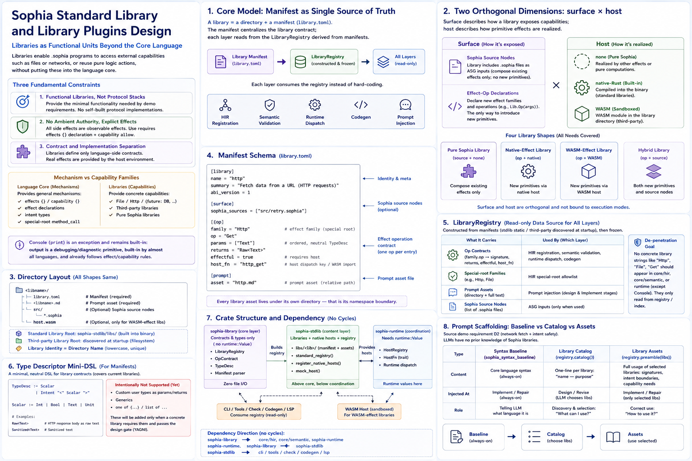

# Sophia Standard Library and Library Plugin Design



> This document mirrors `language_design.md`: while `language_design` defines the language itself, this document defines libraries—what a library is, its boundaries, how to organize them, how to unify the standard library and third-party libraries, and how LLMs discover and use them. The specific language contract of a library (e.g., `Http`) is documented separately (see §VIII Library Catalog). Implementation details are in `stdlib_implementation.md`.
>
> Status: living document. Libraries grow incrementally with demo needs. Current: the library-plugin model has landed (manifest-driven + `LibraryRegistry` + Plan B host registry); standard libraries `Http` / `File` (landed; see `http_lib.md` / `file_lib.md`). WASM production execution, dynamic host imports, the third-party `host.wasm` provider ABI in VM mode, and CLI runner boundaries are documented in `wasm_codegen.md` §VI / §VIII / §XI.

---

## I. Positioning: what is a library

Libraries are on-demand functional units provided outside the core language, enabling `.sophia` programs to call out to files, networking, and other external capabilities, or to reuse a set of pure-logic actions, without baking such things into the language core. I/O like files/network/databases are libraries (as in most languages), not language primitives. Three constraints inherited from the language positioning (`language_design.md` §1/§3):

1. Functionality libraries, not protocol stacks: introduce only the minimum capabilities as needed by demos; do not build lower-level protocols. If networking only needs “fetch from URL,” provide `Http.Get` only—no TCP/TLS. If files only need read/write, provide `File.Read`/`File.Write`. No demand, no feature.
2. No ambient authority; explicit `effect` declarations: all library side effects are observable effects and must be declared via `effects {}` and authorized via capabilities’ `allow{}`—no implicit side-effect backdoors from libraries, consistent with the language’s effect/capability mechanics.
3. Contract vs implementation separation: library effects define only the language-side contract (signature, types, intent boundaries, capability shape). Real side effects are implemented by hosts; `core`/`runtime` do not embed any specific libraries (see §V).

> Mechanisms vs capability families (key boundary): the language core provides the effect/capability/intent mechanisms + common syntax (`effects {}` / `capability {}` / `effect` declarations / special-root method-call shape). Libraries provide specific capabilities (`File`/`Http`/future `DB`/third-party libs).
>
> `Console` (`print`) is the exception and remains a language built-in: output is a debugging/diagnostic primitive, nearly universal across languages, and already follows the effect/capability model with no ambient-authority issues. It does not appear in the library catalog; it is carried by `hir::builtins::BUILTIN_EFFECT_OPS` (the only built-in effect family) and ships with the resident syntax baseline.

> Admission bar: adding a library follows the same demand-driven, design-review discipline as language expansion—triggered by concrete demo needs, one library per design review; do not prepopulate a feature list.

---

## II. Core model: manifest = single source of truth; registries = read-only data sources per layer

> Historical context: libraries used to not be structured entities—the contract of a library like `Http` was scattered across hardcoded const tables/match arms in 9 places across 6 crates (HIR registration, HIR special roots, semantic signatures, runtime interface/dispatch, real host, host selection, codegen, prompts). Consequences: (i) library knowledge leaked into every language-core layer; (ii) third-party libraries had no pattern to follow. The root cause was inverted indexing direction (`layer → {slices of all libraries}`). The current model flips it to `library → manifest → registries → layers`.

A library equals a directory plus a manifest (`library.toml`). The manifest centralizes the library’s contracts for all layers; each layer consumes a `LibraryRegistry` derived from manifests instead of hardcoding. This is the structural landing that keeps libraries out of the language core.

### 2.1 Two orthogonal dimensions of a library (surface × host)

A library’s capabilities are described along two independent dimensions—this unifies standard vs third-party, pure-Sophia vs WASM libraries:

- surface (how the library exposes capabilities): (i) Sophia source nodes (the library ships `.sophia` to serve as additional ASG inputs; it can only compose existing effects/ops and cannot introduce new primitives); (ii) effect-op manifest declarations (the library declares new effect families/ops callable as `Lib.Op(args)`—the only avenue to introduce new primitives and must be backed by a host).
- host (how primitive effects land): none (pure-Sophia composition) / native Rust (compiled into the binary; standard library) / WASM (sandbox module under the library directory; third-party library with new primitives).

This yields four library forms (covering all needs): pure-Sophia library (source + none) / native-effect library (op + native, e.g., `Http`/`File`) / WASM-effect library (op + WASM; third-party primitives) / hybrid (op + source). The two dimensions are orthogonal and not tied to execution modes—see §VI for cross-mode symmetry.

### 2.2 Directory layout (shared for all four forms)

```
<root>/<libname>/
  library.toml          # manifest: identity + effect-op signatures + host binding + surface/asset references
  <libname>.md          # prompt asset (per §III.1 structure)
  src/                  # optional Sophia source nodes: *.sophia
  host.wasm             # optional, only for third-party WASM-effect libraries
```

- Standard-library root = `libs/` within `sophia-stdlib` (compiled into the binary via `include_str!`).
- Third-party root = paths discovered at startup (§V.1).
- Library identity equals directory name (lowercase, unique). All assets live under the directory—the boundary equals the namespace.

### 2.3 Manifest schema (`library.toml`)

```toml
[library]
name = "http"                            # == directory name; unique library id
summary = "Fetch data from network URLs"
abi_version = 1                           # manifest schema version (unsupported versions cause startup failure)

[surface]                                 # optional Sophia source nodes
sophia_sources = ["src/retry.sophia"]

[[op]]                                    # optional; one per effect op
family = "Http"                          # effect family == special-root name
op = "Get"
params = ["Text"]                        # ordered; neutral TypeDesc (§2.4)
returns = "Raw<Text>"
effectful = true                          # whether host is needed (false = pure compute op)
host_fn = "http_get"                     # host dispatch key / WASM import name

[prompt]
asset = "http.md"                        # prompt asset file (relative to library dir)
```

### 2.4 TypeDesc mini-DSL (what libraries can say)

```
TypeDesc := Scalar                  # Int | Bool | Text | Unit
          | Intent "<" Scalar ">"   # Raw<Text> | Sanitized<Text> | ... (intent names from fixed core set)
```

This purposely covers current library shapes (all `Http`/`File` signatures). It intentionally does not support library-defined param/return types, generics, `one of`, or `list of`—expand the DSL and complete the design review if/when needed by a future library (YAGNI). This is the basis for switching the semantic effect-op checks from imperative per-op matches to interpreting manifest TypeDescs (table-driven): each library moves from “edit Rust” to “author a manifest.”

### 2.5 `LibraryRegistry` (read-only data source per layer)

Registries are built from a set of manifests (standard libs static; third-party discovered at startup) and frozen afterward (a prerequisite for deterministic gates). They carry op contracts (family.op → signature/returns/effectful/host_fn), the set of special-root families, prompt assets (catalog + full contents), and Sophia source nodes. Layers consume this instead of hardcoding:

| Layer | Consumption |
| --- | --- |
| HIR registration (effect symbol table) | `AsgIndex::new(registry)/AsgIndex::build(inputs, registry)` injects effect-ops + special-root families |
| HIR special-root allowance | `AsgIndex::is_library_family` (replaces hardcoded `File`/`Http` whitelists) |
| Semantic signature checks | `index.library_op(family, op)` table-driven checks based on TypeDesc (replaces imperative `infer_effect_op`) |
| Runtime dispatch | `HostRegistry` delegates by `(family, op)` (Plan B; §V.3) |
| Codegen | emitted host imports derived from registry |
| Prompts | `registry.catalog()` (design) / `registry.preamble(libs)` (implement) |

De-leakage criterion: code under `core/hir`, `core/semantic`, `runtime` no longer contains string literals like "Http"/"File"/"Get" (except for `Console`)—they only talk to the registry/index.

### 2.6 Crate structure (standard library is a crate)

- `sophia-library` (core layer, contract types): `LibraryRegistry` / `OpContract` / `TypeDesc` / manifest parsing. No `runtime::Value`, so `core/*` can depend on it (avoids dependency cycles). Zero file I/O (parses manifest strings passed in).
- `sophia-stdlib` (content layer): `libs/<lib>/` (manifests + assets + native host) + `standard_registry()` + `register_native_hosts` / `mock_host`. Lives above the core and below coordination (may do I/O). `core` does not depend on it—`core/semantic` consumes an `&AsgIndex` (carrying lib contracts) just like it consumes an `&SemanticModel`.
- `HostRegistry`/`HostFn` live in `sophia-runtime` (need `Value`).

Dependency graph is acyclic: `sophia-library ← core/hir, core/semantic, sophia-runtime`; `sophia-runtime, sophia-library ← sophia-stdlib`; `sophia-stdlib ← cli/tools/check/tools/codegen/lsp`.

---

## III. Prompt scaffolding: baseline vs library catalog vs library assets

> Origin: demo need D2 (network fetch + intent safety). LLMs have no a priori knowledge of Sophia libraries—without purpose and usage hints, they cannot produce `.sophia` that uses libraries. Library knowledge is carried by `LibraryRegistry` (`sophia-stdlib`), not inside the prompt crate.

When LLMs write `.sophia`, prompts inject three classes of assets, with clear boundaries:

| | Resident syntax baseline `sophia_syntax_baseline` | Library catalog `registry.catalog()` | Library assets `registry.preamble(libs)` |
| --- | --- | --- | --- |
| Content | Core language syntax | One line per library: “name — purpose” | Full usage of selected libraries (signatures / intent boundaries / capabilities) |
| Inject stage | implement/repair (resident) | design/revise (LLM chooses libraries) | implement/repair (inject only libraries chosen during design) |

Key boundary: library knowledge is not part of the resident baseline (baseline holds only core syntax). The `prompt` crate holds only the baseline + templates; the catalog/assets are computed from `LibraryRegistry` by the caller and passed in (the `stdlib_catalog` variable of the `design_solution` template is `catalog()`; `implement_system_prompt(stdlib_block)` receives `stdlib_block = preamble(libs)`).

### 3.1 Standard structure for each library asset (`<lib>.md`)

1. Purpose (a sentence or two); 2. Operations (signatures + semantics); 3. Effects and capabilities (declarations + allow forms); 4. Intent boundaries (constraints for returned intents); 5. Neutral example (minimal usage unrelated to any task; shape only). Assets contain only generalizable usage + neutral examples—no task answers/domain names/business logic (guarded by snapshots + anti-leak assertions).

### 3.2 Two stages: choose during design (catalog) → use during implement (assets)

Library selection is an LLM design decision (written into `design_result.libraries`), not a task predeclaration (which would leak solutions and be invalidated by third-party library growth). Design/revise inject only the minimal catalog; implement/repair inject the full assets per the selection (concatenated in lexicographic order by library name; deduped; unknown libraries ignored; empty set injects nothing). Selection flows through `PseudocodeArtifact` / scheduler / `run_implement_loop` / `StepPrompts` all the way to the implement system prompt (graph CLI persists via `.libs` sidecar across processes).

---

## IV. Scope and non-goals

- Do not build protocol stacks: provide functionality only.
- No ambient authority: all library capabilities are explicit effects.
- No new intent kinds defined by libraries: `Raw`/`Sanitized`… are core safety vocabulary; libraries may only reference them (§VI safety red lines).
- No syntax/keyword/type-constructor/generics additions by libraries: they may only declare effect families + operation signatures.
- No prepopulated library list: single-library-per-gate, demand-driven growth.
- No hot reloading: third-party libraries are discovered once at startup; registries are frozen afterward.

---

## V. Loading: standard libraries static; third-party discovered once at startup

### 5.1 Discovery

- Standard libraries: `sophia-stdlib`’s `libs/` are compiled into the binary (manifests/assets/sources via `include_str!`; native hosts linked). The registry’s standard portion is built at process initialization—zero I/O, deterministic.
- Third-party libraries: at process startup, scan in this order—(i) `<project-root>/sophia_libs/`; (ii) `$SOPHIA_LIB_PATH` (platform path-list semantics: `:` on Unix, `;` on Windows). For each subdir, read `library.toml` + assets + optional `.sophia` sources + optional `host.wasm`, and merge into the registry. Do this once, then freeze. Failures (invalid manifests/unsupported `abi_version`/name conflicts/WASM validation failures) cause an honest startup error and exit—no silent skipping, no partial loads, no silent overrides. Discovery entry points: `sophia-stdlib::full_registry_for(project_root)` (used by CLI commands) / `project_roots(project_root)` (compute discovery roots only) / `full_registry_from(roots)` (for tests). Library Sophia sources are parsed into owned AST via `hir::LibrarySources::from_registry` and included alongside user AST within the index/model/execution. This is landed (P2 + CLI production wiring): demo libraries `hash_sophia` (pure Sophia) / `hash_wasm` (WASM) are discovered and executed (see §VI). CLI `check` / `run` / `index` / `graph` / `context` / `repair-context` all use `full_registry_for(root)` for third-party discovery and to merge library sources; `run` registers third-party WASM hosts via `register_wasm_library_hosts` (see §V.3). Deterministic sub-gates (`tools/check::check_program` / `codegen` / LSP) still use `standard_registry`—third-party discovery is a coordination-layer startup behavior and not part of deterministic gates.

### 5.2 Conflicts and isolation

Library names must be unique; effect families must be unique; library Sophia source domains must be unique (library name == domain, isolated from user domains). Any conflict causes a startup error. Each library’s assets are confined to its directory; the registry aggregates by library; non-overlap is structurally guaranteed.

### 5.3 Host dispatch = Plan B (open registry)

Hosts are maintained in `HostRegistry: Map<(family, op), Box<dyn HostFn>>` (not a fixed-method-set trait). `Console` (`print`) is the exception, captured via `HostRegistry::console_write`.

- Standard libs: `sophia-stdlib::register_native_hosts` registers real `reqwest` / `std::fs` closures; `mock_host` registers deterministic in-memory buckets (tests/diff tests).
- Third-party WASM libs: `sophia-stdlib::register_wasm_library_hosts(host, registry)` iterates libraries that include `host.wasm` bytes (i.e., WASM-effect libs) and registers a `WasmHostFn` per effect-op—internally holding a `wasmi` instance of `host.wasm` and bridging via the unified ValueWire provider ABI. Distinguishing criterion = loading method (whether `host.wasm` is present in the registry); complementary with standard libs’ native hosts. Providers export `memory`, `sophia_alloc`, `sophia_read_copy`, and `host_fn(args_ptr,args_len)->result_len`; load failures, missing exports, signature mismatches, traps, and ValueWire type mismatches honestly return `Err` (no silent skipping, no fabricated hosts).
- Honesty red line: mock misses/real failures/WASM traps all return `Err`; the interpreter materializes them as hard errors; never fabricate success.

Plan B’s payoff: native and WASM hosts are isomorphic to the interpreter as `Box<dyn HostFn>`—the interpreter is agnostic to whether an effect is backed by Rust or WASM; this underpins cross-mode symmetry (§VI).

### 5.4 Unified host ABI

The unified host ABI is the ValueWire provider contract shared by the interpreter-side `WasmHostFn` and VM-side dynamic imports. Fixed VM imports are limited to `sophia_host.console_write` and `sophia_host.read_copy`; library operations are imported as `sophia_lib:<library>.<host_fn>` and pass arguments/returns through ValueWire. Native closures and third-party `host.wasm` providers both register as `HostFn` values, so the interpreter and VM mode share the same semantic host seam.

---

## VI. Cross-mode execution: two library forms × two modes (preserve the oracle invariant)

Surface and host are not bound to execution modes; all four quadrants are usable:

| | Interpreter mode | VM mode (WASM codegen) |
| --- | --- | --- |
| Pure-Sophia libraries | Yes: library nodes are regular ASG inputs | Yes: library nodes are emitted with user code |
| Native-effect libraries (standard) | Yes: `HostRegistry` native closures | Yes: module declares imports; instantiator provides natives |
| WASM-effect libraries (third-party) | Yes: `WasmHostFn` (embedded `wasmi` calls `host.wasm`) | Yes: `host.wasm` is the import provider |

- Pure-Sophia libraries are naturally common to both modes: they are Sophia code (interpreted by the interpreter; compiled by codegen) and need no extra mechanism.
- WASM-host libraries also work in both modes: VM mode is native; interpreter mode embeds `wasmi` (now a formal `sophia-runtime` dependency, only triggered by third-party WASM libs; zero cost for standard libs). The interpreter-mode wiring is `runtime::WasmHostFn`, which holds a `wasmi` instance of `host.wasm` and registers it into `HostRegistry`.
- Do not split library capabilities by mode: the project invariant is “the interpreter is the only oracle,” and diff tests require equivalence per hidden case between interpreter and WASM for the same program. If a library worked only in one mode, programs using it would lack cross-mode baselines—breaking the invariant. Therefore library capabilities must be symmetric across modes.

Landed (P2): two demo libraries `hash_sophia` (pure-Sophia) / `hash_wasm` (WASM-effect via `WasmHostFn`) compute the same deterministic digest. `cargo test` acceptance covers discovery + registry merge + cross-domain exemption + pure-Sophia execution + WASM execution via `WasmHostFn`, with bitwise-equal results from both libs. The WASM host ABI is the unified ValueWire provider contract in §V.4; VM-mode imports from third-party `host.wasm` are covered by diff tests.

---

## VII. Safety boundaries (hard constraints to avoid core leakage)

| Libraries can | Libraries cannot (schema/registration-time rejection) |
| --- | --- |
| Declare effect families + operations (`Lib.Op(args)`) | Introduce new intent kinds (fixed in the core; may only reference) |
| Use restricted TypeDesc to define signatures | Add syntax/keywords/type constructors/generics |
| Provide Sophia source nodes (within library domain) | Inject new types visible to the user domain (still defined by user `.sophia`) |
| Provide prompt assets | Change parser/type-system structure/evaluation rules |
| Bind hosts (native Rust / third-party WASM sandbox) | Open ambient authority (all ops still require `effects` + capability `allow`) |

- Intent vocabulary belongs to the core—this is a non-negotiable red line: if third parties could inject intent kinds, they’d be defining security semantics. Intent names in manifest TypeDescs are parsed by the core via `IntentKind::from_head`—unknown names conservatively become `Ty::Error`; never allow them.
- Third-party hosts are WASM sandboxes: capabilities (who may trigger effects) × WASM sandboxing (isolate host implementations) are orthogonal—turning “third-party host = arbitrary code execution” into “load a sandbox module,” which is safe and portable.
- Pure-Sophia third-party libraries carry zero host risk: they have no host; they are subject to the same static checks as user code.

---

## VIII. Library catalog

| Library | Purpose | Form | Language-contract doc | Status |
| --- | --- | --- | --- | --- |
| `Http` | Network GET returning body as untrusted `Raw<Text>` | native-effect | `http_lib.md` | Landed |
| `File` | Local file read/write | native-effect | `file_lib.md` | Landed |
| `DB` | Persistent data store | (TBD) | (not written) | Future candidate: clarify semantics (KV/relational/document? backend? consistency?) before completing the design review; not in v1 |

Adding a library: create `libs/<lib>/` (manifest + asset + optional sources + optional host) → register a line in `sophia-stdlib::STDLIB_LIBS` (standard libs) or place under a third-party root (third-party) → add a `<lib>_lib.md` contract doc (if effectful). See `stdlib_implementation.md` §V.

Historical note: in v0 there was a `storage` top-level node + built-in `DB.Read/Write` effects (in-memory KV partitioned by name). It was removed due to unclear semantics; persistence will be reintroduced via a semantically clear `DB` library in the future. Near-term persistence/local-state demo needs are covered by the `File` library.

---

## IX. Change log

- 2026-05-31 — Establish the standard-library design doc (mirrors `language_design.md`): positioning, two classes of knowledge, baseline vs library-asset boundaries, two-stage prompt scaffolding.
- 2026-05-31 — Establish model (B) “I/O = libraries,” remove `storage`, and add `File`/`DB` (future) to the catalog.
- 2026-05-31 — Library-plugin model landed (absorbs former `library_plugin.md` design-review): refactor libraries from scattered hardcoded slices into manifest = single source of truth + `LibraryRegistry` = read-only data source per layer (flipped indexing). Add two orthogonal dimensions (surface × host) unifying standard/third-party and pure-Sophia/WASM libraries; dual loading paths (standard libs static compile; third-party discovery once at startup + WASM sandbox hosts); table-driven effect signatures (TypeDesc mini-DSL replacing imperative matches); host dispatch to Plan B (`HostRegistry: Map<(family,op), Box<dyn HostFn>>`, natives and WASM are isomorphic); standard libs extracted into `sophia-stdlib` crate and contract types into `sophia-library` crate (`core` consumes read-only `&AsgIndex` carrying library contracts); cross-mode symmetry (four quadrants usable; preserve oracle invariant); intent vocabulary belongs to core as a safety red line. Implementation P1 (standard libs templated; pure refactor; zero behavior change) landed. P2 (third-party dynamic discovery + embedded `wasmi` for WASM hosts) awaited real third-party needs.
- 2026-05-31 — Library-plugin P2 landed (absorbs former `library_plugin_p2.md`). Third-party libraries are discovered once at startup via `sophia-stdlib::full_registry_for(project_root)` (project-root `sophia_libs/` + `$SOPHIA_LIB_PATH`) / `full_registry_from` (specified roots for tests); library Sophia sources are parsed into owned AST via `hir::LibrarySources::from_registry` and included alongside user AST in index/model/execution. Cross-domain exemption: `AsgIndex.library_domains` (collected from `registry.sophia_sources`) + resolver skip `ImplicitCrossDomain` for user→library references (user↔user remains checked). WASM host: `wasmi` promoted to a formal `sophia-runtime` dependency + `runtime::WasmHostFn` (holding `host.wasm`; unified byte ABI; §V.4/§VI.1). Two demo libs, `hash_sophia` (pure Sophia) and `hash_wasm` (WASM-effect op `WasmHash.Mix`, `effectful=false`; `host.wasm` constructed via wasm-encoder in a temporary third-party test root), compute the same deterministic digest (`acc=acc*31+value` x3). `cargo test` integration (`stdlib/tests/library_demo.rs`) validates discovery + registry merge + cross-domain exemption + pure-Sophia execution + WASM lib via `WasmHostFn` + bitwise-equal results. All deterministic; in-gate (369 passed). CLI production wiring (`library_registry(root)` → `full_registry_for(root)` + including library sources into command inputs + `sophia run` registering third-party WASM hosts) left as follow-up—mechanics + deterministic demos are ready.
- 2026-05-31 — CLI production wiring landed (P2 wrap-up). CLI `library_registry(root)` now uses `full_registry_for(root)` (discover third-party libs under project root + `$SOPHIA_LIB_PATH`, return `Result`, fail honestly). Added `discover::project_roots` / `full_registry_for`. `check` / `run` / `index` / `graph` / `context` / `repair-context` consume `library_context(root)` and merge library Sophia sources (`LibrarySources`) into program inputs/ASTs; `sophia run` registers third-party WASM hosts via `sophia-stdlib::register_wasm_library_hosts` (complementary to standard natives; distinction by loading method). `tools/check::check_strip_assist_equivalence` becomes registry-aware (both sides include library sources symmetrically; otherwise user references to library nodes would break equivalence due to asymmetric resolution). Deterministic sub-gates (`check_program` / `codegen` / LSP / graph gate and LLM workflow commands) still use `standard_registry`. Manual smoke with `./sophia_libs/{hash_sophia,hash_wasm}`: `check` passes; `run ViaSophia` / `run ViaWasm` both yield the same digest 210523. Workspace: 372 passed (+3 WASM-host registration tests) / 0 failed; clippy 0 warnings; fmt clean.
- 2026-06-03 — Third-party `host.wasm` ValueWire provider ABI landed. The former direct `(Int,Int)->Int` subset is gone; both interpreter-mode `WasmHostFn` and VM-mode dynamic imports use ValueWire (Unit/Bool/Int/Text; intents erased). Providers export `memory`, `sophia_alloc`, `sophia_read_copy`, and `host_fn(args_ptr,args_len)->result_len`; load/export/signature/trap/ValueWire failures are hard errors. The same `HostRegistry` path is used by native hosts and third-party WASM providers.
- 2026-06-03 — WASM production runtime path documented in `wasm_codegen.md`. `sophia build` now emits `program.wasm`, `program.sophia-build.json`, and third-party host assets; `run/smoke --backend wasm` execute the build artifact after manifest/hash/registry validation. Future boundaries (entry-scoped artifacts, offline bundles, arbitrary `.wasm` paths, trace instrumentation, browser/Node loaders, ValueWire extensions) live in `wasm_codegen.md` §XI.
