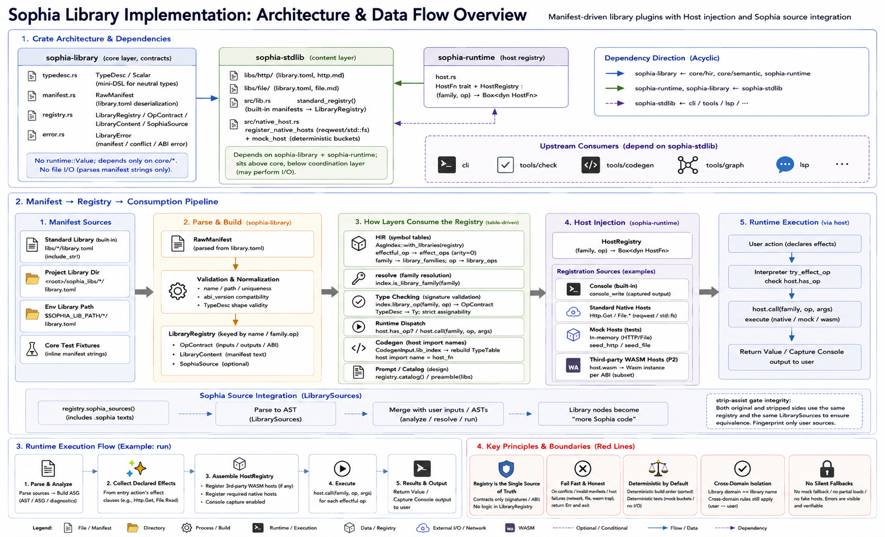

# Sophia Library Implementation



> This document mirrors `language_implementation.md`: it defines the implementation mechanics and roadmap of library plugins—manifest parsing and registries, how each layer consumes registries, `HostRegistry` injection, crate layering, and test boundaries. For motivations and boundaries, see `stdlib_design.md`; for a library’s language contract, see its specific doc (e.g., `http_lib.md`).
>
> Status: authoritative implementation document. The current implementation uses the manifest-driven library-plugin model: `LibraryRegistry` is the single source for library contracts, `HostRegistry` is the runtime host-injection seam, and standard-library contents are provided by `sophia-stdlib`. Future expansion follows the checklist in §V.

---

## I. Crate layering

```
sophia-library  (core layer; contract types)
  src/typedesc.rs   TypeDesc / Scalar (restricted neutral type mini-DSL)
  src/manifest.rs   RawManifest (library.toml deserialization form)
  src/registry.rs   LibraryRegistry / OpContract / LibraryContent / SophiaSource
  src/error.rs      LibraryError (manifest/conflict/ABI errors)
  —— no runtime::Value; core/* may depend; zero file I/O (parses provided manifest strings)

sophia-stdlib   (content layer)
  libs/http/{library.toml, http.md}      standard-library contents (include_str! baked into binary)
  libs/file/{library.toml, file.md}
  src/lib.rs          standard_registry() (built-in manifests → LibraryRegistry)
  src/native_host.rs  register_native_hosts (real reqwest/std::fs) + mock_host (deterministic buckets)
  —— depends on sophia-library + sophia-runtime; above core/below coordination (may do I/O)

sophia-runtime  (host registry home)
  src/host.rs   HostFn trait + HostRegistry: `(family,op) → Box<dyn HostFn>`
  src/value_wire.rs    ValueWire ABI shared by WASM program runner and third-party providers
  src/wasm_host.rs     WasmHostFn provider loader
  src/wasm_program.rs  WasmProgramRunner for non-browser WASM execution
```

Dependencies (acyclic): `sophia-library ← core/hir, core/semantic, sophia-runtime`; `sophia-runtime, sophia-library ← sophia-stdlib`; `sophia-stdlib ← cli / tools/check / tools/codegen / lsp`.

`core` does not depend on `sophia-stdlib`: `core/hir`’s `AsgIndex::new(&registry)/AsgIndex::build(inputs, &registry)` and `core/semantic`’s `TypeChecker::new(model, ast, &index)` consume only read-only `&LibraryRegistry` / `&AsgIndex` (carrying library contracts). Deterministic core tests build fixture registries from inline manifests via `sophia-library`, avoiding stdlib and filesystem.

---

## II. Manifest → registry → layers

### 2.1 Manifest parsing (`sophia-library`)

`LibraryRegistry::build(Vec<LibraryContent>)` parses each library’s `library.toml`, validates: directory name equals manifest `name`; supported `abi_version`; uniqueness of library names/families/domains; valid TypeDesc shapes. Conflicts/invalids return `Err` (no silent overrides). Outputs are aggregated deterministically by library name and `family.op`.

### 2.2 Layer consumption of the registry (replacing hardcoding)

| Touchpoint | Implementation |
| --- | --- |
| HIR effect symbol table + special roots | `AsgIndex::new(registry)/AsgIndex::build(inputs, registry)` populates `effect_ops` (arity=0 for effectful ops), `library_families`, and `library_ops` (all `#[serde(skip)]`-derived symbol tables) |
| HIR special-root allowance | resolver calls `index.is_library_family(family)` (replacing `File`/`Http` literal whitelists) |
| Semantic signature checks | `type_layer::infer_effect_op` queries `index.library_op(family, op)` for `OpContract` and turns TypeDesc into `Ty` (`typedesc_to_ty`) to perform table-driven argument/return checks (intent strictness via existing `assignable_to`) |
| Runtime dispatch | interpreter `try_effect_op` calls `host.has_op(family, op)` and `host.call(family, op, args)` for host delegation |
| Codegen | `CodegenInput` holds `lib_index` (`AsgIndex::new(registry)`) to recompute the TypeTable; host import names from `host_fn` |
| Prompts | `registry.catalog()` (design) / `registry.preamble(libs)` (implement) |

`Console` (`print`) continues to be carried by `hir::builtins::BUILTIN_EFFECT_OPS` (the only built-in effect family), and captured by `HostRegistry::console_write`—a language built-in that does not go through the library registry.

### 2.3 Entry points for registries

- Deterministic sub-gates (`tools/check::check_program`, `tools/codegen`, LSP, graph gate hidden-case model construction, graph design/implement-loop’s library catalog/asset rendering): use `sophia_stdlib::standard_registry()` (standard libs; third-party discovery is a coordination-layer startup action and not part of deterministic gates).
- CLI production commands (`check`/`run`/`index`/`graph`/`context`/`repair-context`): use `library_registry(root)` = `sophia_stdlib::full_registry_for(root)` (standard libs + discovery under `<root>/sophia_libs/` and `$SOPHIA_LIB_PATH` resolved from the project root). Discovery failures are honest errors (no silent skipping/partial loads).
- Third-party discovery entry (startup-only, P2): `sophia_stdlib::full_registry_for(project_root)` / `project_roots(project_root)` / `full_registry_from(roots)`.
- Loading library Sophia sources: `hir::LibrarySources::from_registry(&reg)` parses `registry.sophia_sources()` into owned AST; callers merge `program_inputs()` with user inputs (resolve/index) and `asts()` with user AST (analyze/run). CLI commands use `commands::library_context(root)` to own and merge library ASTs. `tools/check::check_program` also merges (standard registry currently has no sources; pure-Sophia libs do).
- strip-assist gate uses a registry symmetrically: `check_strip_assist_equivalence(sources, registry, index)` ensures both original/stripped sides include the same registry and library sources, avoiding asymmetric resolution when users reference library nodes. Fingerprints cover user code (library code cancels out on both sides).
- Core unit tests: build fixture registries inline via `LibraryRegistry::build` (neutral File/Http manifests), not depending on stdlib.

### 2.4 Cross-domain exemption (pure-Sophia libraries)

Library Sophia nodes are registered under domains equal to library names (isolation). User→library references (e.g., `SophiaDigest`) are exempted via `AsgIndex.library_domains` (populated by the registry parameter to `AsgIndex::new` / `AsgIndex::build` from `registry.sophia_sources()`) and resolver’s `check_cross_domain_domain` skipping `ImplicitCrossDomain` for library domains (user↔user remains checked). Library nodes are statically checked like user code (no privilege)—the exemption only affects visibility.

---

## III. Host-injection seams

`runtime::HostRegistry` is a registry mapping `(family, op)` to `Box<dyn HostFn>`, plus a console capture. `HostFn::call(&[Value]) -> Result<Value, String>`; closures register via `HostRegistry::register_fn`, wrapped internally as `HostFn` objects.

- Execution entry: `run_action(.., &mut HostRegistry)` is the only execution entry. Pure logic / Console programs pass an empty `HostRegistry`; programs using library effects register the required hosts first.
- Standard-library hosts (`sophia-stdlib::native_host`): `register_native_hosts(&mut host)` registers real `reqwest` `Http.Get` and `std::fs` `File.Read`/`File.Write`; `mock_host()` / `register_mock_hosts` register deterministic in-memory buckets (`MockBuckets::seed_http`/`seed_file` for tests/diff tests).
- Third-party WASM hosts (`sophia-stdlib::register_wasm_library_hosts(&mut host, &registry)`): iterate libraries in the registry that carry `host.wasm` bytes (WASM-effect libs), and register a `runtime::WasmHostFn` per effect-op—internally a `wasmi` instance of `host.wasm` forwarding through the unified ValueWire ABI. `host.wasm` must export `memory`, `sophia_alloc(len)`, `sophia_read_copy(dst)`, and one `host_fn(args_ptr,args_len)->result_len` per op. Unit/Bool/Int/Text are supported; intents erase to the inner scalar. Load failures, missing exports, signature mismatches, traps, and ValueWire type mismatches return honest `Err` (no silent skipping; no fabricated hosts). Distinguish by loading method (presence of `host.wasm` in the registry), complementary to standard native hosts. WASM libs are instantiated only when present; standard libs incur zero WASM overhead.
- CLI `sophia run` assembly (`commands::run_interpreter_action`): first `register_wasm_library_hosts` (no-op if none), then register native hosts on demand per entry action’s declared effects (`Http.Get`/`File.*`); third-party WASM ops are often `effectful=false` (not reflected in effect declarations), so their hosts are registered unconditionally.

Honesty red line: mock misses/real failures (network non-2xx/timeout/file missing/invalid UTF-8)/WASM traps all return `Err`, materialized as `RuntimeError` (hard-stop). Never fabricate success or a default response.

---

## IV. Test boundaries

- Real external calls (real network/files) never enter `cargo test` (same policy as e2e/benchmark real LLM). Real hosts are covered by e2e (real I/O) + manual validation; deterministic tests always use `mock_host`.
- Library contract/registry tests (deterministic, in `cargo test`): `sophia-library` registry construction/conflicts/TypeDesc parsing; `sophia-stdlib` `standard_registry` includes File/Http + catalog/preamble + anti-leak assertions (no task tokens) + mock host round-trips/missed honest Err.
- Interpreter dispatch mechanism (`runtime/tests/interpret.rs`): use a neutral test library `Vault` (inline manifest + registered closure) to verify `Lib.Op(args)` dispatch—`runtime` does not depend on `sophia-stdlib` (which instead depends on `runtime`), so we test the mechanism with a neutral lib rather than standard-lib semantics (which belong to stdlib tests).

---

## V. Implementation checklist for adding a new library

1. Create `libs/<lib>/` (standard: under `sophia-stdlib`; third-party: under third-party root): `library.toml` (manifest) + `<lib>.md` (asset per `stdlib_design.md` §3.1) + optional `src/*.sophia` (pure-Sophia lib) + optional `host.wasm` (third-party WASM-effect lib).
2. Register: for standard libs, add an entry to `sophia-stdlib::STDLIB_LIBS` (library name + `include_str!` manifest + asset). For third-party libs, place under `./sophia_libs/` or `$SOPHIA_LIB_PATH`.
3. Hosts (if effectful): standard libs register native closures via `register_native_hosts` and mocks via `register_mock_hosts`; third-party libs provide `host.wasm`.
4. Contract docs (if a new effect family): add `<lib>_lib.md` and register it in `stdlib_design.md` §VIII.
5. Tests: registry construction/asset anti-leak/mock-host round-trips; end-to-end acceptance goes into e2e (real I/O).

Zero changes to the language core: all steps above do not touch `core/*` or `runtime` code—that is the goal of the library-plugin model. Changes in `core` are only needed to extend the TypeDesc mini-DSL (if a library needs more complex signatures), and must complete the design review first.

---

## VI. Change log

- 2026-05-31 — Establish library-implementation doc: prompt asset layout/API; two-stage, on-demand selection; host injection seam; test boundaries.
- 2026-05-31 — Library plugin P1 landed (absorbing former `library_plugin.md`). Rewrote implementation view as manifest → registry → layer consumption: added `sophia-library` (contract types + manifest parsing) and `sophia-stdlib` (contents + native/mock hosts) crates; `AsgIndex::new(registry)` / `AsgIndex::build(inputs, registry)` injecting library effects/special roots/op contracts; table-driven `type_layer::infer_effect_op` (TypeDesc → Ty); host dispatch uses `HostRegistry: (family,op) → Box<dyn HostFn>` (`runtime` does not embed specific libraries); `File`/`Http` moved from hardcoded `core` into `sophia-stdlib/libs/`; prompt crate sheds stdlib content (catalog/assets now provided by the registry); CLI’s `CliHost` removed, replaced by `register_native_hosts`. Core tests use inline-manifest fixtures and do not depend on stdlib. Pure refactor; zero behavior change (File/Http end-to-end semantics unchanged); all workspace tests green. Adding a library requires zero changes to the language core.
- 2026-05-31 — Library plugin P2 landed (third-party dynamic discovery + two demo libs; absorbing former `library_plugin_p2.md`). Added `sophia-stdlib::discover` (`full_registry_for` / `full_registry_from` / `project_roots` / `DiscoverError`) that scans agreed roots → reads manifests/assets/`.sophia`/`host.wasm` → merges registry with deterministic ordering; added `hir::LibrarySources::from_registry` (parse library `.sophia` into owned AST and merge into index/model/execution) + `HirError::LibrarySourceParse`; added `AsgIndex.library_domains`/`is_library_domain` + resolver cross-domain exemption; added `runtime::WasmHostFn` (`wasmi` loads `host.wasm`; ValueWire provider ABI; `wasmi` promoted to runtime dependency + `wasm-encoder` dev-dep). Two fixtures (`stdlib/tests/fixtures/sophia_libs/hash_sophia`, `hash_wasm`) + integration test `stdlib/tests/library_demo.rs` (build `host.wasm` at test time via wasm-encoder; gitignored). Acceptance covers discovery + registry merge + cross-domain exemption + pure-Sophia execution + WASM via `WasmHostFn` with equal digests. CLI production wiring (`full_registry_for(root)` + merging library sources into command inputs + `sophia run` registering third-party WASM hosts) deferred.
- 2026-05-31 — CLI production wiring landed (P2 wrap-up). `discover` adds `project_roots(root)` / `full_registry_for(root)` (resolve `<root>/sophia_libs/` relative to project root rather than process CWD; CLI commands use `--root` to locate the project). `native_host` adds `register_wasm_library_hosts(host, registry)` (iterate registry; register `WasmHostFn` for libraries with `host.wasm`; provider load failures return honest `Err`). CLI `commands` `library_registry(root) -> Result<LibraryRegistry>` now returns `Result` (uses `full_registry_for`); new `library_context(root)` returns `(registry, LibrarySources)`. `check`/`run`/`index`/`graph`/`context`/`repair-context` discover third-party libs and merge library `.sophia` into inputs/ASTs; `run_interpreter_action` unifies WASM-host registration (always) + native-host registration (on-demand by entry effects), replacing `run_with_default_host`/`run_with_real_host`. `tools/check` `check_strip_assist_equivalence(sources, registry, index)` becomes registry-aware (both sides merge library sources symmetrically); `check_program` merges library sources. Graph gate/design/implement-loop and LSP/codegen still use `standard_registry` (deterministic sub-gates). Manual smoke verifies that pure-Sophia + WASM demo libs via CLI `check`/`run` produce the same digest. Later ValueWire provider tests cover runtime Text providers and VM dynamic import through third-party `host.wasm`.
- 2026-06-03 — Third-party `host.wasm` provider ABI migrated to ValueWire. `runtime::WasmHostFn::new(wasm_bytes, op_contract)` is the only provider entry; the old direct i64 ABI is removed. Providers must export `memory`, `sophia_alloc`, `sophia_read_copy`, and `host_fn(args_ptr,args_len)->result_len`. `runtime::value_wire` is shared by `WasmHostFn` and `WasmProgramRunner`; Unit/Bool/Int/Text are supported and intents erase to the inner scalar. Load failures, missing exports, signature mismatches, traps, and ValueWire type mismatches are honest errors.
- 2026-06-03 — WASM build bundle and runtime validation landed in CLI. `sophia build` writes `program.sophia-build.json` and copies third-party `hosts/<lib>/host.wasm` assets; `run --backend wasm` and `smoke --backend wasm` validate wasm hash, registry fingerprint, and host asset hashes before executing through `sophia-runtime::WasmProgramRunner`. This preserves the single semantic path: current project sources and registry still provide the `SemanticModel`; offline bundle loading is intentionally out of scope.
