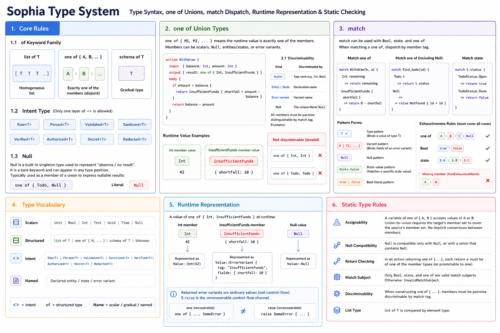

# Sophia Type System



This document describes the current Sophia type-system snapshot: type syntax, `one of` unions, `match` dispatch,
runtime representation, and static checking rules.

---

## I. Core Rule

`Wrapper<T>` forms belong exclusively to Intent Types. All structural types use the `of` keyword family.

### 1.1 The `of` Keyword Family

| Type | Syntax | Meaning |
| --- | --- | --- |
| list | `list of T` | Homogeneous list of elements |
| union | `one of { A, B, ... }` | One of multiple mutually exclusive members |
| gradual | `schema of T` | Gradual type |

`Unknown` is a bare keyword with no parameters.

### 1.2 Intent Types

Intent wrappers use the `<>` form, and only one layer is allowed:

```
Raw<T> | Parsed<T> | Validated<T> | Sanitized<T>
Verified<T> | Authorized<T> | Secret<T> | Redacted<T>
```

Intent types compare by exact wrapper name and inner type.

### 1.3 `Null`

`Null` is the built-in single-value type for absence or no result. It is a bare type keyword and may appear in any type
position. Its typical use is as a `one of` member for nullable results:

```sophia
one of { Todo, Null }
```

The literal is written `Null`.

---

## II. `one of` Union Types

`one of { M1, M2, ... }` means the runtime value is exactly one of the members. Members may be scalars, `Null`,
declared entities/states, or error variants.

```sophia
action Withdraw {
  input  { balance: Int; amount: Int }
  output { result: one of { Int, InsufficientFunds } }
  body {
    if amount > balance {
      return InsufficientFunds { shortfall = amount - balance }
    }
    return balance - amount
  }
}
```

- Members are constructed and returned directly: success values, entities, states, `Null`, and error variants all appear
  as direct union members.
- Recoverable failures use `one of {..., SomeError}` as the return value, and callers must handle them explicitly.
- `raise` is the unrecoverable auto-propagating control-flow channel constrained by `errors {}`; returning an error
  variant and raising one are orthogonal mechanisms.

### 2.1 Distinguishability

Members of a `one of` must be pairwise distinguishable by match tag:

- Scalars are distinguished by type name, such as `Int`, `Bool`, and `Text`;
- entities/states by declaration name;
- error variants by variant name;
- `Null` is the unique literal.

Therefore `one of { Int, Text }` is distinguishable; `one of { Int, Int }` and `one of { Todo, Todo }` are not, and the
checker should report an error.

---

## III. `match`

`match` can inspect `Bool`, state, and `one of` values. Matching a `one of` dispatches by member tag.

```sophia
match Withdraw(b, a) {
  Int remaining                   => return remaining
  InsufficientFunds { shortfall } => return 0 - shortfall
}
```

```sophia
match find_todo(id) {
  Todo t => return t.status
  Null   => raise NotFound { id = id }
}
```

Pattern forms:

- Type pattern: `<TypeName> <binding>`, matching that type member and binding the value.
- Variant pattern: `<VariantName> { f1, f2, ... }`, matching an error variant and binding fields by name.
- `Null`: matches the `Null` member, with no binding.
- State-value pattern: `StateName.Value`, matching a concrete state value.
- Bool literals: `true` / `false`.

Exhaustiveness rules:

- Matching a `one of` must cover all members;
- matching a `Bool` must cover both `true` and `false`;
- matching a state must cover all values;
- `_` wildcard patterns do not exist; missing members produce a `NonExhaustiveMatch` diagnostic.

---

## IV. Type Vocabulary

```
Scalars:    Unit | Bool | Int | Text | Uuid | Time | Null
Structural: list of T | one of { M, ... } | schema of T | Unknown
Intent:     Raw<T> | Parsed<T> | Validated<T> | Sanitized<T> | Verified<T>
            | Authorized<T> | Secret<T> | Redacted<T>
Named:      Declared entity/state/error variant
```

`<>` denotes intents, `of` denotes structural types, and bare names denote scalars, gradual placeholders, or named types.

---

## V. Runtime Representation

`one of` does not introduce an extra wrapper value. A `one of { Int, InsufficientFunds }` runtime value is either
`Value::Int(...)` or an error value carrying the variant tag and fields. `match` dispatches by the actual value tag.

`Null` is represented as `Value::Null`. Returned error variants are ordinary values, distinct from `raise` control-flow
propagation.

---

## VI. Static Type Rules

- Assignability: a position of type `one of { A, B }` accepts any member value; union-to-union assignment requires the
  target member set to cover the source member set. Members do not auto-convert between each other.
- `Null` is compatible only with `Null`, or with a union position that contains `Null`.
- Return checking: in an action returning `one of {...}`, each `return e` must have the type of a member, or be promotable
  to one.
- Match subjects: only `Bool`, state, and `one of` may be matched; other subjects produce `InvalidMatchSubject`.
- Distinguishability: member tags are checked statically when building a `one of` type.
- Lists: `list of T` compares by element type.
