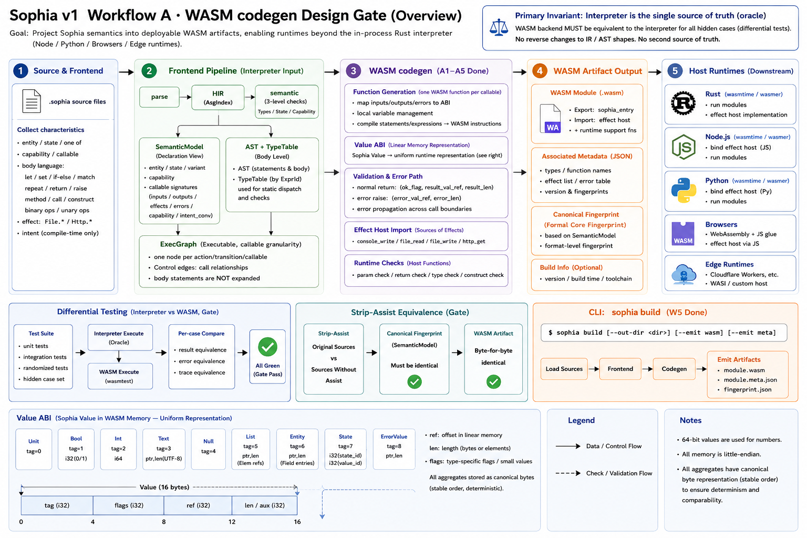

# Sophia v1 Workflow A · WASM codegen Design Gate



> Status: design gate finalized + implementation W1–W5 landed (A1–A5 achieved, 2026-05-31). This document defines the implementation plan and landing record of v1 Workflow A (WASM codegen): project Sophia’s semantics into deployable WASM artifacts so the execution backend expands from “Rust in-process interpreter only” to “embeddable by Node/Python/browsers/edge runtimes.” It corresponds to `dev_checklist_v1.md` Workflow A (A1–A6), `language_implementation.md` §12.2 (emit shape), and `engineering_architecture.md` §14.2. A1–A5 have landed (contract freeze / emit / differential tests / effect host imports / artifact gate + `sophia build`); A6 (incremental queries, decoupled from codegen) awaits its own design gate.
>
> Three-step discipline (user-established methodology): this is the design gate for codegen—first fix the input contracts / value ABI / function ABI / effect ABI / toolchain / diff-test and gate locations; after confirmation, implement in phases. §10’s seven decision points are confirmed and adopted; proceed per §9 W1→W5. This document contains no implementation code.
>
> Prime invariant (throughout): the interpreter is the only semantic source of truth (oracle). Any outputs of the WASM backend must be equivalent to the interpreter per hidden case (differential tests). Codegen must not demand IR/AST shape changes (`language_implementation.md` §12.1). Introducing a second semantic source of truth is forbidden.

---

## I. Goals and boundaries

### 1.1 Deliverables (v1 completion criteria 1 + 3)

- Criterion 1: starter-subset programs compile via the WASM backend and are equivalent to interpreter results per hidden case (all diff tests green).
- Criterion 3: strip-assist equivalence holds at the artifact layer—after removing all Semantic Assist fields, the emitted WASM byte sequence is identical byte-for-byte (extends the existing formal-core fingerprint gate; see `language_design.md` §5.1).

After landing, `sophia build` changes from a no-op to actually emitting WASM artifacts (`engineering_architecture.md` §9.1). Landed in W5.

### 1.2 Non-goals (boundaries)

- No async/concurrency/await/threads: the starter-subset body sublanguage is synchronous/pure (`language_implementation.md` §9.3), and WASM MVP’s async support is limited—one of the selection reasons for WASM; we will not make an exception here.
- No second codegen target: native (cranelift/LLVM) or named-language emission (TS/Python) is deferred to v2+ upon clear deployment needs (`engineering_architecture.md` §14.3/`language_implementation.md` §12 end).
- No parallel body IR: see §III’s input-contract decision—codegen, like the interpreter, consumes AST + semantic metadata for bodies; do not invent a lowered body IR layer (avoid a second truth source and overdesign).
- No heavyweight external toolchain in `cargo test`: the diff-test WASM executor must be a normal Cargo dependency, pure Rust, deterministic (see §VII toolchain decisions). Real deployment hosts (wasmtime/browsers) consume artifacts downstream; not part of gates.
- No LLM calls inside codegen: `core`/`tools` remain purely deterministic (iron rule, `language_implementation.md` §2).

---

## II. Current state (starting point for codegen)

Before landing codegen, pin down “what the interpreter actually executes”—that is the semantics WASM must replicate.

### 2.1 Execution path

```
parse(.sophia) → HIR(AsgIndex) → semantic(SemanticModel + 3 layers of checks) → exec-ir(ExecGraph) → interpreter run
```

- `SemanticModel` (`core/semantic/src/model.rs`): name-indexed declaration view—entity field types; state value sets; error-variant fields; capability allow/deny; callable signatures (inputs/outputs/effects/errors/capability/intent_conversion). This is the primary input contract for codegen.
- `ExecGraph` (`core/exec-ir`): execution graph at callable granularity—one node per action/transition; calls in bodies are Control edges. Body-level statements are not expanded into the graph (by design).
- Interpreter (`runtime/src/interp.rs`): consumes AST bodies + `SemanticModel`; directly evaluates runtime `Value`. Execution Graph is used to validate calls (node exists + materialized call edge) and for trace projection.

### 2.2 Runtime value model (to be replicated exactly by WASM)

`runtime::Value` (`runtime/src/value.rs`):

| Value | Contents | Notes |
| --- | --- | --- |
| `Unit` | — | |
| `Bool(bool)` | | |
| `Int(i64)` | 64-bit signed | |
| `Text(String)` | UTF-8 | `.length` = `chars().count()` (Unicode scalar count, not bytes) |
| `Null` | — | `one of`’s `Null` member |
| `List(Vec<Value>)` | homogeneous elements | `.append(item)` |
| `ErrorValue { variant, fields }` | a returned error member (failure member of `one of`) | different from `raise` |
| `Entity { name, fields }` | field-name → value (`BTreeMap` for stable order) | |
| `State { state, value }` | tagged union (state name + value name) | |

Key fact: intents are compile-time static and erased at runtime (`Raw<Text>`/`Sanitized<Text>`/`Text` are all `Text` at runtime). WASM value representation must carry no intent tags—same as the interpreter.

### 2.3 Body sublanguage (execution semantics to be replicated by WASM)

- Statements: `let`/`set`/`return`/`raise`/`if`-`else` (every `if` has an `else`)/`match` (exhaustive; `_` forbidden)/`repeat` (bounded loop)/`print` (Console.Write)/expression statements.
- Expressions: literals (Str/Int/Bool/Null)/`Ident`/`List`/`Field` (including pseudo-fields `Text.length` and `StateName.Value`)/`MethodCall` (`list.append`, library special roots `File.*`/`Http.*`)/`Call` (cross-callables + built-in `to_text`)/`Construct` (entity/error-variant/transition call)/`Not`/`Neg`/`Binary`.
- Binary ops (`eval_binary`): `And`/`Or` (short-circuit per interpreter)/`Eq`/`Ne`/`Lt`/`Le`/`Gt`/`Ge`/`Add` (Int+Int; Text+Text concat; List append)/`Sub`/`Mul`; unary `Neg`. No division or modulo.
- Outcomes: each callable produces `Outcome::Returned(Value)` or `Outcome::Raised(RaisedError)`; `raise` bubbles across call boundaries via the error channel and materializes there.
- Runtime validation: check arg arity and types before call (`check_value`); validate output type after return.

### 2.4 Effect delegation

Side effects are delegated via the `EffectHost` trait: `console_write`/`file_read`/`file_write`/`http_get`. `InMemoryHost` is a deterministic mock (`seed_file`/`seed_http` preset buckets; honest `Err` on misses). In WASM, these are host imports (see §VI).

### 2.5 Strip-assist status

`tools/check/src/strip_assist.rs`: parse the same sources twice (original + strip-assist) and compare the Formal Core fingerprint (`formal_fingerprint`) + semantic 3-layer diagnostics. The artifact layer adds byte-level comparison here.

---

## III. Input contracts (A1: freeze; do not reshape IR)

A1 requires freezing and documenting v0’s `SemanticModel`/`ExecGraph` as codegen input contracts. F1 (type unification) and F2/S1/S2 + File have landed; IR shape is stable (includes `OneOf`/`Null`/`ErrorValue`/`File`/`Http` effects). Freeze now.

A1 landed in W1 (2026-05-31): the contract is codified as `tools/codegen`’s `CodegenInput` (`tools/codegen/src/contract.rs`)—a single read-only entry that bundles the three inputs below; internally `CodegenInput::new(model, asts)` constructs the exec graph via `ExecGraph::from_model` (same source as `Interpreter::new`, guaranteeing both backends see the same graph). The W1 contract-freeze test (`tools/codegen/tests/contract.rs`) guards “graph matches model callables + emit honest placeholders.”

Codegen consumes (without rewriting) the following three:

1. `SemanticModel` (declaration view)—entity/state/variant/capability/callable signatures. Codegen uses this to produce function signatures, type projections, and host descriptions for runtime validation.
2. `ExecGraph` (callable-granularity execution graph)—decides which WASM functions to generate (one per node), and call relationships (Control edges → WASM `call`).
3. AST bodies + `TypeTable` (statement-level)—codegen traverses the body AST like the interpreter to generate function-body instructions; it consults `TypeTable` (by `ExprId`) where static dispatch is needed (e.g., Int vs Text for `Add`).

### Decision ①: does the body need a new lowered IR?

Adopt: no new body IR; codegen traverses AST directly (same source as interpreter). Reasons: (i) starter-subset body is minimal (no closures/complex control); AST → WASM is a direct structural induction; (ii) a second body IR risks a dual-truth “interpreter reads AST; codegen reads new IR”; (iii) the interpreter is the executable spec for “AST → behavior,” and codegen need only project “AST → instructions” in parallel with diff tests ensuring equivalence. If the body sublanguage grows significantly in the future, revisit via a design gate.

### Decision ②: how are values represented in WASM (value ABI)? See §IV.

---

## IV. Value ABI: representing Sophia `Value` in WASM linear memory

This is the core of codegen design. WASM MVP has only 4 numeric types (i32/i64/f32/f64) + linear memory; no GC or aggregates. Sophia `Value` is a tagged recursive structure (with String/List/Entity/nesting).

### Decision ③: value representation scheme

- Adopt: tagged heap values + i32 handles.
  - Allocate all Sophia values in a bump-only region of linear memory. Uniform representation: `[tag: i32][payload…]`; WASM stack/locals/params/returns all pass i32 handles (offsets into memory).
  - Tag enum aligns 1:1 with `Value` variants: `Unit=0, Bool=1, Int=2, Text=3, Null=4, List=5, ErrorValue=6, Entity=7, State=8`.
  - Payload layout (deterministic; ensures strip-assist byte stability): Bool `[tag][i32 0/1]`; Int `[tag][i64]`; Null/Unit `[tag]`; Text `[tag][len:i32][utf8 bytes…]`; List `[tag][len:i32][handle…]`; Entity `[tag][name_ptr:i32][nfields:i32][(key_ptr:i32, val_handle:i32)…]` (fields sorted by field name—same as `BTreeMap`); ErrorValue `[tag][variant_ptr:i32][nfields:i32][(key_ptr,val_handle)…]` (same order); State `[tag][state_ptr:i32][value_ptr:i32]`.
  - String/name literals go into the data section (constant pool), immutable at runtime; dynamic strings (Text+Text) allocate in the bump heap.
  - Memory management: bump-only; no reclamation. Values allocated within one `run` call are not freed; the region is reset after the call (starter subset has no long-lived allocations; `repeat` is bounded). No GC/refcount (YAGNI; consistent with no concurrency).
- Reject: WASM GC/reference types (tooling/host support uneven; YAGNI for starter subset; undermines coverage aim); reject JSON serialization for value passing (loses structure; drifts from interpreter semantics; slow). Only use a byte-level contract at host boundaries (see §VI).

Equivalence red line: `Text.length` must be Unicode scalar count (like `chars().count()`), not UTF-8 byte count—store bytes in memory but compute length by scalar counting (a prelude helper). `Int` is i64 throughout.

### Decision ④: how to encode error outcomes (raise vs returned ErrorValue)?

Failure members (`ErrorValue`) of `one of` are ordinary return values (tag=6 heap value; returned normally). `raise` is control-flow break that bubbles across calls; WASM MVP has no exceptions. Adopt: each callable returns an i32 handle and uses an Outcome wrapper to distinguish returned vs raised: signature `(params...) -> i32` returning a handle to an Outcome `[kind: i32 (0=Returned,1=Raised)][value_handle: i32]`. Callers test `kind`; if raised, propagate the same Outcome; if returned, take `value_handle`. This mirrors the interpreter’s `Outcome` and bubbling without needing WASM exceptions. At compile time, known-terminating `raise` paths emit “construct ErrorValue → wrap as Raised Outcome → return.”

---

## V. Function ABI and body instruction generation (A2: minimal emit)

### 5.1 Module structure

A `.sophia` program emits as one WASM module:

- type section: function signatures (uniform starter-subset form “i32-handle params × N → i32 Outcome handle”); entities/states/errors do not enter the WASM type section (no aggregate types in WASM), but go into generated constant metadata tables (names/field names go into the data section) for value ABI and host validation to reference.
- import section: effect host functions (§VI) + required runtime helpers (§5.3 decision).
- function + code sections: one function per `ExecGraph` node (action/transition); body instructions generated by AST traversal.
- memory section: a single linear memory (initial pages + a bump-pointer global).
- export section: export each callable (`run <Action>` entry), named `action_<Name>`/`transition_<Name>`; also export the bump-reset entry and memory.
- data section: string/name constant pool.

### 5.2 Body → instructions (structural induction; mirror interpreter)

Each AST construct’s instructions mirror the interpreter’s `eval`/`exec_stmt`:

| AST | WASM instruction strategy |
| --- | --- |
| `let x = e` | eval e → store handle in a WASM local |
| `set x = e` | eval e → overwrite local (HIR has guaranteed existence + mutability) |
| `return e` | eval e → wrap as Returned Outcome → `return` |
| `raise V {..}` | construct ErrorValue → wrap as Raised Outcome → `return` |
| `if c {..} else {..}` | eval c → `if`/`else` block (WASM structured control flow) |
| `match s { arms }` | eval s → chained `block`/`br_if` by tag (exhaustive; final arm as fallback); bind fields into locals |
| `repeat n {..}` | eval n → `loop` + counter (`n.max(0)` times); return/raise inside the body exits early through block `br` |
| `print e` | eval e → string handle → `call $console_write` (host import) |
| `Binary` / `Not` / `Neg` | i64 integer ops / comparisons / bool; `Add` statically dispatches Int/Text/List via `TypeTable` |
| `Call f(args)` | eval args → `call $action_f` → inspect Outcome.kind (raised bubbles; returned value is unwrapped) |
| `MethodCall File/Http` | eval args → call the corresponding host import; failure semantics in §VI |
| `Field` / `Construct` | value-ABI field reads / heap value construction |

Control flow uses WASM structured constructs (`block`/`loop`/`if`/`br`/`br_if`), matching the starter-subset (no goto).

### Decision ⑤: where to put runtime helpers (length / string concat / value equality / value construction)?

Adopt: generate them into the module as private prelude functions (alloc/make_*/get_*/value_eq/wrap_returned/raised/outcome_*/reset). Body code calls them. Pros: artifacts are self-contained, host-agnostic, byte-deterministic (strip-assist friendly). Cons: fixed prelude cost. Reject: moving core value semantics to hosts; only true I/O (effects) go via imports (§VI).

---

## VI. Effect ABI (A4: effects via host imports)

Effects are Sophia’s only interface to the outside world and naturally map to WASM host imports—also the enforcement point for capabilities.

### 6.1 Imports (aligned with `EffectHost`)

Module declares imports under the `sophia_host` namespace:

| import | Signature (values passed via linear-memory ptr/len) | Corresponding `EffectHost` |
| --- | --- | --- |
| `console_write(ptr:i32, len:i32)` | write a line | `console_write` |
| `file_read(path_ptr, path_len) -> i32` | return Outcome handle (Ok Text / Err) | `file_read` |
| `file_write(path_ptr,path_len, content_ptr,content_len) -> i32` | Outcome (Ok Unit / Err) | `file_write` |
| `http_get(url_ptr, url_len) -> i32` | Outcome (Ok Text / Err) | `http_get` |

- Failure semantics: host imports return Outcome handles; `Err` materializes as `Raised` (hard-stop), same as the interpreter’s `RuntimeError::Validation`—never fabricate success.
- Capability boundary: which imports are actually linked is decided by the entry callable’s `declared_effects` (same source as CLI `needs_real_host`). Programs without `File.*`/`Http.Get` don’t import them (zero overhead). Capability allow/deny is checked at compile time; runtime host policies (e.g., directory whitelists) are host responsibilities.

### 6.2 Host-side implementations (who provides the imports)

- Diff-test host (in `cargo test`): pure Rust, reusing `InMemoryHost` semantics (`seed_file`/`seed_http`) bridged via the WASM executor’s import callbacks—ensuring the same mock data and failure semantics as the interpreter.
- Real deployment hosts (CLI/browser/Node; not part of gates): the CLI’s `CliHost` (`std::fs`/`reqwest`) supplies imports via wasmtime; other hosts implement the import interface. Consistent with S1/File-library “real I/O belongs to coordination; not in `cargo test`.”

---

## VII. Tooling and diff tests (A3: interpreter as oracle)

### Decision ⑥: how to emit and how to execute WASM in tests?

- Emit: adopt a pure-Rust WASM encoding crate (e.g., `wasm-encoder`)—lightweight, no system deps, deterministic bytes. Do not generate `.wat` and call external `wat2wasm` (brings external toolchains; non-deterministic gaps). Exact crate/version pinned at implementation; recorded in engineering notes.
- Execute (for diff tests): adopt a pure-Rust WASM interpreter (e.g., `wasmi`)—interp-based, pure Rust, no system deps, eligible for `cargo test`. Do not use wasmtime in gates (has cranelift JIT; heavy; potential system deps)—wasmtime is for real deployments.

Selection principle: dependencies in `cargo test` must be pure Rust, deterministic, and sans heavy system deps. Real deployment toolchains (wasmtime/browsers) are artifact consumers; not in gates. The design gate fixes the shape (encoding + interpreter; both pure Rust); names/versions fixed at implementation.

### 7.1 Differential testing—fulfilling Criterion 1

Add a diff-test harness (location in §IX): for each program and each hidden case:

1. Run with interpreter → `Outcome` (oracle).
2. Emit WASM + run (inject same mock seed) → `Outcome'`.
3. Assert `Outcome == Outcome'` (compare value structures: Returned values / Raised variants).

Any mismatch fails the diff test with honest attribution—no smoothing or fabricated agreement. Diff programs reuse existing executable coverage: benchmark L1–L6 tasks + e2e reference solutions (already interpreter-passing). This naturally covers scalars/aggregates/cross-calls/error algebra/`one of`/File/Http.

In the initial phase, diff tests join deterministic CI (`dev_checklist_v1.md`): “Workflow A additionally requires per-hidden-case equivalence; included in deterministic gates.” Real-LLM e2e/benchmarks remain examples, not in CI.

### 7.2 Strip-assist at the artifact layer (A5 / Criterion 3)

Extend `tools/check`’s strip-assist gate: emit two `.wasm` artifacts (original vs strip-assist) for the same program and assert byte-for-byte equality. This requires deterministic emit (value layout order; stable constant-pool order; no timestamps; no HashMap iteration order)—§IV/§V layout decisions serve this. This extends “formal-core fingerprint equality” to “artifact-byte equality.”

---

## VIII. `sophia build` landing (A5; completed)

`cli/src/commands.rs::build` changed from a no-op to: (i) run `check` (includes IR-layer strip-assist); (ii) run the artifact-layer strip-assist gate (`sophia_codegen::check_artifact_strip_equivalence`—assert identical `.wasm` after stripping assists); (iii) emit `.wasm` to `sophia-runs/build/program.wasm` (with `sophia.toml` `[build] target = wasm`, `out_dir = sophia-runs/build`); (iv) for constructs not yet covered by codegen (`to_text`/`List`—no v1 demo need), report `NotYetImplemented` honestly—do not fabricate outputs (interpreter remains usable). `smoke` build now truly emits.

Artifact gates live near `tools/codegen` (owner of byte emit), complementing IR-layer gates in `tools/check`: Criterion 3 = IR-fingerprint unchanged ∧ artifact bytes unchanged. The `materialize` command’s `artifact_diff` gate still compares IR-level strip-assist; including WASM-byte diff in the same gate is a possible incremental step.

---

## IX. Implementation phases and landings (execute after discussion confirmation)

Aligned with v1 Workflow A (A1–A6). Each phase is independently mergeable/testable; before merging, require fmt + clippy (-D warnings) + tests all green, and differential tests equivalent per hidden case. Interpreter as oracle throughout.

| Phase | Content | Landing | Acceptance |
| --- | --- | --- | --- |
| W1 (A1) | Freeze input contracts: document `SemanticModel`/`ExecGraph` as codegen inputs; create `tools/codegen` crate skeleton (depends on core; deterministic; no I/O) | `docs/wasm_codegen.md` (this doc) + `tools/codegen` | Contract docs + empty crate compile ✅ Completed |
| W2 (A2) | Minimal emit: value ABI (§IV) + function ABI + scalars/arithmetic/`if`/`match`/`let`-`set`/`return`-`raise`/cross-calls; entity/state/error value construction + field access | `tools/codegen/src/*` | Unit: emit a valid module (executor loads) ✅ Completed (W2a–W2d: all 8 value kinds + all operators + all control flow + entity/state/Text/`repeat`; `to_text`/`List` are YAGNI placeholders) |
| W3 (A3) | Diff-test harness: interpreter vs WASM per hidden case; reuse benchmark/e2e reference solutions | `tools/codegen/tests/diff.rs` (or `runtime`/`cli`) | L1–L5 + D1 equivalence all green ⚙️ Harness in place (emit + `wasmi` execute + compare with interpreter; 19 cases cover L1–L6 [D1/D2/D3] + G2/G5 shapes: pure logic/Text/`repeat`/effects Console·Http·File + intent conversions) |
| W4 (A4) | Effect host imports (console/file/http); capability boundary via entry effects; diff tests cover D2 (Http)/D3 (File)/G2 (Console)/G5 (File) | codegen import section + diff-test host bridges `InMemoryHost` | Diff tests with effects equivalent ✅ Completed (5 `sophia_host` imports: console_write/file_write/file_read/http_get/read_copy; byte ABI; all modules declare same imports; real vs mock decided by instantiator; diff tests run via pure-Rust mock host) |
| W5 (A5) | Artifact-layer strip-assist byte diff (extends `tools/check`); `sophia build` emits `.wasm`; `smoke` wires through | `tools/check/src/strip_assist.rs` + `cli/src/commands.rs` | Byte-diff gate + build artifact ✅ Completed (`check_artifact_strip_equivalence`; `sophia build` check→gate→emit; unimplemented constructs report `NotYetImplemented`) |

Note: A6 (incremental query architecture; Salsa-style; supports LSP) is decoupled from codegen and may proceed in parallel; it is outside this design gate’s scope.

---

## X. Decision points (seven adopted, 2026-05-31)

1. No new lowered body IR; traverse AST directly (A). Adopted.
2. Value ABI: tagged heap + i32 handle + bump-only memory; no GC (A). Adopted.
3. Raising uses Outcome wrapper (kind + handle) bubbling via returns; no WASM exceptions. Adopted.
4. Pure value helpers generated into the module (prelude); only I/O goes via host imports. Adopted.
5. Emit via pure-Rust encoder; diff tests via pure-Rust interpreter (deployment hosts not in gates). Adopted.
6. New crate location: `tools/codegen` (deterministic tooling layer; depends on core; no I/O). Adopted.
7. Diff programs: reuse benchmark/e2e interpreter-passing references; do not invent new programs. Adopted.

---

## XI. Change log

- 2026-05-31 — Draft (design-gate proposal). Define Workflow A as v1 Criterion 1 (diff-test equivalence) + Criterion 3 (artifact-layer strip-assist); inventory interpreter semantics (value model/body sublanguage/effect delegation) as the oracle to replicate in WASM; propose value ABI (tagged heap + i32 handle + bump-only memory), function ABI (Outcome-wrapped returns + raise bubbling), effect ABI (host imports + capability-driven injection), and tooling (pure-Rust encoder + pure-Rust interpreter; deployment tools not in gates); list W1–W5 phases (aligned with A1–A5; A6 decoupled) and seven decisions. Pure documentation; no code changes.
- 2026-05-31 — Finalized (seven decisions adopted). Confirmed: (i) no lowered body IR (traverse AST; avoid dual truth); (ii)/(iii) value ABI as tagged heap + i32 handle + bump-only memory; (iv) raise via Outcome wrapper (no WASM exceptions); (v) pure value helpers in-module; I/O via host imports; (vi) pure-Rust encoder/interpreter for gates; (vi) new `tools/codegen` crate (deterministic tool layer); (vii) reuse benchmark/e2e references for diffs. Move from draft to final; proceed W1→W5. Pure docs.
- 2026-05-31 — W1 landed (A1: freeze input contracts + crate skeleton). New `tools/codegen` crate (deterministic tool layer; depends on `sophia-syntax`/`sophia-semantic`/`sophia-exec-ir`; zero I/O): `CodegenInput` (contract.rs) binds the three frozen inputs (SemanticModel/ExecGraph/full-program AST + recomputable `TypeTable`) into one read-only entry; `CodegenInput::new` internally constructs the graph via `ExecGraph::from_model` (same as interpreter). `CodegenError` (`error.rs`: `InvalidInput`/`NotYetImplemented`); `emit_module` W1 placeholder returns `NotYetImplemented` honestly (no dummy module). Workspace registers `tools/codegen` and adds `sophia-codegen` dep. W1 contract tests: (i) graph matches model callables (incl. cross-call edge Quad→Double); (ii) emit honest placeholder. Workspace 338 passed/0 failed (336+2); clippy -D warnings clean; fmt clean. Next: W2 (minimal emit: value ABI + function ABI + scalars/arithmetic/control-flow body).
- 2026-05-31 — W2a landed (A2 minimal emit: scalar core + A3 diff harness). `tools/codegen` integrates `wasm-encoder` 0.243 (rust 1.80 cap) to emit `.wasm`; `wasmi` 0.40 (dev-dep) runs diff tests. Value ABI (abi.rs): tagged heap + i32 handle + bump-only memory; Int `[tag@0][i64@8]`/Bool `[tag@0][i32@4]`/Null·Unit `[tag@0]`; Outcome `[kind@0][value@4]`. Emit (emit.rs): module with prelude (alloc/make_*/get_*/value_eq/wrap_returned/raised/outcome_*/reset), one function per callable (i32×N → i32 Outcome; deterministic naming/section order). Covers `Unit`/`Bool`/`Int`/`Null`; literals/`Ident`/`Not`/`Neg`; binary ops (`And`/`Or` via i32 and/or with pure-Bool operands; `Eq`/`Ne` via `value_eq`; `Lt`–`Ge` via i64 compare; `Add` per `TypeTable`; `Sub`/`Mul`); `if`/`else`; `let`/`set`; `return`; cross-call `Call` (Outcome-kind check; bubble raised; take returned). Honest placeholders for `match`/`repeat`/`raise`/`print`/`to_text`/Text/List/`Field`/`MethodCall`/`Construct`. Diff tests: 5 tasks all equivalent. Workspace 344 passed/0 failed; clippy clean; fmt clean. Next W2b (`match`/`repeat`/`raise` + Text/List/Entity/State + `Field`/`Construct`), then W4 (effect imports).
- 2026-05-31 — W2b landed (A2 error algebra + `one of` returns + `match`). Extends emit: ErrorValue record layout (deterministic key ordering); constant string pool; prelude helpers (`str_eq`/`rec_field`/`rec_name_eq`); emit for `raise V{..}`/failure-member `Construct`/`match` over Bool/Null/scalar Type/Variant pattern. Guard `Eq`/`Ne` to scalars per `TypeTable`. Placeholders for `repeat`/Text/List/Entity/State/Type/State patterns/entity `Construct`/nested record fields. Diff tests add 3 cases; all equivalent. Workspace 347 passed/0 failed; clippy clean; fmt clean. Next W2c (Entity/State + patterns) then W4/W5.
- 2026-05-31 — W2c landed (A2 aggregates: Entity + State). Extends emit: State layout (`[tag][state_ptr][state_len][value_ptr][value_len]`); constant pool extended (entity/state names; field/value names); prelude helpers (`make_state` + name-equality); generalized record emit; `Construct`/`Field` emit; `match` adds entity/state Type patterns and `State`-value pattern. Placeholders for `repeat`/Text/List/`Text.length`/stdlib I/O/nested records. Diff tests add 4 cases; all equivalent. Workspace 351 passed/0 failed; clippy clean; fmt clean. Next W2d (`repeat` + Text/List + `Text.length` + `to_text`) then W4/W5.
- 2026-05-31 — W2d landed (A2 Text + `repeat`). Extends emit: Text layout (`[tag][bytes_ptr][byte_len]`); intern string literals; prelude helpers (`make_text`/`text_length` with Unicode scalar counting; `text_concat`); `value_eq` adds Text; emit of `Str`/Text `Add`/`Text.length` pseudo-field/Text `Type` pattern; `repeat` as counted loop; placeholders for `print`/`to_text`/List/stdlib I/O/nested records. Diff tests add 4 cases; all equivalent. Workspace 355 passed/0 failed; clippy clean; fmt clean. Next W4 (effect imports), then W5 (artifact diff + `sophia build`).
- 2026-05-31 — W4 landed (A4 effect host imports: Console/File/Http). Emit maps effects to WASM host imports (5 `sophia_host` imports: console_write/file_write/file_read/http_get/read_copy; byte-level ABI—host only handles byte buffers, value-layout agnostic). All modules declare these 5 imports uniformly (structure fixed); real vs mock hosts provided by instantiator; capability boundaries already enforced in semantics. Emit extends `print`/`File.Write`/`File.Read`/`Http.Get` with appropriate import calls and value construction. Host failures trap (interpreter uses hard errors; diff tests use honest mock hosts). Diff tests add 3 cases; all equivalent. Workspace 358 passed/0 failed; clippy clean; fmt clean. Next W5 (artifact strip gate + `sophia build`).
- 2026-05-31 — W5 landed (A5 strip-assist artifacts + `sophia build`; A1–A5 wrapped). `tools/codegen` adds `emit_from_sources(strip)` + `check_artifact_strip_equivalence` (identical `.wasm` bytes pre/post strip; requires deterministic emit since W2). `sophia build` runs check → artifact gate → emits `sophia-runs/build/program.wasm`; uncovered constructs reported `NotYetImplemented` honestly. `sophia.toml` updated; smoke emits; `tools/codegen` gains `sophia-hir` dep; CLI gains `sophia-codegen` dep. Codegen tests + deterministic cases; CLI pipeline proves build emits + honest reporting. Workspace 362 passed/0 failed; clippy clean; fmt clean. A1–A5 achieved: v1 Criterion 1 (per-case equivalence) + Criterion 3 (artifact strip-assist). A6 awaits its own design gate; real deployment hosts wired per need; `to_text`/`List` added on demand.
