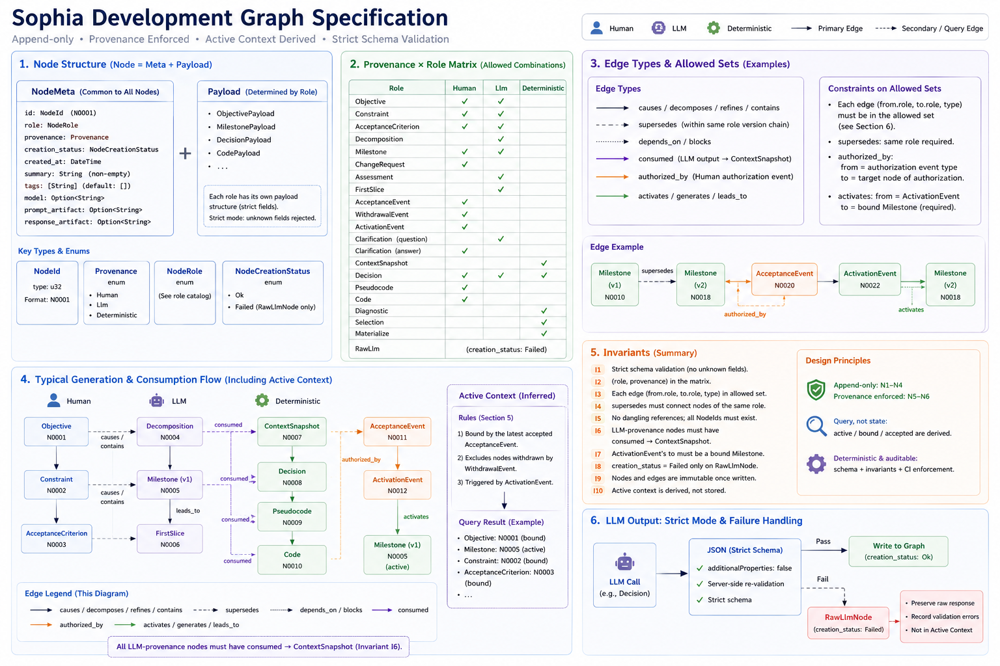

# Sophia Workflow Graph Specification



> This document is the normative specification for the Development Graph: strict node payload schemas, the allowed `(from.role, to.role, type)` edge set, append-only invariants, and the Active Context derivation algorithm. Conceptual background (four-dimension model, role catalog, action-choice principles, budget and scoring, Materialize Gate) is in `language_design.md` §10. Rust-side implementation details and GraphStore constraints are in `language_implementation.md` and `engineering_architecture.md`.
>
> This spec is the single source of truth for schema-validation code, JSON shapes embedded in prompt templates, and CI invariant tests. Design docs do not repeat schema fields; this spec does not repeat design explanations.

---

## I. Common structure

### 1.1 Identifiers and enums

```rust
pub struct NodeId(pub u32);

pub enum Provenance {
    Human,
    Llm,
    Deterministic,
}

pub enum NodeRole {
    Objective,
    Constraint,
    AcceptanceCriterion,
    Decomposition,
    Milestone,
    ChangeRequest,
    Assessment,
    FirstSlice,
    AcceptanceEvent,
    WithdrawalEvent,
    ActivationEvent,
    Clarification,
    ContextSnapshot,
    Decision,
    Pseudocode,
    Code,
    Diagnostic,
    Selection,
    Materialize,
    RawLlm,
}

pub enum NodeCreationStatus {
    Ok,
    Failed, // allowed only on RawLlm
}
```

`NodeId` is assigned when emitting creation events; recommended format `N{>=4 zero-padded digits}`, e.g., `N0001`.

### 1.2 NodeMeta

Every node is `meta + payload`. `meta` is uniform across roles and carries the four dimensions; `payload` depends on the role.

```rust
#[derive(Serialize, Deserialize)]
#[serde(deny_unknown_fields)]
pub struct NodeMeta {
    pub id: NodeId,
    pub role: NodeRole,
    pub provenance: Provenance,
    pub creation_status: NodeCreationStatus,
    pub created_at: DateTime<Utc>,
    pub summary: String,             // non-empty
    pub tags: Vec<String>,           // default []
    pub model: Option<String>,       // optional when provenance == Llm
    pub prompt_artifact: Option<String>,
    pub response_artifact: Option<String>,
}

pub struct Node<P> {
    pub meta: NodeMeta,
    pub payload: P,
}
```

Constraints:

- All payload structs must use `#[serde(deny_unknown_fields)]` (strict mode; extra fields rejected).
- `summary` must be non-empty.
- `provenance` is immutable after write.
- `provenance` is enforced by creation paths: Human via CLI/manual inputs or scenario files; Llm via LLM-call helpers; Deterministic via deterministic helpers. Schema cannot forge provenance.
- `creation_status == Failed` is allowed only on `RawLlm`.

### 1.3 Strict mode for LLM outputs

Any interface that accepts raw LLM JSON (e.g., Decision payloads, Assessment outputs) must:

1. Set `additionalProperties:false` in JSON Schema.
2. Validate against that same schema again on the server after receiving the response.

No “lenient parse + post-filter” solutions. Failures go to `RawLlm` (see §4.4.8).

---

## II. Provenance × Role matrix

Hard constraints between roles and provenance, enforced by factories:

| Role | Allowed provenance |
| --- | --- |
| `Objective` | `Human`, `Llm` |
| `Constraint` | `Human`, `Llm` |
| `AcceptanceCriterion` | `Human`, `Llm` |
| `Decomposition` | `Llm` |
| `Milestone` | `Human`, `Llm` |
| `ChangeRequest` | `Human` |
| `Assessment` | `Llm` |
| `FirstSlice` | `Llm` |
| `AcceptanceEvent` | `Human` |
| `WithdrawalEvent` | `Human` |
| `ActivationEvent` | `Human` |
| `Clarification` | `Llm` (question) / `Human` (answer) |
| `ContextSnapshot` | `Deterministic` |
| `Decision` | `Llm` or `Deterministic` (baseline) |
| `Pseudocode` | `Llm` |
| `Code` | `Llm` |
| `Diagnostic` | `Deterministic` |
| `Selection` | `Deterministic` |
| `Materialize` | `Deterministic` |
| `RawLlm` | `Llm` (always with `creation_status: Failed`) |

This guarantees non-forgeable provenance. For example, `Objective`/`Milestone` created by LLM must have `Llm` provenance; to enter active context, they require an `AcceptanceEvent` to the version chain (see §5).

---

## III. Append-only invariants

| Id | Invariant |
| --- | --- |
| N1 | Node payloads are immutable. |
| N2 | The edge set only ever grows (append-only). |
| N3 | State changes are expressed via successor nodes plus `supersedes` edges. |
| N4 | Human-authorization events are carried by dedicated nodes (`AcceptanceEvent`/`WithdrawalEvent`/`ActivationEvent`). |
| N5 | `active`/`bound`/`accepted` are derived queries, not stored fields. |
| N6 | Provenance is enforced by creation paths; schema cannot forge it. |

Schema-level invariants (CI-guarded):

| Id | Invariant |
| --- | --- |
| I1 | Every node (meta + payload) validates under strict serde (`deny_unknown_fields`). |
| I2 | `(role, provenance)` pairs must be allowed by the matrix in §II. |
| I3 | Each edge’s `(from.role, to.role, type)` must be in the allowed set (see §VI). |
| I4 | `supersedes` chains are acyclic and endpoints share the same role. |
| I5 | No dangling refs: every `to` NodeId must exist. |
| I6 | Every LLM-provenance node (`Decision`/`Pseudocode`/`Code`/`Assessment`/`Decomposition`) must have a `consumed→ ContextSnapshot` edge. |
| I7 | `ActivationEvent` targets must be bound `Milestone`s. |
| I8 | `creation_status: Failed` appears only on `RawLlm`. |
| I9 | Nodes and edges are append-only (CI diff checks guard immutability). |
| I10 | Active Context derivation depends only on current graph state; no mutable node fields are read. |

Engineering consequences:

- GraphStore exposes no payload-write API; `update_node` is limited to metadata that neither affects schema validation nor active-context derivation, and is not part of normal code paths.
- `append_edge` must validate `(from.role, to.role, type)` before writes.
- Nodes do not carry `*_status` fields; lifecycle is expressed by events and edges. The only exception is `creation_status` on `RawLlm`.

---

## IV. Node payload schemas

All payloads must use `#[serde(deny_unknown_fields)]`. Rust shapes below are normative.

### 4.1 Goals cluster

#### 4.1.1 ObjectiveNode

```rust
#[derive(Serialize, Deserialize)]
#[serde(deny_unknown_fields)]
pub struct ObjectivePayload {
    pub title: String,        // non-empty
    pub description: String,  // non-empty
}
```

Lifecycle is derived from edges/events: `member_of` to `Decomposition`; `constrained_by` to `Constraint`; `validated_by` to `AcceptanceCriterion`; bound/accepted via queries (§V); completion via an `AcceptanceEvent` with `decision: Satisfied`.

#### 4.1.2 ConstraintNode

```rust
pub enum ConstraintKind { Invariant, OutOfScope, Preference, Forbidden }

pub enum VerifierKind { HiddenCase, AuditRule, Manual }

#[derive(Serialize, Deserialize)]
#[serde(deny_unknown_fields)]
pub struct Verifier {
    pub kind: VerifierKind,
    pub r#ref: String, // non-empty
}

#[derive(Serialize, Deserialize)]
#[serde(deny_unknown_fields)]
pub struct ConstraintPayload {
    pub kind: ConstraintKind,
    pub statement: String,        // non-empty
    pub verifier: Option<Verifier>,
}
```

Each constraint is its own node; `verifier` is optional. Hidden verifiers and audit rules drive regression gates deterministically; `Manual`/`None` are context only.

#### 4.1.3 AcceptanceCriterionNode

```rust
#[derive(Serialize, Deserialize)]
#[serde(deny_unknown_fields)]
pub struct AcceptanceCriterionPayload {
    pub statement: String,
    pub verifier: Option<Verifier>,
}
```

#### 4.1.4 DecompositionNode

```rust
#[derive(Serialize, Deserialize)]
#[serde(deny_unknown_fields)]
pub struct DecompositionPayload {
    pub rationale: String,   // non-empty
    pub proposed_count: u32, // redundant; convenience for queries
}
```

`Decomposition` is an LLM execution-product node (like `Pseudocode`/`Code`/`Assessment`) and must carry `consumed→ ContextSnapshot` (I6). Edges: `decomposes← parent_objective`; `member_of→ child_objective | child_milestone`; `supersedes→ previous_decomposition`.

#### 4.1.5 MilestoneNode

```rust
#[derive(Serialize, Deserialize)]
#[serde(deny_unknown_fields)]
pub struct MilestonePayload {
    pub name: String,
    pub summary: String,
}
```

Stage scope via edges: `groups→ Objective`; `requires→ Constraint(Invariant)`; `excludes→ Constraint(OutOfScope)`; `validated_by→ AcceptanceCriterion`. Active rule in §V.

### 4.2 Change cluster

#### 4.2.1 ChangeRequestNode (Human only)

```rust
pub enum ChangeRequestKind { NewRequirement, Correction, Preference, Rejection, ConstraintChange }
pub enum ChangePriority { Must, Should, Could }

#[derive(Serialize, Deserialize)]
#[serde(deny_unknown_fields)]
pub struct ChangeRequestPayload {
    pub kind: ChangeRequestKind,
    pub request: String, // non-empty
    pub priority: ChangePriority,
}
```

Associated via `targets→`; acceptance via event queries.

#### 4.2.2 AssessmentNode (+ structured LLM output)

```rust
pub enum Risk { Low, Medium, High }
pub enum BlastRadius { Local, Module, Subsystem, CrossSystem, ProductScale }
pub enum RecommendedStrategy { DirectChange, VerticalSlice, StagedRollout, Spike, RejectAsTooLarge }

#[derive(Serialize, Deserialize)]
#[serde(deny_unknown_fields)]
pub struct AssessmentPayload {
    pub risk: Risk,
    pub blast_radius: BlastRadius,
    pub recommended_strategy: RecommendedStrategy,
    pub affected_systems: Vec<String>, // default []
    pub unknowns: Vec<String>,         // default []
    pub notes: String,                 // default ""
}

#[derive(Serialize, Deserialize)]
#[serde(deny_unknown_fields)]
pub struct AssessmentLlmOutput {
    #[serde(flatten)]
    pub head: AssessmentPayload,

    pub proposed_first_slice: Option<FirstSlicePayload>,
    pub proposed_invariants: Vec<ConstraintPayload>,
    pub proposed_recommended_action: DecisionAction,

    pub self_check: AssessmentSelfCheck,
}

#[derive(Serialize, Deserialize)]
#[serde(deny_unknown_fields)]
pub struct AssessmentSelfCheck {
    pub affects_only_visible_targets: bool,
    pub no_hidden_answers: bool,
    pub no_pseudocode_or_code: bool,
}
```

Derivatives are split into separate nodes and edges: `assesses→`; `affects→`; `proposes→ FirstSlice`; `proposes→ Constraint(Invariant)`; `proposes→ Decision`.

#### 4.2.3 FirstSliceNode

```rust
#[derive(Serialize, Deserialize)]
#[serde(deny_unknown_fields)]
pub struct FirstSlicePayload { pub purpose: String }
```

Edges: `groups→ Objective`; `requires→ Constraint(Invariant)`; `excludes→ Constraint(OutOfScope)`; `validated_by→ AcceptanceCriterion`. Accepting a FirstSlice via `AcceptanceEvent` promotes it to the next `Milestone` (new node + `supersedes`).

### 4.3 Events cluster

#### 4.3.1 AcceptanceEventNode

```rust
pub enum AcceptanceDecision { Accepted, AcceptedWithChanges, Satisfied }

#[derive(Serialize, Deserialize)]
#[serde(deny_unknown_fields)]
pub struct AcceptancePayload { pub decision: AcceptanceDecision, pub notes: String }
```

`Accepted/Satisfied` are Human-only provenance; multiple `accepts→` edges allowed.

#### 4.3.2 WithdrawalEventNode

```rust
#[derive(Serialize, Deserialize)]
#[serde(deny_unknown_fields)]
pub struct WithdrawalPayload { pub reason: String }
```

Edges: `withdraws→` the invalidated nodes.

#### 4.3.3 ActivationEventNode

```rust
#[derive(Serialize, Deserialize)]
#[serde(deny_unknown_fields)]
pub struct ActivationPayload { pub reason: String }
```

Edges: `activates→ Milestone` (must be bound; I7). One active milestone per domain (latest `ActivationEvent`).

#### 4.3.4 ClarificationNode

```rust
pub enum ClarificationKind {
    Question,
    Answer,
}

#[derive(Serialize, Deserialize)]
#[serde(deny_unknown_fields)]
pub struct ClarificationPayload {
    pub kind: ClarificationKind,
    pub body: String, // non-empty
}
```

Provenance is determined by `kind`: `Question` must be `Llm`; `Answer` must be `Human`.

When the LLM returns `needs_clarification` during design / implement / assess, that is equivalent to emitting a `Clarification(Question)`. A human answer emits a `Clarification(Answer)` plus an `answers→ question` edge.

Unanswered questions appear in the active context `outstanding_questions` list (§V).

### 4.4 Inference and execution cluster

#### 4.4.1 ContextSnapshotNode

```rust
#[derive(Serialize, Deserialize)]
#[serde(deny_unknown_fields)]
pub struct ContextSnapshotPayload {
    pub schema_version: u32, // 1
    pub snapshot: ActiveContext,
    pub digest: String, // 64-hex, lower-case (SHA-256)
}
```

LLM-provenance nodes must `consumed→` the snapshot created just before the call (I6).

#### 4.4.2 DecisionNode

```rust
pub enum DecisionAction { DesignSolution, ImplementDesign, RepairCode, ReviseDesign, Decompose, Backtrack, Select, Materialize, NeedsClarification }

#[derive(Serialize, Deserialize)]
#[serde(deny_unknown_fields, tag = "kind")]
pub enum StateAssessment {
    Goal { goal_size: GoalSize, decomposition_pressure: Pressure, active_milestone_present: bool, outstanding_clarifications: u32 },
    Code { has_pseudocode: bool, has_code: bool, compile_status: CompileStatus, error_type: ErrorType, repair_attempts: u32 },
    Change { blast_radius: BlastRadius, risk: Risk, affects_active_milestone: bool },
}

pub enum GoalSize { Tiny, Small, Medium, Large }
pub enum Pressure { Low, Medium, High }
pub enum CompileStatus { NotChecked, Pass, Fail }
pub enum ErrorType { None, Local, Conceptual, Integration }

#[derive(Serialize, Deserialize)]
#[serde(deny_unknown_fields)]
pub struct DecisionPayload {
    pub selected_action: DecisionAction,
    pub confidence: f32,       // [0,1]
    pub rationale: String,     // non-empty
    pub state_assessment: StateAssessment,
}
```

Edges: `considers→ focus`; `consumed→ ContextSnapshot` (I6).

#### 4.4.3 PseudocodeNode

```rust
#[derive(Serialize, Deserialize)]
#[serde(deny_unknown_fields)]
pub struct PseudocodePayload { pub purpose: String, pub artifact_path: String /* == "content.pseudo" */ }
```

Edges: `addresses→` (Objective/Milestone/FirstSlice); `consumed→ ContextSnapshot`; `revises→ Pseudocode`.

#### 4.4.4 CodeNode

```rust
#[derive(Serialize, Deserialize)]
#[serde(deny_unknown_fields)]
pub struct CodePayload { pub files: Vec<String> /* non-empty */ }
```

Edges: `addresses→`; `consumed→ ContextSnapshot`; `implements→ Pseudocode`; `repairs→ Code`.

#### 4.4.5 DiagnosticNode

```rust
pub enum DiagnosticKind { PseudoCheck, CodeCheck, ConstraintAudit, ArtifactWrite, ArtifactDiff, RegressionGate }
pub enum DiagnosticSeverity { Info, Warning, Error }

#[derive(Serialize, Deserialize)]
#[serde(deny_unknown_fields)]
pub struct DiagnosticItem { pub code: String, pub severity: DiagnosticSeverity, pub problem: String, pub location: Option<String> }

#[derive(Serialize, Deserialize)]
#[serde(deny_unknown_fields)]
pub struct DiagnosticPayload { pub kind: DiagnosticKind, pub ok: bool, pub diagnostics: Vec<DiagnosticItem> }
```

Provenance: Deterministic. Edge: `checks→ Pseudocode|Code|Milestone|Constraint`.

#### 4.4.6 SelectionNode

```rust
#[derive(Serialize, Deserialize)]
#[serde(deny_unknown_fields)]
pub struct SelectionPayload { pub rationale: String }
```

Edge: `selects→ Code`.

#### 4.4.7 MaterializeNode

```rust
#[derive(Serialize, Deserialize)]
#[serde(deny_unknown_fields)]
pub struct MaterializePayload { pub target_root: String, pub files: Vec<String> }
```

Edge: `materializes→ Selection`. See `language_implementation.md` §XV for the type-state gate.

#### 4.4.8 RawLlmNode

```rust
pub enum RawLlmFailureKind { ExecutionError, ParseError, ValidationError, SelfCheckFailure }

#[derive(Serialize, Deserialize)]
#[serde(deny_unknown_fields)]
pub struct RawLlmPayload { pub failure_kind: RawLlmFailureKind, pub operation: String, pub error_summary: String }
```

Always `creation_status: Failed`. Edge: `attempted→ target`.

---

## V. Active Context derivation

Active Context is a recomputed view over current graph state (I10). Types and algorithm are normative.

### 5.1 Types

```rust
#[derive(Serialize, Deserialize)]
#[serde(deny_unknown_fields)]
pub struct ActiveContext {
    pub bound_objectives: Vec<ObjectiveView>,
    pub active_milestone: Option<MilestoneView>,
    pub bound_constraints: Vec<ConstraintView>,
    pub bound_acceptance_criteria: Vec<AcceptanceCriterionView>,
    pub open_change_requests: Vec<ChangeRequestView>,
    pub outstanding_questions: Vec<ClarificationView>,
    pub digest: String, // 64-hex, lower-case, SHA-256
}
```

Each `*View` intentionally exposes only a subset of fields; do not leak full `NodeMeta` to prompts.

### 5.2 Binding predicate

```
N is bound at time T iff
  N is the head of its version chain at T, AND
  ( provenance(N) == Human OR
    ∃ AcceptanceEvent a such that a accepts→ y for some y ∈ chainOf(N) ),
  AND ¬∃ later WithdrawalEvent w such that w withdraws→ y for some y ∈ chainOf(N)
        with timestamp(w) > timestamp(latest_acceptance_of(N)).
```

Human-provenance nodes are implicitly accepted; no other provenance has this exemption. `Milestone` additionally requires an `ActivationEvent` (step 5).

### 5.3 Inheritance along edges

Inheritance via `member_of` and `groups`:

- If a `Decomposition` is bound, all `Objective`s `member_of` it are bound.
- If a `Milestone` is bound, all `Objective`s it `groups→` are bound; all `Constraint`s it `requires→` are bound.

### 5.4 Algorithm

```text
fn derive_active_context(graph: &Graph, t: Time) -> ActiveContext:

    // 1. Heads
    heads = { n ∈ graph.nodes | ¬∃ edge supersedes from any m to n }

    // 2. Accept queries
    bound_heads = ∅
    for h in heads:
        if provenance(h) == Human:
            bound_heads.insert(h)
        else:
            chain = chain_of(h)
            if ∃ a where role(a)==AcceptanceEvent and a accepts→ y for some y ∈ chain:
                bound_heads.insert(h)

    // 3. Withdrawal queries
    for h in copy(bound_heads):
        chain = chain_of(h)
        latest_acc_t = max { ts(a) | a accepts→ y, y ∈ chain }
        latest_wd_t  = max { ts(w) | w withdraws→ y, y ∈ chain }
        if latest_wd_t exists and (latest_acc_t is None or latest_wd_t > latest_acc_t):
            bound_heads.remove(h)

    // 4. Inheritance propagation
    for d in bound_heads where role(d) == Decomposition:
        for o where o member_of→ d:
            bound_heads.insert(head_of_chain(o))
    for m in bound_heads where role(m) == Milestone:
        for o where m groups→ o:
            bound_heads.insert(head_of_chain(o))
        for c where m requires→ c:
            bound_heads.insert(head_of_chain(c))

    // 5. Active milestone (one per domain)
    active_ms_candidates = bound_heads ∩ { n | role(n) == Milestone }
    activations = [ act | role(act)==ActivationEvent ∧ target(act) ∈ active_ms_candidates ]
    active_milestone = if activations empty then None else target_of(argmax_by_ts(activations))

    // 6. Constraint aggregation
    bound_constraints = (
        { c | c ∈ bound_heads, role(c)==Constraint, active_milestone? requires/excludes→ c }
        ∪
        { c | c ∈ bound_heads, role(c)==Constraint, ∃ o ∈ bound_heads, role(o)==Objective, o constrained_by→ c }
    )

    // 7. Open change requests
    open_change_requests = {
        cr | cr ∈ heads, role(cr)==ChangeRequest,
             ¬∃ AcceptanceEvent a where a accepts→ y ∈ chain_of(cr),
             ¬∃ WithdrawalEvent w where w withdraws→ y ∈ chain_of(cr)
    }

    // 8. Outstanding questions
    outstanding_questions = {
        q | q ∈ heads, role(q)==Clarification, kind(q)==Question,
             ¬∃ Clarification a where kind(a)==Answer ∧ a answers→ q
    }

    // 9. Digest (stable serialization)
    snapshot = serialize_stable({ bound_objectives, active_milestone, bound_constraints,
                                  bound_acceptance_criteria, open_change_requests, outstanding_questions })
    digest = sha256(snapshot)

    return ActiveContext { ..., digest }
```

Notes:

- Stable serialization: sets sorted by NodeId; fields in fixed schema order; timestamps as RFC 3339 UTC.
- Digest format must be 64-char lower-case hex; mismatched formats are rejected.
- The derivation must not read mutable fields.

### 5.6 Hidden test cases must be invisible to LLMs (anti-cheat projection discipline)

`ConstraintView` / `AcceptanceCriterionView` (the `*View` types in §5.1) project only `id` / `kind` / `statement`; they never project the `verifier` field. This is a structural anti-cheat boundary:

- `ConstraintPayload.verifier` (`Verifier { kind, ref }`) exists in the graph node payload (§4.1.2) and may be read by deterministic gates.
- The active context (the view fed to LLMs) removes `verifier` entirely from `ConstraintView`: the LLM cannot see whether a constraint has a hidden case, nor the hidden-case reference name, let alone the hidden data.
- `verifier.ref` is only an opaque reference name (for example `"hc:add_one_increments"`). It does not contain expected inputs or outputs. The actual case body is stored outside the graph in the hidden store below; active-context derivation never touches that store.

Therefore “hidden case data appears in a snapshot” (the thing anti-cheat audit must check in §10.7) is structurally impossible: snapshots are serialized from `ActiveContext`, and `ActiveContext` has no field that can carry verifier bodies.

## VA. Hidden verifier store

Hidden-case expected inputs/outputs for the regression gate are validation-only data and must never be visible to the LLM being verified (§10.8: prompts must not include validation-only hidden expected outputs). This section defines where they live, how gates consume them, and how they stay decoupled from the graph.

### 5A.1 Why they are outside both the graph and active context

- **Not in active context**: active context is fed to LLMs; putting hidden cases there leaks answers and violates the first principle.
- **Not in graph node payloads either**: the graph is append-only event-sourced storage whose contents may be dumped, audited, or displayed by commands such as `graph nodes`. Storing expected outputs in any node payload gives them a path to be read from the graph, even if `*View` projections omit them. The graph keeps only the opaque `verifier.ref`, never the case body.
- **Conclusion**: hidden case bodies live in an independent store outside the graph, indexed by `ref`, and only deterministic gates read them at materialize time.

### 5A.2 Storage shape

The hidden store is a `ref → HiddenCase` map stored at a project-local location that is **not in the Development Graph and not in active context**:

```text
sophia-runs/verifiers/hidden.json   # ref → HiddenCase (physically separate from dev_graph.sqlite)
```

Store entries reuse the `runtime` value model directly (**one value model**, no mirror type): hidden-case arguments and expected outcomes ultimately feed the interpreter, so using `runtime::Value` avoids conversion drift.

```rust
// = runtime::HiddenCase (with serde). Never fed to LLMs; only gates load by ref.
pub struct HiddenCase {
    pub r#ref: String,              // opaque key; matches ConstraintPayload.verifier.ref
    pub entry_action: String,       // Action name to invoke
    pub args: Vec<Value>,           // runtime::Value; single value model reused
    pub expected: ExpectedOutcome,  // Returns(Value) | Raises(variant)
}
```

`Value` is `runtime::Value` (a serde externally tagged union, e.g. `{"Int":42}`). `hidden.json` is an array of `HiddenCase` entries; deserialization builds a map by `ref`.

Constraints:

- **Unique keys**: every `ref` in `hidden.json` must be unique and joins to graph `verifier.ref` by that key.
- **Coverage check at gate time**: if a bound invariant has `verifier.kind == HiddenCase` but `hidden.json` lacks the matching `ref`, the gate must hard-block honestly. The coordination layer must not inject a fabricated `VerifierOutcome`; `audit_constraints` then reports the missing outcome as a hard error, the same as any declared verifier with no result.
- **Authorship**: `hidden.json` is written by maintainers / problem authors, not by LLMs. The LLM produces the code under verification, not the expected answers used to verify it. The write path is physically separate from generated-code paths, and CI/audit can separately verify that it never enters any prompt.

### 5A.3 Gate consumption flow (at materialize time)

```text
graph select / materialize (deterministic gate; constraint_audit gate from §VII point 4):
  1. Load hidden.json (missing file = empty store); derive active context and take bound invariants.
  2. For each bound constraint, read verifier from the raw ConstraintNode payload
     (not ConstraintView, which intentionally omits verifier) and project it into audit::Constraint.
  3. For each invariant with verifier.kind=HiddenCase:
       a. Fetch HiddenCase from hidden.json by ref (missing → no outcome injected → step 4 hard-blocks).
       b. Parse + resolve + analyze the candidate source to build a SemanticModel.
       c. runtime::run_hidden_cases (the v0 interpreter truly executes the candidate) → VerificationResult.
       d. Losslessly map to audit::VerifierOutcome (passed + detail) and inject it into audit.
  4. audit_constraints(constraints, outcomes) decides → DiagnosticNode(kind=ConstraintAudit
     / RegressionGate), checks→ Code; any invariant failure blocks materialization (no fabricated pass).
```

Layering is preserved, matching the existing “injected report” pattern:

- **Execution** belongs to `runtime` (`run_hidden_cases`).
- **Judgment** belongs to `tools/audit` (`audit_constraints` consumes injected `VerifierOutcome`s).
- **Loading hidden storage + building the candidate model + wiring execution and judgment + emitting graph nodes** belongs to the **coordination layer** (CLI `graph_cmd`, via `run_constraint_audit` / `run_hidden_verifiers`). `tools` and `runtime` do not know about `hidden.json` or the graph.

### 5A.4 Relationship to the e2e harness

The e2e harness rule “answers live only in harness expectations and are not fed to the LLM” (`e2e_test.md` §III anti-leakage) is the test-form of this same mechanism: `Case.expect` is equivalent to a hidden case body, and the harness acts as a temporary hidden store. Persisting that as `hidden.json` + graph `verifier.ref` lets hidden cases drive regression gates in the real workflow too, not only in e2e, while reusing the same anti-leakage discipline.

---

## VI. Edge catalog and hard constraints

Edge kinds are deliberately limited: each edge kind permits only specific `(from.role, to.role)` combinations. `append_edge` checks before every write; combinations not listed here are rejected.

`T*` in the table means the edge kind may target multiple roles. Each concrete edge still has exactly one `from` and one `to`.

| Edge type | from role | to role | Meaning |
| --- | --- | --- | --- |
| `supersedes` | T | T (same role) | Version chain |
| `decomposes` | Objective | Decomposition | This objective proposes the decomposition |
| `member_of` | Objective \| Milestone | Decomposition \| Milestone \| FirstSlice | Membership |
| `groups` | Milestone \| FirstSlice | Objective | Objectives included in a phase |
| `constrained_by` | Objective \| Milestone \| FirstSlice | Constraint | Constraint associated with the node |
| `requires` | Milestone \| FirstSlice | Constraint (`kind=Invariant`) | Invariants the phase must preserve |
| `excludes` | Milestone \| FirstSlice | Constraint (`kind=OutOfScope`) | Explicitly excluded scope |
| `validated_by` | Objective \| Milestone \| FirstSlice | AcceptanceCriterion | Acceptance condition |
| `targets` | ChangeRequest | Objective \| Milestone \| Constraint | Object targeted by the change |
| `assesses` | Assessment | ChangeRequest \| Objective | Object being assessed |
| `affects` | Assessment | Objective \| Milestone \| Code | Impact surface identified by the assessment |
| `proposes` | Assessment | FirstSlice \| Constraint \| Decision | Proposal derived by the assessment |
| `accepts` | AcceptanceEvent | T* (Objective \| Constraint \| Milestone \| FirstSlice \| Decomposition \| ChangeRequest \| AcceptanceCriterion) | Accepted target list (multiple edges) |
| `withdraws` | WithdrawalEvent | T* (same allowed set as `accepts` + Decomposition, Code) | Withdrawn target list |
| `activates` | ActivationEvent | Milestone | Activates a milestone |
| `answers` | Clarification (`Answer`) | Clarification (`Question`) | Answer points to the question |
| `asks_about` | Clarification (`Question`) | Objective \| Milestone \| ChangeRequest | Context node the question is about |
| `consumed` | Decision \| Pseudocode \| Code \| Assessment \| Decomposition | ContextSnapshot | Context snapshot used at creation time |
| `considers` | Decision | Objective \| Code \| ChangeRequest \| Milestone | Current focus node of the decision |
| `addresses` | Pseudocode \| Code | Objective \| Milestone \| FirstSlice | Goal domain served by this artifact |
| `revises` | Pseudocode | Pseudocode | Revision based on diagnostic feedback |
| `implements` | Code | Pseudocode | A code candidate implements a pseudocode artifact |
| `repairs` | Code | Code | Repair chain |
| `checks` | Diagnostic | Pseudocode \| Code \| Milestone \| Constraint | Object being checked |
| `selects` | Selection | Code | Selected candidate |
| `materializes` | Materialize | Selection | Materialization event |
| `attempted` | RawLlm | T* (any target node the call attempted to construct) | Failed call target |

### 6.1 Additional validation

- `supersedes`: the chain must be acyclic; both ends must have the same role; one node may have at most one outgoing `supersedes` edge.
- `accepts` / `withdraws` / `activates`: the target role must support that event action (`ActivationEvent` can only activate `Milestone`, etc.).
- `proposes`: `from` must be `Assessment`; `to` must be one of `FirstSlice` / `Constraint` / `Decision`.
- `answers`: `from` must be `Clarification(Answer)`; `to` must be `Clarification(Question)`.
- `consumed`: every LLM-provenance node must have at least one outgoing `consumed→ ContextSnapshot` edge (I6).

### 6.2 Edge immutability

Edges have no `status` field. The existence of an edge is itself a fact. “Withdrawing an `accepts` edge” is represented by creating a `WithdrawalEvent`, not by deleting the edge.

### 6.3 Multiple edges can coexist

Multiple `supersedes` edges pointing to the same old node are allowed (rare, but consistent with fork scenarios). Binding queries count “any path that reaches the active chain head” as binding. This reserves room for future spike / branch exploration; early implementations may reject this shape for simplicity.

---

## VII. Workflow integration points

Prompt templates and candidate-action tables above the workflow live in other documents. This spec defines the integration points the workflow must use:

1. **A `ContextSnapshotNode` must be created before every LLM call**. Downstream LLM-provenance nodes must `consumed→` that snapshot (I6).
2. **Lifecycle progression may only be carried by `AcceptanceEvent` / `WithdrawalEvent` / `ActivationEvent`**. The CLI must not mutate node fields directly.
3. **“Redo a decomposition after it was wrong” must be represented as `WithdrawalEvent` withdrawing the old `Decomposition` + creating a new `Decomposition` + a `supersedes` edge**. State changes must not be stored in node fields.
4. **Regression-constraint checks are carried by `Diagnostic(RegressionGate)`**. The diagnostic uses `checks→ Constraint` to state which constraint was gated.

### 7.1 Implementation feedback: relationship between artifacts on disk and the graph

Implementation has solidified the following integration conventions, which are consistent with this spec but were not previously explicit:

5. **Nodes do not store artifact bodies; artifacts are written outside the graph**. `Pseudocode.artifact_path` is fixed to `"content.pseudo"`, and `Code.files` stores paths only (§4.4.3 / §4.4.4). `.pseudo` text and candidate `.sophia` file bodies are written under `sophia-runs/graph/artifacts/` (not materialized) and are written/read by the orchestration layer (CLI). This keeps graph nodes lightweight, immutable, and comparable; bodies are reconstructible artifacts, not graph state.
6. **Fallback nodes for emit failures are orchestration-layer responsibility**. When an LLM call fails, emit a `RawLlmNode` (`attempted→` target) plus the `ContextSnapshot` that was created before the call. `workflow/engine::run_llm_step` centralizes this rule and never fabricates a successful `CodeNode`.
7. **Selection / Materialize re-run gates**. Gates before materialization (`code_check` / `constraint_audit` / `artifact_diff` / runtime validation) are re-run separately by `select` and `materialize`; compile-time type-state proofs cannot be persisted across processes (see `language_design.md` §10.10). Each gate result emits the corresponding `Diagnostic` and `checks→ Code`.
8. **Scores do not enter the graph**. Candidate ranking is an in-memory heuristic in the deterministic pipeline; this spec has no `Score` role. Selection is represented only by `SelectionNode { rationale }` (see `language_design.md` §10.9).

---

## VIII. Out of scope

- Cross-graph merges; deletions/GC/archival; payload encryption/ACLs; schema evolution (introduce new roles; bridge via `supersedes`).

---

## IX. Implementation checklist

The factory layer and GraphStore implementation must cover:

- [ ] Every payload struct uses `#[serde(deny_unknown_fields)]`.
- [ ] LLM output schemas are validated both in prompts and on the server side.
- [ ] `(role, provenance)` validation (matrix in §II).
- [ ] `(from.role, to.role, type)` validation (table in §VI).
- [ ] `supersedes` acyclicity + same-role validation.
- [ ] Dangling reference detection.
- [ ] Required `consumed→ ContextSnapshot` validation for LLM-provenance nodes.
- [ ] Bound-node validation for `ActivationEvent` targets.
- [ ] `creation_status: Failed` is allowed only for `RawLlmNode`.
- [ ] Node/edge read-only tests (CI diff checks).
- [ ] Stable ordering and SHA-256 digest tests for Active Context derivation.
