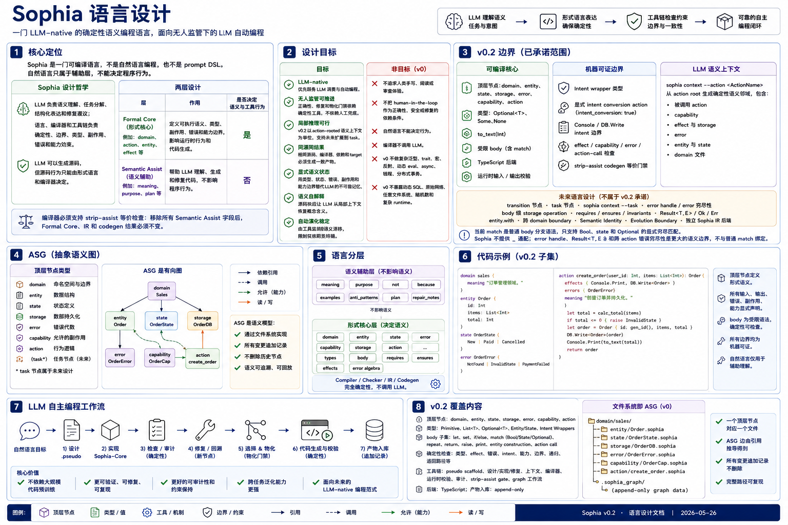

# Sophia 语言设计



Sophia 是一门 LLM-native 的确定性语义编程语言，面向无人监管下的 LLM 自动编程。项目核心问题是：如果一个 LLM 没有大量代码预训练、并不擅长传统编程语法和代码惯例，但具备较强的自然语言语义理解能力，是否可以通过专门为 LLM 设计的语言、检查器和工作流，让它在没有人工审查兜底的条件下稳定完成自主编程？

Sophia 的回答是：让 LLM 负责语义理解、任务分解、结构化表达和修复建议；让语言、编译器和工具链负责确定性、边界、类型、副作用、错误和能力约束。LLM 可以生成源码，但源码行为只能由形式语言和编译器决定。Sophia 的所有设计取舍都优先服务 LLM 在无人监管自动编程中的成功率、可修复性、上下文裁剪和约束保持；人类阅读、手写、审查或运维便利不是设计目标。

## 1. 核心定位

Sophia 不是自然语言编程，也不是 prompt DSL。它是一门可编译语言。

自然语言在 Sophia 中存在，但只属于辅助层，用于帮助 LLM 理解、生成和修复代码；它不能决定程序行为，不能参与类型检查、IR implementation 或 codegen。

完整语言设计的核心边界：

| 层              | 作用                                                                                                                                       | 是否决定程序语义或确定性工具行为 |
| --------------- | ------------------------------------------------------------------------------------------------------------------------------------------ | -------------------------------- |
| Formal Core     | domain、entity、state、transition、error、capability、storage、action、task，以及其中的 field、body、requires、ensures、effects 等形式元素 | 是                               |
| Semantic Assist | meaning、purpose、not、because、examples、anti_patterns、plan、repair_notes                                                                | 否                               |

编译器必须支持 `strip-assist` 等价检查：移除所有 Semantic Assist 字段后，Formal Core、IR 和 codegen 结果必须不变。

其中，`action`、`transition`、`entity`、`effect`、`capability` 等节点影响 runtime 语义或 codegen；`task` 不参与 runtime codegen，但参与 task closure、context、exclude 检查和 LLM 工作边界，因此在完整语言设计中仍属于 Formal Core。v0.2 只实现 action-rooted semantic context，不实现 `task` 顶层节点。

## 2. 设计目标

Sophia 面向的是低代码预训练或非代码优化的 LLM，因此语言设计只优先考虑 LLM 的局部语义恢复、自动修复、上下文裁剪和无人工监管下的约束保持，而不是人类手写、阅读或审查体验。

### 2.1 v0.2 边界

v0.2 的目标不是补齐完整 Sophia 语言，而是把当前已经可运行的 v0 core 收束成一个可承诺、可测试、可实验复现的语言子集。v0.2 只承诺以下三类能力：

| 类别           | v0.2 committed scope                                                                                                                                                                                             |
| -------------- | ---------------------------------------------------------------------------------------------------------------------------------------------------------------------------------------------------------------- |
| 可编译 core    | `domain`、`entity`、`state`、`storage`、`error`、`capability`、`action` 顶层节点；`Optional<T>` / `Some` / `None`；`to_text(Int)`；包含 `match` 的受限 body；TypeScript backend；runtime input/output validation |
| 机器可证边界   | Intent wrapper 类型、显式 intent conversion action、Console / DB.Write intent 边界、effect / capability / error / action-call 检查、strip-assist codegen 等价门禁                                                |
| LLM 语义上下文 | `sophia context --action <ActionName>` 从 action root 生成确定性语义邻域，包含被调用 action、capability、effect storage、error、entity、state 和 domain 文件                                                     |

以下设计项保留为 future language design，不属于当前已实现的 v0.2 承诺：`transition` 顶层节点、`task` 顶层节点、`sophia context --task`、error handle / error 穷尽性、body 级 storage operation、`requires` / `ensures` 证明、`invariants`、`Result<T,E>` / `Ok` / `Err`、`entity.with`、跨 domain boundary、Semantic Identity、Evolution Boundary、独立 Sophia IR 后端。

当前 `match` 是普通 body 分支语法，只支持 Bool、state 和 Optional 的显式穷尽匹配。Sophia 不提供 `_` catch-all；能显式枚举的语义边界必须显式枚举。error handle、`Result<T,E>` 和跨 action 错误穷尽性是更大的语义边界，不和普通 `match` 绑定。

目标：

| 目标           | 含义                                                                                                         |
| -------------- | ------------------------------------------------------------------------------------------------------------ |
| LLM-native     | 语言和工具输出首先面向 LLM 消费，而不是面向人类阅读、手写或审查。                                            |
| 无人监管可推进 | correctness、repair 和 materialize gate 依赖确定性工具，不依赖人工判断。                                     |
| 局部推理可行   | v0.2 中 LLM 只拿到 action-rooted semantic context，也能理解当前任务需要的语义闭包；未来扩展到 task closure。 |
| 同源同结果     | 相同源码、编译器、依赖和 target 必须生成一致产物。                                                           |
| 显式语义状态   | 用类型、状态、错误、副作用和能力边界替代 LLM 的不可靠记忆。                                                  |
| 语义自解释     | 源码块应让 LLM 从局部上下文恢复概念含义。                                                                    |
| 自动演化稳定   | 长期迭代中由工具监测语义漂移，限制实体职责坍塌。                                                             |

非目标：

- 不追求人类手写简洁性。
- 不追求人类阅读友好性。
- 不追求人类审查友好性；可追踪、可检查、可回放只服务于 LLM 自动编程循环和确定性工具链，而不是把人类 review 作为设计中心。
- 不把 human-in-the-loop 当作 correctness、safety 或 repair 的依赖条件。
- 不允许自然语言决定行为。
- 编译器不调用 LLM。
- v0 不做复杂泛型、trait/typeclass、宏、反射、动态 eval、async、线程或分布式事务。
- v0 不暴露动态 SQL、原始网络、任意文件系统、随机数和复杂 runtime。

## 3. 基本原则

| 原则                           | 要求                                                           |
| ------------------------------ | -------------------------------------------------------------- |
| LLM-native 表面                | 语法、诊断、上下文和 graph artifact 都优先供 LLM 和工具消费。  |
| Unattended Automation          | 自动检查、修复和物化门禁不得依赖人工审查作为安全网。           |
| 确定性核心                     | 所有可执行行为必须由形式语法决定。                             |
| 自然语言辅助，不是自然语言语义 | 自然语言字段只能辅助 LLM 理解，不能影响编译产物。              |
| 全部显式表达                   | 输入、输出、错误、副作用、能力、状态转换、前后置条件必须显式。 |
| 语义可恢复                     | 源码块必须让 LLM 能从局部上下文恢复语义。                      |
| 文件系统 ASG                   | ASG 是语义模型；v0 用目录和文件实现。                          |
| 同源同产物                     | 同源、同编译器、同 target 输出一致。                           |

Sophia 的核心设计哲学是：把所有需要“记忆”的东西，变成需要“表达”的东西。LLM 最擅长局部表达，最不擅长跨上下文长期记忆。

### 3.1 LLM-native 特性审查准则

Sophia 是全新设计的 LLM-native language，不继承传统语言为了人类手写、阅读、审查、IDE 习惯、生态惯例或历史兼容而形成的设计包袱。任何语言特性进入 Sophia，都必须能回答一个问题：它如何提高无人监管 LLM 自动编程的成功率、修复率、可检查性、上下文裁剪质量或约束保持能力？

不满足这个问题的特性，即使对人类程序员熟悉、简洁或方便，也不应进入 Sophia-Core。

| 设计取舍                                   | LLM-native 理由                                                                                                                                                  | 拒绝的历史包袱                                             |
| ------------------------------------------ | ---------------------------------------------------------------------------------------------------------------------------------------------------------------- | ---------------------------------------------------------- |
| 语义化节点，而不是文本文件里的任意代码组织 | LLM 需要从局部上下文恢复“这是什么、能做什么、不能做什么”；`entity`、`action`、`capability`、`error` 等语义节点把角色显式化，降低模型从语法惯例中猜测职责的负担。 | class/member、module/import 惯例、靠文件名或目录暗示职责。 |
| 不追求简洁                                 | 简洁通常依赖隐式上下文、库惯例、作用域规则和读者经验；这些都会增加 LLM 在无人监管下的记忆负担。Sophia 宁愿重复、冗长、显式，让模型不用猜。                       | 人类手写效率、短语法、隐式默认值、约定优于配置。           |
| 基于图，而不是线性工程文本                 | LLM 不应读取整项目再推断相关性；工具应从 action/task root 计算确定性语义邻域，把最小闭包交给 LLM。ASG edge 让依赖可枚举、可裁剪、可回放。                        | 线性源码阅读顺序、人工导航、IDE symbol jumping。           |
| 一个顶层语义节点一个文件                   | LLM context window 应装入精确语义节点，而不是大文件切片。文件边界等于 ASG node 边界，使 prompt 构造、diff、repair 和 materialize gate 都能稳定操作。             | 多概念混在一个源文件里，靠人类阅读分段。                   |
| 高内聚 node                                | 每个 node 只承担一个 LLM 可恢复的职责：entity 描述数据身份，action 描述可执行用例，capability 描述能力边界。高内聚让 LLM 局部修改时不必维护无关职责。            | “方便放一起”的类、工具模块、上帝对象、隐式 owner。         |
| 显式 effect / capability                   | LLM 容易在修复中偷偷引入 IO、storage、network 或 secret 访问；effect 和 capability 把这些风险变成机器可拒绝的声明，而不是依赖模型自律。                          | 隐式权限、ambient API、任意 runtime access。               |
| Intent Types                               | LLM 容易忘记数据是否已清洗、验证、授权或脱敏；`Raw<T>`、`Sanitized<T>`、`Secret<T>` 等把“数据经历过什么”变成类型，而不是对话记忆。                               | 注释、命名约定、开发者脑内数据流。                         |
| Error algebra                              | LLM 容易把错误路径散落成字符串或遗漏分支；封闭 error variant 让错误成为可枚举、可传播、可检查的节点。                                                            | ad hoc string errors、异常惯例、未声明 throw。             |
| Semantic Assist 不决定语义                 | LLM 需要自然语言帮助理解，但自然语言不能成为 runtime；strip-assist 等价保证 assist 只能影响生成和修复过程，不能改变程序行为。                                    | 注释驱动行为、prompt DSL、自然语言解释即语义。             |
| `.pseudo -> .sophia` 两阶段                | LLM 先表达解题语义，再降到形式 core，减少一次性生成完整程序的负担；两阶段 artifact 也让 repair loop 有结构化中间状态。                                           | 直接从自然语言生成传统代码，失败后靠聊天修补。             |
| deterministic context / graph artifact     | 无人监管自动编程必须可回放；context、edges、diagnostics、graph node 都是给 LLM 和工具消费的状态，不是给人类审查兜底。                                            | 人工 code review、人工选择相关文件、人工判断修复是否合理。 |

### 3.2 特性准入规则

新增语言特性必须满足全部准入条件：

1. **LLM-consumable**：能进入 deterministic context，或能减少 LLM 需要记住/猜测的状态。
2. **Machine-checkable**：能由 parser、checker、audit、runtime validation 或 graph gate 检查；不能只靠 prompt 要求模型遵守。
3. **Closure-friendly**：依赖关系能形成明确 ASG edge，支持 action/task root 的最小语义闭包。
4. **Repair-guiding**：失败时能产生结构化 diagnostic，指导 LLM 自动修复。
5. **No human fallback**：不能把 correctness、safety、merge、materialize 或 evolution decision 交给人工审查兜底。
6. **No legacy convenience**：如果主要收益是让传统程序员更熟悉、更短、更像现有语言，则默认拒绝。

## 4. 伪代码与正式代码边界

Sophia 工作流中，`.pseudo` 是从自然语言需求到 `.sophia` 的中间垫脚石。它的粒度不能太近：如果 `.pseudo` 已经承担完整类型、effect、capability 和 error algebra，LLM 等于提前写了一遍正式代码；也不能太远：如果 `.pseudo` 只是散文说明，implementation 时会再次变成猜测。

`.pseudo` 永远表达解题逻辑，不表达可编译语法。伪代码检查可以要求任务意图、输入输出语义、循环次数、分支条件、状态更新和副作用意图足够明确；不能要求算法行写成 Sophia-Core 的合法控制结构、表达式或类型语法。把自然语言分支、状态更新和返回意图翻译成可编译 `.sophia` 是 implementation 阶段的职责。

边界准则：

| 内容         | `.pseudo`                            | `.sophia`                    |
| ------------ | ------------------------------------ | ---------------------------- |
| 任务意图     | 必须写清                             | 可在 `meaning` 中辅助说明    |
| 输入输出语义 | 必须写清，可不写完整类型             | 必须写完整 formal type       |
| 算法步骤     | 必须逐步写清                         | 必须转成 body 语句           |
| 循环与分支   | 必须写清次数/条件和状态更新          | 必须使用正式控制结构         |
| 副作用       | 写意图，如打印、读库、写库           | 必须写 formal effect         |
| 错误路径     | 写语义分支，如缺失、已完成、非法输入 | 必须写 error algebra variant |
| 能力边界     | 写禁止事项和必要能力提示             | 必须写 capability allow/deny |
| 类型与约束   | 可粗略或留空                         | 必须完整、可检查             |
| 可执行性     | 不可执行、不可编译                   | 唯一可编译输入               |

实现上，编译器只扫描 `.sophia`。`.pseudo` 只能存在于 `sophia-runs/graph` 或实验输入中，不能被 `sophia check/build` 当作源码读取。

可执行边界：

```text
User Request
  -> .pseudo       # 非确定性，由 LLM 生成或修订
  -> .sophia       # 非确定性 implementation 的结果，但文件本身必须形式化
  -> check/build   # 确定性，只接受 .sophia
```

如果 `.pseudo` 和 `.sophia` 不一致，以 `.sophia` 为唯一程序语义；`.pseudo` 只作为修复和追溯材料。

## 5. 文件系统 ASG

Sophia 的语义模型是 ASG（抽象语义图，Abstract Semantic Graph），但 v0 不引入图数据库。物理实现采用 domain-first 文件布局：一个语义节点一个文件，顶层按 domain 聚合。v0.2 可编译文件布局只接受 `domain`、`entity`、`state`、`storage`、`error`、`capability` 和 `action`；`transition` 与 `task` 是保留设计，不进入 v0.2 checker / build。

Sophia 的顶层结构不是传统 OOP 的 class/member 树，而是 domain 内的语义图。v0.2 中 Entity、Action、Capability、Error、Storage、State 是可编译 ASG node；Transition、Task 是 future ASG node 设计。它们在文件系统中平级，是为了让工具链可以稳定索引、裁剪和组合语义上下文。这种平级不表示它们承担相同职责，也不表示 action 属于 entity。

核心边界：

| 概念         | 角色                             | 不应承担                                            |
| ------------ | -------------------------------- | --------------------------------------------------- |
| `domain`     | 领域聚合边界和命名空间           | 不承载业务执行逻辑                                  |
| `entity`     | 领域概念、字段、不变量和语义身份 | 不执行 IO，不拥有 workflow，不隐藏 effect           |
| `transition` | 纯状态转换                       | 不访问 storage、time、network、secret               |
| `action`     | 可执行用例和 runtime entry       | 不隐式获得能力，不把 capability/effect 藏在 body 中 |
| `capability` | 能力沙箱和 effect 权限边界       | 不表达业务算法                                      |
| `error`      | 封闭错误代数                     | 不作为字符串约定散落在 body 中                      |
| `storage`    | 持久化抽象节点                   | 不暴露 SQL 或动态外部资源                           |
| `task`       | LLM 工作单位和 closure root      | 不是运行时单位，不改变程序行为                      |

因此，Sophia 不采用：

```text
entity Todo {
  fields ...
  action complete { ... }
}
```

而采用：

```text
entity Todo
transition CompleteTodoTransition
capability TodoCapability
error TodoError
storage Todos
action CompleteTodo
task ImplementCompleteTodo
```

这些节点通过显式引用形成图边。v0.2 工具链先从 action 出发遍历 ASG，得到当前 action 所需的最小语义邻域；未来 task 节点落地后，再从 task include / exclude 计算 task closure。这样做是为了服务 LLM 的局部推理：模型不需要记住整个项目，也不会被一个巨大 class 中无关的方法和字段干扰。

推荐结构：

```text
my_project/
  sophia.toml
  sophia.lock
  domains/
    TodoDomain/
      domain.sophia
      entities/
        Todo.sophia
      states/
        TodoStatus.sophia
      errors/
        TodoError.sophia
      storages/
        Todos.sophia
      capabilities/
        TodoCapability.sophia
      transitions/
        CompleteTodoTransition.sophia
      actions/
        CompleteTodo.sophia
      tasks/
        ImplementCompleteTodo.sophia
  sophia-runs/
    generated/
    asg_index.json
    task_closures/
    build/
```

约束：

- 一个文件只能定义一个顶层 formal node。
- node 文件必须放在所属 domain 目录内。
- v0 文件布局使用 PascalCase domain 目录、PascalCase entity/action/capability 文件名、PascalCase 节点名；domain 定义文件固定为 `domain.sophia`。
- 顶层 node 之间的关系必须通过显式引用形成 ASG 边，不能通过文件嵌套或隐式 owner 推断。
- Entity 不是最高级容器；domain 是聚合边界，ASG node 是语义单位。
- 禁止隐式 import。
- 禁止同名 shadowing。
- 跨 domain 引用必须通过 boundary 或 task include 显式声明。
- `asg_index.json` 是可重建缓存，不是语义源。

`sophia.toml` 最小配置：

```toml
[project]
name = "mini_todo"
version = "0.1.0"
sophia_version = "0.1"

[source]
domain_root = "domains"
generated_dir = "sophia-runs/generated"

[layout]
strategy = "domain_first"
one_top_level_node_per_file = true
forbid_global_kind_dirs = true

[build]
target = "typescript"
out_dir = "sophia-runs/build"

[check]
require_strip_assist_equivalence = true
forbid_implicit_imports = true
forbid_shadowing = true
require_explicit_cross_domain_boundary = true
```

`asg_index.json` 最小结构：

```json
{
  "version": 1,
  "nodes": {
    "Todo": {
      "kind": "Entity",
      "domain": "TodoDomain",
      "path": "domains/TodoDomain/entities/Todo.sophia"
    },
    "CompleteTodo": {
      "kind": "Action",
      "domain": "TodoDomain",
      "path": "domains/TodoDomain/actions/CompleteTodo.sophia"
    }
  }
}
```

索引必须按路径排序后生成，JSON key 输出必须稳定排序，避免同一源码产生不同缓存。

## 6. Formal Core

Formal Core 的基本单位是 ASG node。每个 node 必须能被独立解析和索引，但语义检查发生在图关系上，而不是单个文件孤立文本上。

主要图边：

| 起点         | 边                 | 终点                                     | 含义                                                        |
| ------------ | ------------------ | ---------------------------------------- | ----------------------------------------------------------- |
| `action`     | `uses_type`        | `entity` / `state` / scalar type         | action input/output/body 使用该类型                         |
| `action`     | `binds_capability` | `capability`                             | action 只能使用该 capability policy 允许且未 deny 的 effect |
| `action`     | `declares_effect`  | `effect`                                 | action body 允许产生的副作用                                |
| `action`     | `raises`           | `error.variant`                          | action 可显式抛出的领域错误                                 |
| `action`     | `reads/writes`     | `storage`                                | action 访问持久化抽象                                       |
| `action`     | `calls`            | `transition` / `action`                  | action 复用纯转换或受限调用其他 action                      |
| `transition` | `uses_type`        | `entity` / `state`                       | transition 输入输出的状态形状                               |
| `entity`     | `has_field`        | `field`                                  | entity 的形式数据结构                                       |
| `entity`     | `has_invariant`    | `invariant`                              | entity 必须保持的语义约束                                   |
| `task`       | `includes`         | ASG node                                 | LLM 当前工作需要的语义闭包入口                              |
| `task`       | `excludes`         | capability/effect/storage/network/secret | LLM 当前工作禁止引入的能力边界                              |

这个设计故意把“数据是什么”“状态如何纯变化”“谁可以执行什么副作用”“当前 LLM 该看什么”拆成不同节点。这样不是为了兼顾人类阅读，而是为了让无人监管的 LLM 自动编程循环获得更稳定的局部推理、可检查边界和演化监测。

### 6.1 Entity

Entity 声明领域概念、字段、不变量和语义身份。Entity 不直接执行 IO，也不拥有 action。与 entity 相关的行为应拆成 transition 或 action，并通过显式类型引用连接回 entity。

```sophia
entity Todo {
  meaning:
    "A Todo is a user-created task item."

  not:
    "A Todo is not a calendar event."
    "Todo 不得包含认证数据。"

  fields {
    id { type: Persisted<Uuid> }
    title { type: Sanitized<Text> }
    status { type: TodoStatus }
    created_at { type: Time }
    completed_at { type: Optional<Time> }
  }

  invariants {
    TitleNotEmpty {
      require { self.title.length > 0 }
    }

    DoneHasCompletionTime {
      when { self.status == TodoStatus.Done }
      require { self.completed_at.exists }
    }
  }
}
```

规则：

- Field 必须显式声明类型。
- 可空字段必须使用 `Optional<T>`。
- Invariant 必须使用形式表达式，不能使用自然语言。

当前 v0 已实现的 entity 子集更小，目标是先替代路线图中的 Record/Struct 能力：

```sophia
entity Account {
  fields {
    balance: Int
    is_locked: Bool
  }
}
```

已实现规则：

- entity 文件路径为 `domains/<Domain>/entities/<Entity>.sophia`。
- entity 顶层名、文件名和 ASG 节点名必须一致并使用 PascalCase。
- `fields` 中每个字段必须显式声明类型。
- 字段类型可以是 `Unit`、`Bool`、`Int`、`Text`、`List<Int>`、`List<Text>`、同一 ASG 中已声明的 entity / state 类型，以及这些类型上的 Intent wrapper 或 `Optional<T>` wrapper。
- action input/output 和 storage value 可以使用 entity 类型与 Intent wrapper 类型。
- body 表达式支持字段访问，例如 `account.balance`、`account.is_locked`。
- body 表达式支持完整 entity 构造，例如 `Account { balance = new_balance, is_locked = account.is_locked }`。
- 构造 entity 时必须提供所有字段；未知字段、缺失字段和字段类型不匹配都必须报错。
- `meaning` / `not` 等 Semantic Assist 字段已纳入 strip-assist 等价门禁；改变它们不得改变 Formal Core、IR 或生成的 TypeScript。
- TypeScript backend 生成 `export interface Account` 和 `entities` metadata。
- runtime input/output validation 使用生成的 entity metadata 校验 JSON object。

暂未实现：

- `invariants` 静态或运行时证明。
- `entity.with` 更新语法。
- 跨 domain entity boundary 检查。

### 6.2 State

```sophia
state TodoStatus {
  value Pending {
    meaning: "这个 Todo 尚未完成。"
  }

  value Done {
    meaning: "这个 Todo 已完成。"
  }
}
```

当前 v0 已实现的 state 子集：

- 支持 `domains/<Domain>/states/<State>.sophia`。
- 支持 `state Name { value ValueName { ... } }`，`value` 关键字必须显式出现；裸 block 不会被当作 state value。
- action input/output、entity field 和 error variant field 可以使用已声明 state 类型。
- body 表达式支持 state value，例如 `TodoStatus.Pending` 和 `TodoStatus.Done`。
- checker 会拒绝未知 state 类型、未知 state value、重复 state、空 state 和重复 value。
- TypeScript backend 生成同名 `const` 和 union type，运行时 JSON 形状为 value 名称字符串，例如 `"Done"`。
- runtime input/output validation 会校验 state 值是否属于声明集合。

暂未实现：

- state value 上的 formal assist 或 per-value invariant。
- state transition graph 约束。
- state 与 `transition` 节点的合约证明。

### 6.3 Transition

Transition 是 future scope 的纯状态转换节点，不属于 v0.2 可编译子集。需要时间、随机数或外部数据时，必须作为参数传入。

```sophia
transition CompleteTodoTransition {
  input {
    todo: Todo where todo.status == TodoStatus.Pending
    completed_time: Time
  }

  output {
    todo: Todo where todo.status == TodoStatus.Done
  }

  effects { Pure }

  body {
    return todo.with {
      status = TodoStatus.Done
      completed_at = Some(completed_time)
    }
  }

  ensures {
    output.todo.status == TodoStatus.Done
    output.todo.completed_at.exists
  }
}
```

Transition 不允许访问 storage、network、secret 或 filesystem。Transition 适合表达“给定旧状态和显式输入，得到新状态”的领域规则；需要能力边界或外部副作用时，必须由 action 调用 transition。

### 6.4 Error Algebra

```sophia
error TodoError {
  variant TodoNotFound {
    id: Persisted<Uuid>
  }

  variant TodoAlreadyDone {
    id: Persisted<Uuid>
    done_at: Time
  }

  variant StorageFailure {
    cause: Text
  }
}
```

规则：

- Error 是封闭代数类型。
- Action 必须声明可能 raise 的 error variant。
- `match` 必须显式穷尽；Sophia 永久禁止 `_` catch-all，避免新增状态、错误或分支时被默认分支静默吞掉。
- 外部 IO 错误必须显式映射为领域错误。

当前 v0 已实现的最小 error algebra 子集：

- 支持 `domains/<Domain>/errors/<Error>.sophia`。
- 支持 `error Name { variant VariantName { field: Type } }`。
- variant 字段类型使用现有 v0 类型、entity 类型和 intent wrapper 类型。
- action `errors { VariantName }` 必须引用已声明 variant。
- body 支持 `raise VariantName { field = expr }`。
- checker 会拒绝未知 variant、未在 action `errors` 中声明的 raise、缺字段、未知字段和字段类型不匹配。
- action 调用会传播错误约束：被调用 action 声明的 errors 必须由调用方声明，直到 error handle 支持落地。
- TypeScript backend 将 `raise` 编译为 tagged object throw，并输出 error metadata。

暂未实现：

- error handle 语法和错误穷尽性检查。
- 外部 IO 错误到领域错误的强制映射。
- runtime harness 对预期错误结果的结构化断言。

### 6.5 Intent Types

Intent Type 描述数据经历过的语义转换，用类型系统替代 LLM 的记忆。

| Intent Type     | 含义                             |
| --------------- | -------------------------------- |
| `Raw<T>`        | 外部原始输入，未验证、未清洗     |
| `Parsed<T>`     | 已解析成结构化值                 |
| `Validated<T>`  | 格式或业务规则已验证             |
| `Sanitized<T>`  | 已清洗，可进入安全存储或展示路径 |
| `Verified<T>`   | 所有权、身份或外部事实已验证     |
| `Authorized<T>` | 权限已验证                       |
| `Persisted<T>`  | 已写入持久层                     |
| `Secret<T>`     | 敏感值，不可普通输出             |
| `Redacted<T>`   | 已脱敏值                         |

例如，`Raw<Text>` 不能直接写入要求 `Sanitized<Text>` 的字段。

v0.2 已承诺的 Intent Type 子集：

- `Raw`、`Parsed`、`Validated`、`Sanitized`、`Verified`、`Authorized`、`Persisted`、`Secret`、`Redacted` 可以包装已支持的 v0 类型、entity 类型和 state 类型。
- Intent assignability 使用严格相等；`Raw<Text>` 不能赋给 `Sanitized<Text>`，`Sanitized<Text>` 也不能隐式降级为 `Text`。
- 表达式推导会保留 intent：例如 `Raw<Text> + Text` 推导为 `Raw<Text>`，相同 intent 的 `Sanitized<Text> + Sanitized<Text>` 推导为 `Sanitized<Text>`。
- 显式 conversion action 使用 `intent_conversion: true`，必须是一入一出、同 inner type、不同 intent、无 effect、body 直接 `return` 输入值。
- action call、entity construction、return、storage value 和 Console boundary 必须满足 intent 类型规则。
- `Console.Write` 只能输出字面量、`Sanitized<T>` 或 `Redacted<T>`。
- `DB.Write("Storage")` 要求 action output type 与 storage value type 完全一致。

暂未实现：跨 domain / library intent compatibility、用户自定义 conversion proof、HTTP response 等更丰富外部边界、基于 lattice 的 intent 子类型关系。

### 6.6 Effect System

| Effect                | 含义                         |
| --------------------- | ---------------------------- |
| `Pure`                | 无副作用；与其他 effect 互斥 |
| `DB.Read("Storage")`  | 读取指定 storage             |
| `DB.Write("Storage")` | 写入指定 storage             |
| `Console.Write`       | 写 stdout                    |

规则：

- Action body 内使用的所有 effect 必须包含在 `action.effects` 中。
- 被调用 action 的 observable effects 必须是调用方 effects 的子集；`Pure` 表示无 observable effect，不要求 effectful caller 重复声明。
- 未声明 effect 编译失败。
- v0.2 的 `DB.Read` / `DB.Write` 是 storage intent/effect boundary metadata，用于 capability、context 和 storage value 检查；body 级可执行 storage operation 属于 future scope。
- v0 当前只接受表中列出的 effect。`Time.Read`、`Network.Out`、`Secret.Read`、`Log.Write` 和 filesystem effect 尚未进入可编译 Sophia-Core。

### 6.7 Capability

Capability 是能力沙箱。Action 必须绑定 capability，且 action effects 必须被 capability allow，并且不能命中 deny。

```sophia
capability TodoCapability {
  allow {
    DB.Read("Todos")
    DB.Write("Todos")
  }

  deny {
    DB.Read("Users")
    DB.Write("Users")
  }
}
```

`deny` 优先于 `allow`。v0 不支持动态 capability。Capability 只描述能力边界，不描述业务算法；业务算法必须留在 action 或 transition。

### 6.8 Storage

```sophia
storage Todos {
  key: Persisted<Uuid>
  value: Todo
}
```

v0 使用抽象 storage，不暴露 SQL。storage 名称必须是静态 PascalCase 符号，并与 `domains/<Domain>/storages/<Storage>.sophia` 文件名一致。

### 6.9 Action

Action 是主要可执行单元，也是 runtime entry。Action 把输入输出、错误、副作用、能力边界和 body 放在同一处，是为了让 LLM 和 checker 都能局部判断“这个用例允许做什么”。Action 可以引用 entity，但不是 entity 的成员方法。

```sophia
action CompleteTodo {
  meaning:
    "Complete an existing pending Todo."

  capability: TodoCapability

  input {
    todo_id: Persisted<Uuid>
  }

  output {
    todo: Todo where todo.status == TodoStatus.Done
  }

  effects {
    DB.Read("Todos")
    DB.Write("Todos")
  }

  errors {
    TodoNotFound
    TodoAlreadyDone
    StorageFailure
  }

  requires {
    todo_id is Persisted<Uuid>
  }

  body {
    let maybe_todo = storage.Todos.get(todo_id)

    match maybe_todo {
      None =>
        raise TodoNotFound { id = todo_id }

      Some(todo) =>
        match todo.status {
          TodoStatus.Done =>
            raise TodoAlreadyDone {
              id = todo_id
              done_at = todo.completed_at.unwrap
            }

          TodoStatus.Pending =>
            let updated = CompleteTodoTransition {
              todo = todo
            }
            let save_result = storage.Todos.save(updated)

            match save_result {
              Ok(saved) => return saved
              Err(storage_error) =>
                raise StorageFailure { cause = storage_error.message }
            }
        }
    }
  }

  ensures {
    output.todo.status == TodoStatus.Done
    output.todo.completed_at.exists
  }
}
```

### 6.10 Task

Task 是 future scope 的 LLM 工作单位，不是运行时单位。未来工具链根据 task 计算确定性的 task closure；v0.2 使用 `sophia context --action` 作为较小的可落地替代。

```sophia
task ImplementCompleteTodo {
  goal:
    "Implement and verify CompleteTodo."

  include {
    entity Todo
    state TodoStatus
    error TodoError
    storage Todos
    capability TodoCapability
    transition CompleteTodoTransition
    action CompleteTodo
  }

  exclude {
    DB.Read("Users")
    DB.Write("Users")
  }
}
```

## 7. Body 子语言 v0

v0 body 子语言故意受限，目标是让低代码预训练 LLM 稳定生成、检查和修复。

设计目标中的完整 v0 body 能力包括 `raise`、`match`、transition call、storage operation 和 `entity.with`。当前实现按增量路线推进，只启用了更小的可运行子集；未实现能力不得出现在可 materialize 的 `.sophia` 中。普通 `match` 已作为小步语法扩展落地，尤其用于替代多层 mutually-exclusive `if/else`；error handle 和错误穷尽性则属于更重的错误语义扩展。

| 允许                                                                  | 禁止                                |
| --------------------------------------------------------------------- | ----------------------------------- |
| `let`、`set`、`return`、`raise`、`if/else`、`match`、`repeat N times` | `while`、`for`、递归                |
| 变量、字面量、字段访问、完整 entity 构造                              | lambda、closure、高阶函数           |
| 比较、布尔表达式                                                      | operator overload、隐式转换         |
| `print`                                                               | 线程、async/await、共享可变全局状态 |

实现子集建议：

| 结构                                | v0 行为                                                                      |
| ----------------------------------- | ---------------------------------------------------------------------------- |
| `let name = expr`                   | 不可重新赋值                                                                 |
| `let mutable name = expr`           | 允许后续 `set`                                                               |
| `set name = expr`                   | 只能修改 mutable 局部变量                                                    |
| `return expr`                       | 必须与 action output 兼容；非 Unit action 的所有路径必须 `return` 或 `raise` |
| `if condition { ... } else { ... }` | condition 必须推断为 `Bool`                                                  |
| `match expr { Pattern { ... } }`    | expr 必须是 `Bool`、state 或 `Optional<T>`；case 必须穷尽                    |
| `repeat N times { ... }`            | `N` 必须是静态整数或已验证 bounded 值                                        |
| `print expr`                        | 需要 `Console.Write` effect 和 capability                                    |
| `EntityName { field = expr, ... }`  | 必须完整覆盖 entity 字段，且字段类型匹配                                     |
| `raise Variant { field = expr }`    | variant 必须在 action `errors` 中声明                                        |

作用域规则：

- action input 是 body 根作用域变量。
- `let` / `let mutable` 声明 block-scoped local；`if` 和 `repeat` body 会创建子作用域。
- 子作用域可以读取外层变量，也可以 `set` 外层 mutable 变量。
- block 内声明的变量不会泄漏到 block 外。
- `match Some(name)` 绑定的 name 只在该 case body 内可见，且不能 shadow 外层可见变量。
- v0.2 禁止 shadow 可见变量名，避免 LLM repair 中出现同名局部造成语义漂移。

当前已实现表达式类型：

- `Unit`：`unit`
- `Bool`：`true`、`false`、比较表达式、`and` / `or` / `not`
- `Int`：整数字面量、Int 变量、基础算术
- `Text`：字符串字面量、Text 变量、`Text + Text` 拼接、显式 `to_text(Int)` 转换
- `List<Int>` / `List<Text>`：列表字面量、`list + [item]`、`list.append(item)`
- `Optional<T>`：`None`、`Some(expr)`；`None` 只能赋给 `Optional<T>`，`Some(expr)` 推导为 `Optional<expr_type>`
- Entity：entity 变量、字段访问、完整 entity 构造
- Entity/action/error 字段赋值使用 balanced delimiter 解析；嵌套 entity/action 构造、列表、`Some(...)` 或字符串中的逗号不会拆分顶层字段。

当前已实现 `match`：

- `match Bool` 必须包含 `true` 和 `false`。
- `match StateName` 必须包含该 state 的所有 `StateName.Value`。
- `match Optional<T>` 必须包含 `Some(name)` 和 `None`；`Some(name)` 在分支内绑定 `T`。
- Sophia 永久禁止 `_` catch-all；所有分支必须显式写出。

仍未实现的 body 设计项：transition call、storage operation、`Ok/Err`、`entity.with`、`requires` / `ensures` 证明。`raise` 已作为最小 error algebra 子集落地，但尚未配套 error handle / error 穷尽性。无法静态证明的 `ensures` 后续应产生 `requires_runtime_check` 诊断，而不是静默通过。

## 8. 编译管线

```text
源文件
  -> 文件扫描
  -> 节点索引
  -> 解析
  -> Raw AST
  -> 名称解析
  -> ASG 构建
  -> 类型检查
  -> Intent 类型检查
  -> Effect 检查
  -> Capability 检查
  -> Error 声明与传播检查
  -> TypeScript 后端 codegen
```

| 阶段     | 输入            | 输出             |
| -------- | --------------- | ---------------- |
| 文件扫描 | 目录结构        | file list        |
| 节点索引 | file list       | `asg_index.json` |
| 解析     | `.sophia` 文件  | Raw AST          |
| 名称解析 | Raw AST + index | resolved AST     |
| ASG 构建 | resolved AST    | ASG              |
| 检查     | ASG             | checked ASG      |
| IR 实现  | checked ASG     | Sophia IR        |
| Codegen  | IR              | target artifact  |

编译器不得调用 LLM。

最小可实现检查集：

| 检查              | MVP 要求                                                                                                                   |
| ----------------- | -------------------------------------------------------------------------------------------------------------------------- |
| Parse             | 每个文件一个顶层 node，未知块报错                                                                                          |
| Name Resolution   | 所有引用必须可由 index 解析                                                                                                |
| Type Check        | 字段赋值、return、action call 类型匹配；block scope；非 Unit action 全路径 return/raise；transition call 属于 future scope |
| Intent Type Check | 不允许弱 intent 写入强 intent                                                                                              |
| Effect Check      | body 使用的 effect 必须显式声明                                                                                            |
| Capability Check  | action effect 必须被 capability allow，且未命中 deny                                                                       |
| Error Check       | `raise` 必须声明；被调用 action 的 errors 必须由调用方继续声明                                                             |
| Strip Assist      | v0.2 比较生成的 TypeScript artifact；IR hash 待 IR 层落地后补充                                                            |

## 9. Task Closure 与 Semantic Paging

v0.2 committed scope 是 action-rooted semantic context。`sophia context --action <ActionName>` 从 action 出发，输出稳定排序的文件集合、源码 payload、ASG node 摘要和 ASG edge 摘要：

1. 加入 root action。
2. 加入 action 绑定的 capability。
3. 加入 action input / output、entity fields、error variant fields、storage key/value 引用到的 entity 与 state。
4. 加入 action effects 引用到的 storage。
5. 加入 action `errors` 引用到的 error file。
6. 递归加入 body 中调用的 action。
7. 加入涉及到的 domain file。
8. 输出 `binds_capability`、`calls`、`declares_effect`、`allows_effect`、`denies_effect`、`raises`、`reads`、`writes`、`uses_type` 等显式 edge，说明每个文件为何进入 context，以及 action effect 与 capability policy 如何对齐。
9. 输出 `sources`，按 `files` 同序携带闭包内源码内容，供 LLM prompt 或调试工具直接消费。
10. 输出按路径、节点和 edge 排序，保证稳定。

输出 JSON 至少包含：

```json
{
  "root": { "kind": "Action", "name": "CreateTodo" },
  "files": [
    "domains/TodoDomain/actions/CreateTodo.sophia",
    "domains/TodoDomain/capabilities/TodoCapability.sophia",
    "domains/TodoDomain/domain.sophia",
    "domains/TodoDomain/entities/Todo.sophia"
  ],
  "sources": [
    {
      "path": "domains/TodoDomain/actions/CreateTodo.sophia",
      "content": "action CreateTodo { ... }"
    }
  ],
  "nodes": [
    {
      "name": "CreateTodo",
      "kind": "Action",
      "domain": "TodoDomain",
      "path": "domains/TodoDomain/actions/CreateTodo.sophia"
    }
  ],
  "edges": [
    {
      "from": "CreateTodo",
      "relation": "binds_capability",
      "to": "TodoCapability",
      "to_kind": "Capability"
    },
    {
      "from": "CreateTodo",
      "relation": "declares_effect",
      "to": "DB.Write(\"Todos\")",
      "to_kind": "Effect"
    },
    {
      "from": "TodoCapability",
      "relation": "allows_effect",
      "to": "DB.Write(\"Todos\")",
      "to_kind": "Effect"
    },
    {
      "from": "TodoCapability",
      "relation": "allows_effect",
      "to": "Todos",
      "to_kind": "Storage",
      "detail": "DB.Write(\"Todos\")"
    },
    {
      "from": "CreateTodo",
      "relation": "uses_type",
      "to": "Todo",
      "to_kind": "Entity",
      "detail": "result"
    }
  ],
  "summary": {
    "domains": ["TodoDomain"],
    "actions": ["CreateTodo"],
    "capabilities": ["TodoCapability"],
    "entities": ["Todo"],
    "states": [],
    "errors": [],
    "storages": []
  },
  "diagnostics": []
}
```

`sophia context --task <TaskName>` 是 future scope。Task closure 计算规则保留如下：

1. 从 `task.include` 中的节点出发。
2. 加入 formal dependencies。
3. 加入引用到的类型、错误、effect、capability、storage、transition。
4. 加入所涉及 entity 的 invariants。
5. 应用 `task.exclude`；如果 formal 依赖被 exclude 命中则报错，不静默删除。
6. 输出按节点类型和名称排序，保证稳定。

Semantic Paging 是 task closure 的工具链升级：从 task 出发沿 ASG 做图邻域遍历，而不是依赖向量相似度 RAG。目标是让 LLM 只加载当前任务的语义邻域，降低 attention diffusion。

未来 `sophia context --task <TaskName>` 应输出机器可读 JSON，供 LLM prompt、repair loop 和 deterministic tooling 消费。JSON 至少包含：

```json
{
  "task": "ImplementCompleteTodo",
  "files": [
    "domains/TodoDomain/entities/Todo.sophia",
    "domains/TodoDomain/states/TodoStatus.sophia",
    "domains/TodoDomain/errors/TodoError.sophia",
    "domains/TodoDomain/storages/Todos.sophia",
    "domains/TodoDomain/capabilities/TodoCapability.sophia",
    "domains/TodoDomain/transitions/CompleteTodoTransition.sophia",
    "domains/TodoDomain/actions/CompleteTodo.sophia",
    "domains/TodoDomain/tasks/ImplementCompleteTodo.sophia"
  ],
  "excluded": ["DB.Read(\"Users\")"],
  "diagnostics": []
}
```

## 10. 语义熵与演化边界

Sophia 不只关注当次编译正确，也关注长期迭代后的语义稳定。

### 10.1 Semantic Identity

Entity 可以声明语义身份，用于工具链检测长期职责漂移。

```sophia
entity Todo {
  semantic_identity {
    core_capability: [
      "task.lifecycle.management",
      "user.intent.capture",
      "completion.state.tracking",
    ]

    forbidden_drift: [
      "user.authentication",
      "notification.delivery",
      "analytics.reporting",
      "scheduling.coordination",
    ]

    drift_tolerance: 0.15
  }
}
```

Entropy Detection 是工具链检查，不参与运行时语义。它用于发现实体名称仍在、类型仍通过，但职责已经被多轮修改侵蚀的情况。

### 10.2 Evolution Boundary

Evolution Boundary 声明实体允许、禁止和需要自动门禁升级的演化方向。

```sophia
entity Todo {
  evolution {
    allowed: [
      "improve title validation precision",
      "add more status states",
      "optimize db query performance",
      "add metadata fields",
    ]

    forbidden: [
      "add routing or scheduling logic",
      "mutate other entities directly",
      "introduce network side effects",
      "own user authentication state",
    ]

    requires_gate: [
      "adding new top-level fields",
      "changing status transition graph",
    ]
  }
}
```

Evolution Boundary 是前瞻性约束，Semantic Entropy 是回顾性监测。前者阻止明显越界，后者发现渐进漂移。

## 11. CLI 规范

| 命令                                   | 作用                                     |
| -------------------------------------- | ---------------------------------------- |
| `sophia init`                          | 创建标准目录结构和 `sophia.toml`         |
| `sophia index`                         | 扫描 node 文件并生成 `asg_index.json`    |
| `sophia parse <file>`                  | 解析单个 node 文件                       |
| `sophia graph`                         | 输出 ASG 摘要                            |
| `sophia context --action <ActionName>` | 生成 v0.2 action-rooted semantic context |
| `sophia context --task <TaskName>`     | 生成确定性 task closure，future scope    |
| `sophia check`                         | 执行静态检查和 strip-assist 等价门禁     |
| `sophia build --target ts`             | 生成 TypeScript 代码                     |
| `sophia repair-context --error <id>`   | 生成 LLM 修复上下文，不调用 LLM          |

当前可编译子集把 strip-assist 等价作为 `check` / `build` 门禁执行；单独的 `sophia strip-assist` CLI 尚未实现。

## 12. 面向 LLM 的错误信息

错误信息必须同时服务编译诊断和 LLM 修复循环。

```text
ERROR CHECK-TYPE-001
位置:
  domains/TodoDomain/actions/AddTodo.sophia:42:12

问题:
  Raw<Text> 被赋给 Todo.title 字段。

期望:
  Sanitized<Text>

实际:
  Raw<Text>

原因:
  Todo.title 要求文本已经通过 sanitization conversion。

修复选项:
  1. 构造 Todo 前调用 conversion action SanitizeTitle。
  2. 如果调用方已经保证 sanitization，则把 action input type 改为 Sanitized<Text>。
  3. 不要把 Todo.title 弱化为 Raw<Text>；这会违反 entity invariant TitleNotEmpty。

相关节点:
  domains/TodoDomain/entities/Todo.sophia
  domains/TodoDomain/actions/SanitizeTitle.sophia
  domains/TodoDomain/tasks/ImplementAddTodo.sophia
```

`repair-context` 只生成结构化上下文，不调用模型。

## 13. 状态与路线图

本文档定义 Sophia 语言语义和 v0.2 语言边界。当前实现状态见 `status.md`；未来工作和研究里程碑见 `roadmap.md`。
